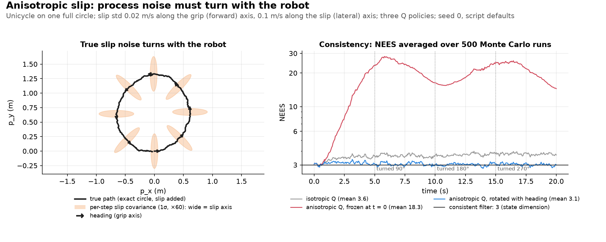

# Heading-dependent process noise for friction-anisotropic locomotion

## Intuition

"Anisotropic friction" means **a surface grips well along one axis and slides easily along the perpendicular one**. The classic biological example is a snake's belly scales, which slide easily along the body and grip sideways (Hu et al. 2009). Our pad is the mirror image: it grips along its forward axis and slips sideways. Swapping the axes would only rotate the noise ellipse by 90°.

That noise ellipse is fixed *to the pad*, i.e. to the robot's body frame. The catch: as the robot turns, the ellipse turns with it in the world frame. Its long (slip) axis in world coordinates:

```text
heading = 0°        heading = 45°        heading = 90°
     ↕                    ⤡                    ↔
 (slip along y)    (slip along the       (slip along x)
                     diagonal)
```

So a filter that fixes the ellipse orientation once (say at $t = 0$) is right only at that instant. After the robot turns, it models slip in the wrong direction. Our toy problem (a unicycle looping through every heading) exposes this by comparing three process-noise policies:

- `fixed_anisotropic`: right shape, orientation frozen at the start.
- `heading_aware`: ellipse re-oriented every step to the current heading.
- `isotropic`: no directional claim at all, the safe fallback.

**Where the question comes from.** Hybrid-systems filtering usually models friction as discrete contact modes (stuck or sliding), each switch with its own saltation matrix. Kong et al. (2024, §V-F) derive that matrix for stick-slip under Coulomb friction, whose single coefficient $\mu$ has no preferred direction. For an anisotropic pad that is not enough: slip variance depends on heading relative to the pad's own friction axes, not only on the active mode. A filter that switches modes correctly but keeps an isotropic $Q$ treats slip along the low-friction axis like slip along the high-friction one.

We work through the simplest concrete version, using [`friction_anisotropic_ekf.py`](../../use_numpy/friction_anisotropic_ekf.py)'s crawling unicycle.


*Figure: the setup at `use_numpy/friction_anisotropic_ekf.py`'s defaults, plotted by `uv run python assets/make_figures.py friction_anisotropic_ekf_concept`. Ellipses are enlarged to be visible; their 5:1 axis ratio is exact.*

**Relation to the point-cloud note.** This applies an argument the repo already made, on the other side of the filter:
- [`pointcloud_pose_tracking_empirical_note.md`](pointcloud_pose_tracking_empirical_note.md) §2/§5 (terms in the [glossary](../glossary.md#1-geometry-and-lie-groups)) showed that a noise ellipsoid fixed in an object's own frame looks anisotropic-and-rotating in the world frame, and that what matters is whether the filter's noise model tracks that rotation, not "rigid vs. non-rigid." That note was about *measurement* noise in a point-cloud registration EKF/IEKF.
- Here we apply the same argument to *process* noise, for a robot that is actually moving and turning.
- We stay with an ordinary EKF throughout: no new IEKF/Lie-group derivation, since the question is purely "does $Q$'s shape track heading," not a linearization-frame question.

**Scope.** Heading is exact and noise-free, driven only by a known, constant commanded turn rate. Only *position* picks up random slip. This isolates one question (does the process-noise ellipse's orientation track heading?) from heading estimation, which the toy deliberately leaves out.

---

## 1. The setup

A unicycle robot drives at a *known* constant commanded forward speed $v_{\text{cmd}}$ and turn rate $\omega_{\text{cmd}}$, so its true path is an exact circular arc (`exact_arc_step`, closed-form, exact for any $dt$ - the same "exact propagation, not a linearization" convention as `saltation_matrix_ekf.flow`; §1.1 gives the formulas and the Jacobian). $\omega_{\text{cmd}}$ defaults to $\dfrac{2\pi}{T}$ (where $T$ is the run duration), i.e. exactly one full loop over the run - so the heading sweeps through every possible orientation relative to a fixed reference.

On top of that exact commanded arc, true position picks up a random slip disturbance each tick, drawn in the **pad's own body frame** - low variance along the grip/forward axis, high variance along the slip/lateral axis - then rotated into world coordinates by the **true** heading at that instant.

We compare three ways of building the position block of the filter's process-noise covariance $Q$ (the policies above, selected by `q_policy`). All share the identical predict step and the same noisy position measurement each tick. The `isotropic` circle has the same total noise budget as the two ellipses (a fair comparison, not a rigged one; see §1.1).

### 1.1 The filter math, concretely

All three variants run the same EKF over $x = [p_x, p_y, \theta]^\top$. Each tick is one **predict step** followed by one **position update** (`run_ekf`). The only difference between the variants is how the position block of $Q$ is built inside the **predict step**.

**Predict, mean and Jacobian** (`exact_arc_step`). With constant commanded speed $v$ and turn rate $\omega$, the robot moves along an exact circular arc of radius $r = v/\omega$:

```math
\theta^{-} = \theta + \omega\,\Delta t, \qquad
p_x^{-} = p_x + r\left(\sin\theta^{-} - \sin\theta\right), \qquad
p_y^{-} = p_y - r\left(\cos\theta^{-} - \cos\theta\right)
```

**Intuition for $F$'s third column (heading as a lever arm):** a heading error pushes the robot sideways a little on every step.
- At the defaults ($0.2$ m/s, $\Delta t = 0.05$ s) one step is $`0.2 \times 0.05 = 0.01`$ m long.
- A $1^\circ$ heading error ($`0.0175`$ rad) turns that step into a $`0.01 \times 0.0175 \approx 1.7\times10^{-4}`$ m sideways error.
- Tiny per step, but it repeats every step, so it adds up.
- Heading enters the position this way and no other way. So the position updates can correct heading only through this column.

```math
F = \frac{\partial x^{-}}{\partial x} =
\begin{bmatrix}
1 & 0 & r\left(\cos\theta^{-} - \cos\theta\right) \\
0 & 1 & r\left(\sin\theta^{-} - \sin\theta\right) \\
0 & 0 & 1
\end{bmatrix}
```

The mean is propagated exactly, with no linearization. $F$ is still needed because heading enters the position update nonlinearly: its third column says how an error in $\theta$ turns into a position error over one step. When $|\omega| < 10^{-9}$ the code switches to the straight-line limit, $`p^{-} = p + v\,\Delta t\,(\cos\theta, \sin\theta)`$, to avoid dividing by $\omega$.

**Predict, covariance** (`predict`):

```math
P^{-} = F\,P\,F^\top + Q, \qquad
Q = \begin{bmatrix} Q_{\text{pos}} & 0 \\ 0 & (\sigma_\theta\,\Delta t)^2 \end{bmatrix}
```

$Q_{\text{pos}}$ is the 2×2 position block, and it is the only thing that changes between variants. Two functions build it: `isotropic_Q_pos` (a circle) and `anisotropic_Q_pos` (a rotated ellipse). The three variants are then defined by which function they call and, for the ellipse, which heading they pass in.

**Isotropic block** (`isotropic_Q_pos`). The same variance in every direction:

```math
Q_{\text{pos}}^{\text{iso}} = \sigma_{\text{iso}}^2\,\Delta t^2\,I_2,
\qquad
\sigma_{\text{iso}}^2 = \frac{\sigma_{\text{grip}}^2 + \sigma_{\text{slip}}^2}{2}
```

$\sigma_{\text{iso}}^2$ is the average of the two body-frame slip variances. Rotation doesn't change a matrix's trace, so the circle has the same total variance as the ellipse below, namely $2\sigma_{\text{iso}}^2 \Delta t^2 = (\sigma_{\text{grip}}^2 + \sigma_{\text{slip}}^2)\Delta t^2$. The isotropic variant is not handicapped by assuming more or less noise overall; it only lacks direction. A circle looks the same at every rotation, so this block needs no heading.

**Anisotropic block** (`anisotropic_Q_pos`). It starts from an ellipse in the pad's own body frame (small variance along the grip/forward axis, large variance along the slip/lateral axis) and rotates it into the world frame by some heading $\theta_Q$:

```math
Q_{\text{pos}}^{\text{aniso}}(\theta_Q) = R(\theta_Q)
\begin{bmatrix} \sigma_{\text{grip}}^2 & 0 \\ 0 & \sigma_{\text{slip}}^2 \end{bmatrix}
R(\theta_Q)^\top \Delta t^2,
\qquad
R(\theta_Q) = \begin{bmatrix} \cos\theta_Q & -\sin\theta_Q \\ \sin\theta_Q & \cos\theta_Q \end{bmatrix}
```

The $\Delta t^2$ converts a slip-velocity standard deviation (m/s) into a per-tick position variance (m²). It matches the simulator exactly: `generate_ground_truth_and_data` adds slip of $\sigma\,\Delta t$ each tick, so this is the true slip covariance, not a tuned guess. The simplification is in the simulator itself, which uses a fixed per-tick std instead of continuous-time white noise ($\sigma^2\Delta t$); see [pointcloud_pose_tracking_empirical_note.md §1.1](pointcloud_pose_tracking_empirical_note.md#11-the-filter-math-concretely) for what that changes. Written out, with $a = \sigma_{\text{grip}}^2 \Delta t^2$, $b = \sigma_{\text{slip}}^2 \Delta t^2$, $c = \cos\theta_Q$ and $s = \sin\theta_Q$:

```math
Q_{\text{pos}}^{\text{aniso}}(\theta_Q) =
\begin{bmatrix}
a c^2 + b s^2 & (a - b)\,c s \\
(a - b)\,c s & a s^2 + b c^2
\end{bmatrix}
```

**Intuition (off-diagonal term):** the off-diagonal is what tilts the ellipse. At 45° it says "slip in $x$ and slip in $y$ move together".
- At 45°, $`cs = 1/2`$, so both diagonal entries are $`(a+b)/2`$ and the off-diagonal is $`(a-b)/2`$.
- The correlation is $`(a-b)/(a+b)`$.
- At the script defaults, $`a = 4\times10^{-4}\,\Delta t^2`$ and $`b = 10^{-2}\,\Delta t^2`$, so the correlation is $`-0.0096/0.0104 \approx -0.92`$.
- Negative means slip runs along the diagonal $`x = -y`$, the 135° line, which is the pad's long (lateral) axis when the body is at 45°.

This function doesn't decide which heading to use. The caller does, and that choice separates the variants.

**The three variants.** At predict step $k$ (propagating from tick $k-1$ to tick $k$), `predict` branches on `q_policy`:

| `q_policy` | $Q_{\text{pos}}$ | Heading used to orient it |
| --- | --- | --- |
| `isotropic` | $`Q_{\text{pos}}^{\text{iso}}`$ | none (a circle): ignores the pad's anisotropy entirely |
| `fixed_anisotropic` | $`Q_{\text{pos}}^{\text{aniso}}(\theta_{\text{ref}})`$ | $\theta_{\text{ref}}$, the true heading at $t = 0$ (`x_true[0, 2]`, which is $0$ in the default run), never updated. The ellipse keeps pointing in its initial direction while the robot turns underneath it. |
| `heading_aware` | $`Q_{\text{pos}}^{\text{aniso}}(\hat\theta_{k-1})`$ | $\hat\theta_{k-1}$, the filter's own heading estimate after the previous tick's update (`x[2]` before this step's propagation), so the ellipse follows the estimated heading |

- `heading_aware` uses the estimate, not the true heading, because a real filter has no access to the truth.
- It uses the heading at the *start* of the step rather than the propagated $\theta^{-}$. With the defaults the heading changes by only $\omega\Delta t \approx 0.9°$ per step, so this makes no practical difference.

This mirrors how the simulator generates the truth (`generate_ground_truth_and_data`): each tick it draws slip in the body frame with standard deviations $\sigma_{\text{grip}}$ and $\sigma_{\text{slip}}$ (scaled by $\Delta t$) and rotates it by the *true* heading. `heading_aware` is the only variant whose noise model has nearly the same shape and orientation as that process (0.9° offset, §1.1), apart from its own heading-estimate error.

**Position update** (`measurement_update`). Only position is measured:

```math
H = \begin{bmatrix} 1 & 0 & 0 \\ 0 & 1 & 0 \end{bmatrix}, \qquad R = \sigma_{\text{pos}}^2 I
```

```math
r = z - H x^{-}, \qquad S = H P^{-} H^\top + R, \qquad K = P^{-} H^\top S^{-1}, \qquad
x^{+} = x^{-} + K r, \qquad P^{+} = (I - K H)\,P^{-}
```

Heading is never measured directly. It gets corrected only through the position-heading cross-covariance that $F$'s third column builds up in $P^{-}$. That is where `heading_aware`'s $\hat\theta_{k-1}$ comes from.

Script defaults: $\sigma_{\text{grip}} = 0.02$ m/s, $\sigma_{\text{slip}} = 0.1$ m/s, $\sigma_\theta = 0.01$ rad/s, $\sigma_{\text{pos}} = 0.02$ m, $v = 0.2$ m/s, $\Delta t = 0.05$ s. The true heading is noise-free, so the small $\sigma_\theta$ term only keeps the filter's heading covariance from collapsing to zero.

Two consequences follow directly from these formulas:

- **The off-diagonal term is what points the ellipse.** It is zero only when $\theta_Q$ is a multiple of 90°. With the defaults, slip variance is 25 times grip variance (5:1 in standard deviation), so a wrong direction matters a lot. A misaligned `fixed_anisotropic` ellipse assumes little noise where the real slip is large, so it is overconfident in exactly that direction. That drives the NEES gap in §2: even at 0-45° it is about 3× worse than `isotropic` (11.1 vs 3.5).
- **A 180° error costs nothing.** Replacing $\theta_Q$ with $\theta_Q + \pi$ flips the sign of both $c$ and $s$, leaving $c^2$, $s^2$ and $cs$ unchanged. So $Q_{\text{pos}}^{\text{aniso}}$ repeats every 180°, the periodicity §3 builds on. (That holds for $Q$ itself; §3 shows the error a mismatch leaves in the heading estimate does not disappear when the ellipse realigns.)

---

## 2. The dominant finding: `fixed_anisotropic` is dramatically worse, everywhere

Monte Carlo NEES over 500 trials (seed 0, $`dt = 0.05\,\text{s}`$, one full loop over $`20\,\text{s}`$, all script defaults), binned by how far the true heading has rotated away from `fixed_anisotropic`'s fixed reference heading. Each trial draws a fresh slip realization, initial error and measurement noise. Redrawing the slip matters, because slip is the process noise whose model $Q$ is being tested.



*Figure: `use_numpy/friction_anisotropic_ekf.py` at its defaults (seed 0), plotted by `uv run python assets/make_figures.py friction_anisotropic_ekf`.*

| Rotation away from reference | `isotropic` | `fixed_anisotropic` | `heading_aware` |
| --- | --- | --- | --- |
| 0-45° | 3.5 | 11.1 | 3.1 |
| 45-90° | 3.7 | 20.1 | 3.1 |
| 90-135° | 3.7 | 23.8 | 3.0 |
| 135-180° | 3.6 | 18.2 | 3.1 |

A consistent 3-DoF filter averages $\text{NEES} = 3$. For an average over 500 independent trials, the 95% acceptance interval is $[2.79, 3.22]$ (the single-run bound of 7.81 doesn't apply to an average).

- `heading_aware` stays inside that interval in every bin: it is consistent.
- `isotropic` sits just above it, 3.5-3.7 (3.4-3.8 across seeds 0-3), in every bin: mildly overconfident. Its circle assumes half the true variance along the slip axis (5.2e-3 vs 1e-2) and also about 13× too much along the grip axis (5.2e-3 vs 4e-4).
- `fixed_anisotropic` is 3.7-8× too high: badly overconfident.

This is robust. Across seeds 0-3, `isotropic`'s and `heading_aware`'s bins move by at most 0.15 and `fixed_anisotropic`'s by at most 1.4, and `fixed_anisotropic` is worse than *both* alternatives in every bin of every seed.

RMS position error from the script's single run (one trajectory, not the Monte Carlo) tells a smaller but consistent story: at seed 0, $`\text{heading\_aware}\ (0.0108\,\text{m}) < \text{isotropic}\ (0.0118\,\text{m}) < \text{fixed\_anisotropic}\ (0.0131\,\text{m})`$, and the same ordering holds in seeds 1-3. The right shape pointed the right way is both more accurate and, as the table shows, far better calibrated.

---

## 3. A secondary finding: the worst mismatch is 90°, not 180°

The *worst* of `fixed_anisotropic`'s four bins is 90-135° in all four seeds, not the largest possible mismatch (135-180°). The reason: a covariance ellipse $`R(\theta)\,\mathrm{diag}(a,b)\,R(\theta)^\top`$ has period $\pi$ in $\theta$, not $2\pi$, since rotating it by 180° gives back the identical ellipse. For the *orientation of the noise ellipse*, a 180° heading difference is no mismatch at all, so the worst possible mismatch is 90°. (The binned peak lands in 90-135° rather than 45-90° because the filter's error takes about a second to build up, so its NEES trails the mismatch slightly.)

Past the peak, NEES recovers only partly: 18.2 in the 135-180° bin, still about 6× the consistent value, although the ellipse is realigned at 180°. Splitting the NEES into position and heading parts shows why. This is approximate: one 200-trial check the script doesn't print, and heading NEES is heavy-tailed, so values vary between runs (a second 200-trial run differed by up to ~20%, with the same pattern).

| Time (heading) | Position NEES (2 DoF, consistent = 2) | Heading NEES (1 DoF, consistent = 1) |
| --- | --- | --- |
| 0 s (0°) | 2.0 | 0.9 |
| 5 s (90°) | 6.9 | 8.8 |
| 10 s (180°) | 2.6 | 14.1 |
| 15 s (270°) | 9.9 | 11.1 |
| 20 s (360°) | 2.2 | 10.5 |

The position part follows the ellipse mismatch: it peaks at 90° and 270° and returns to nearly consistent at 180° and 360°. The heading part doesn't come back. Likely mechanism (not isolated): while the ellipse is misaligned, the filter explains real slip with the wrong position noise and pushes part of that error into its heading estimate. Heading is never measured directly, so the error would drain away only slowly through the position-heading cross-covariance, consistent with it persisting long after the ellipse realigns. The figure's NEES curve shows both effects: two humps a half-turn apart, on a floor that doesn't return to 3.

---

## 4. Takeaway for a real friction-anisotropic contact model

Both findings point the same way for modeling a friction-anisotropic pad's slip in a real filter: **the noise model needs to track the *current* heading**, not just "know" the pad is anisotropic in the abstract.
- Right shape but wrong orientation (`fixed_anisotropic`) is not a forgivable approximation. It is much worse than the naive isotropic fallback in every bin, because it makes a confident, specific directional claim that is false most of the time.
- That claim does the most damage at a 90° mismatch (§3), and the damage outlasts the mismatch through the heading estimate.
- If heading-tracking isn't available, the safe fallback is to claim no direction at all (`isotropic`) rather than the wrong one.

---

## 5. References

1. Hu, D. L., Nirody, J., Scott, T., & Shelley, M. J. (2009). *The Mechanics of Slithering Locomotion*. Proceedings of the National Academy of Sciences, 106(25), 10081-10085. https://doi.org/10.1073/pnas.0812533106 - the source of the opening image (a snake's belly scales) and the phenomenon modeled: friction fixed to the body frame, lower along the body than across it for snakes. The paper's friction model is deterministic; translating it into an EKF process-noise ellipse is this doc's own extension, applying the world-frame-rotation argument from [`pointcloud_pose_tracking_empirical_note.md`](pointcloud_pose_tracking_empirical_note.md) (see §Intuition above) to process rather than measurement noise.
2. Kong, N. J., Payne, J. J., Zhu, J., & Johnson, A. M. (2024). *Saltation Matrices: The Essential Tool for Linearizing Hybrid Dynamical Systems*. Proceedings of the IEEE, 112(6), 585-608. https://doi.org/10.1109/JPROC.2024.3440211 (preprint: arXiv:2306.06862) - §V-F derives the saltation matrix for the stick-slip friction transition under Coulomb friction with a single, direction-free coefficient; this doc's direction-dependent process noise is the part that model leaves out. Also reference 1 of [hybrid_saltation_ekf.md](hybrid_saltation_ekf.md#11-references).
3. Khalili, H. H., Cheah, W., Garcia-Nathan, T. B., Carrasco, J., Watson, S., & Lennox, B. (2020). *Tuning and Sensitivity Analysis of a Hexapod State Estimator*. Robotics and Autonomous Systems, 129, 103509. https://doi.org/10.1016/j.robot.2020.103509 - a real-hardware study (an IMU + leg-kinematics EKF on the Corin hexapod) of how an EKF's accuracy depends on its noise parameters, tuned there by particle-swarm optimization; this doc's fixed-vs-heading-aware $Q$ comparison is one instance of that broader question. Also reference 4 of [inchworm_zupt_ekf.md](inchworm_zupt_ekf.md#5-references).