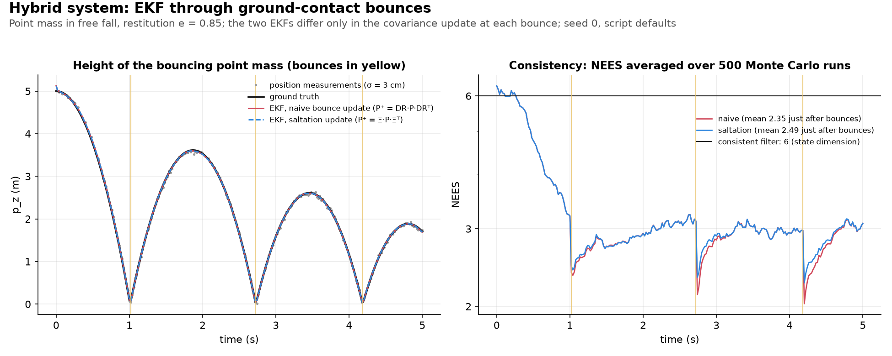

# Saltation matrices: propagating uncertainty through a hybrid/discontinuous event

## Intuition

A hybrid system alternates **ordinary smooth motion** (falling) with **sudden, instantaneous jumps** (bouncing), triggered the instant some condition is hit (touching the ground). The tricky part isn't the jump itself - it's that two nearby trajectories don't hit that condition at the same moment.

Ball A (nominal) and ball B (starts 5 cm higher) fall together. B has farther to fall, so it lands a fraction of a second *later* than A and has picked up extra speed by then:

```text
 at the instant A touches down (schematic, not to scale; the real delay is 4.9 ms):

      B ●                  <- still above the ground, still falling
        │
        ▼      A
 ──────────────●────── ground
```

So B's bounce isn't "the same bounce rule applied to a slightly different starting state" - it's applied to a state that has had a bit more time to accelerate first.

- **Ordinary Jacobian of the bounce** ($DR$, the reset map's own derivative): sees only how the bounce transforms a state already sitting at the ground. It implicitly assumes both balls land at the same instant, so it misses B's extra falling time.
- **Saltation matrix** ($\Xi$): adds exactly that - **how much *extra time* a perturbed trajectory needs to reach the ground, and what that delay does to the state before the bounce (B falls longer) and after it (B rebounds later)**.
- **It is not a rounding error**: §3 works a case where **the naive approach predicts a position offset has *zero* effect on the post-bounce velocity, when the timing shift is in fact the *entire* effect**.

Every filter in [kf_ekf_iekf.md](kf_ekf_iekf.md) and [extra_kf_variants.md](extra_kf_variants.md) assumes the state evolves *continuously* between measurements. Bio-inspired locomotion (a footstep, an inchworm anchor/release cycle, a friction-anisotropic grip-then-slip transition) breaks that assumption on purpose: the platforms move in **discrete, hybrid bursts**.

This doc works through the tool that lets an EKF cross such a discontinuity without either:

- (a) silently pretending nothing happened, or
- (b) discarding all uncertainty information at the jump.

The concrete example is the bouncing-point-mass toy problem in [`saltation_matrix_ekf.py`](../../use_numpy/saltation_matrix_ekf.py).


*Figure: the default run of `use_numpy/saltation_matrix_ekf.py` and the [§3](#3-a-worked-example-naive-vs-saltation-in-numbers) worked example, plotted by `uv run python assets/make_figures.py saltation_matrix_ekf_concept`.*

> **Reading order**
> - **§1-§3, core idea**: why the reset Jacobian isn't enough, plus a worked example showing it's wrong by a real amount. Enough for a first read.
> - **§4, derivation**: from scratch, including a tempting but wrong approach that we check against finite differences. Skippable if we take the formula on faith.
> - **§5-§8, practical payoff**: a structural property, a modest but real empirical finding, tuning gotchas, and what uncertain contact detection costs.
> - **§9, tangent**: periodic-orbit stability, which this script never needs. Safe to skip.

---

## 1. What a hybrid dynamical system is, here

A **hybrid dynamical system** alternates **continuous flow** with **instantaneous discrete jumps**, triggered by a **guard condition** and applied via a **reset map**:

- **State**: $x = (p, v) \in \mathbb{R}^6$ with $p, v \in \mathbb{R}^3$ - a point mass's position and velocity, plain $\mathbb{R}^6$ (no rotation, unlike most scripts in this repo).
- **Flow**: $`\dot x = f(x) = \begin{bmatrix} v \\ (0,0,-g) \end{bmatrix}`$ - ordinary free-fall, affine in $x$ (linear plus a constant gravity term), so it can be integrated exactly.
- **Guard**: $g(x) = p_z$. (The letter $g$ does double duty in this doc, following the saltation-matrix literature: $g(x)$ and its gradient $Dg$ are the guard, while a bare $g$ in the dynamics, as in $\tfrac12 g t^2$, is gravity, $9.81\ \text{m/s}^2$.) The system jumps whenever a falling trajectory reaches $g(x) = 0$ (touches the ground). Its gradient $Dg = \partial g/\partial x$ - which shows up throughout this doc, starting in §2 - is the constant row vector $(0,0,1,0,0,0)$ here: it just picks out the $p_z$ component.
- **Reset map**: $R(x)$, applied at the guard - here, $`v_z \mapsto -e\,v_z`$ (an inelastic bounce with restitution $e$), position and horizontal velocity untouched. Throughout this doc, a superscript $-$/$`+`$ on a state, vector field or covariance (e.g. $x^{-}$, $f^{-}$, $x^{+}$, $f^{+}$, $P^{-}$, $P^{+}$) means "evaluated just before/after the reset" - see the notation table below.

This is the canonical example (the word "saltation" is Latin for "leaping"), and the simplest analog of a foot-strike/ground-contact impact - a discrete velocity reset at a discrete contact event - without $SE(3)$'s rotational complexity layered on top.

**Notation used throughout this doc.** Several letters mean something different here than in the rest of the repo, or mean two things within this doc; the table settles each one.

| Symbol | Meaning |
|---|---|
| $x = (p, v)$ | State: position $p$ and velocity $v$, each in $\mathbb{R}^3$. |
| $f(x)$ | The continuous flow (free fall). |
| $g(x) = p_z$, $Dg$ | The guard and its gradient, the row vector $(0,0,1,0,0,0)$. A bare $g$ in the dynamics is gravity, $9.81\ \text{m/s}^2$. |
| $R(x)$, $DR$ | The reset map and its Jacobian, $\text{diag}(1,1,1,1,1,-e)$. Not a rotation, and not a measurement-noise covariance (that is $R_z$). |
| $e$ | Coefficient of restitution. |
| $x^{-}$, $x^{+}$ | The state just before and just after the bounce, with $x^{+} = R(x^{-})$. **Never** before/after a measurement update in this doc. |
| $f^{-}$, $f^{+}$ | The flow evaluated at $x^{-}$ and at $x^{+}$. |
| $P^{-}$, $P^{+}$ | The covariance just before and just after the bounce. |
| $`t^{*}`$, $\delta t$ | The nominal trajectory's crossing time, and how much later (or earlier) a perturbed trajectory crosses. |
| $\tau$, $`\tau_{\text{detect}}`$ | The crossing time `crossing_time` finds within a tick, and the time the bounce is applied once §8's detection error is added. |
| $\Phi$ | A flow Jacobian $\partial x'/\partial x$: $\Phi(h)$ over an interval $h$ (§1.1), $`\Phi_{\text{before}}`$/$`\Phi_{\text{after}}`$ on either side of a bounce (§3-§4). In §4, $\Phi(x, s)$ is the flow map itself and $D_1\Phi$ its Jacobian. |
| $\Xi$ | The saltation matrix (§4's boxed formula). |
| $`\Xi_{\text{own-time}}`$ | §4's event-to-event variant, correct for a different question. |
| $a \otimes b$ | Outer product: a column vector times a row vector, giving a matrix. |
| $Q(h)$, $`\sigma_{\text{imp}}`$ | Process noise over an interval $h$, and the impact-noise floor added at each bounce. |
| $z$, $H$, $R_z$, $S$, $K$ | Position measurement, its Jacobian, its noise covariance, the innovation covariance, and the Kalman gain (§1.1). |
| $`x_{k\|k-1}`$, $`P_{k\|k-1}`$ / $`x_{k\|k}`$, $`P_{k\|k}`$ | The estimate before and after tick $k$'s measurement update. |
| $p$, $S(t)$ in §4 | A perturbation parameter (not position) and the trajectory's sensitivity to it (not the innovation covariance). |

### 1.1 The filter math, concretely

Both EKF variants run over $x = (p, v) \in \mathbb{R}^6$. Each tick of length $\Delta t$ is one **hybrid predict step** (`step_hybrid`) followed by one **position update** (`measurement_update`), both driven by `run_ekf`. The only difference between the variants is the `use_saltation` flag, which picks the matrix used on the covariance at a bounce.

**Free-fall flow** (`flow`). Between bounces the dynamics are integrated in closed form over any interval $h$, with $a = (0, 0, -g)$:

```math
p' = p + v\,h + \tfrac12 a\,h^2, \qquad v' = v + a\,h, \qquad
\Phi(h) = \frac{\partial x'}{\partial x} = \begin{bmatrix} I_3 & h\,I_3 \\ 0 & I_3 \end{bmatrix}
```

This is exact, not a linearization, because the flow is affine in $x$: between bounces the mean and covariance propagate with no approximation at all.

**Process noise** (`process_noise_covariance`). For an interval $h$ and acceleration-disturbance std-dev $\sigma_a$:

```math
Q(h) = \begin{bmatrix} \left(\tfrac12 \sigma_a h^2\right)^2 I_3 & 0 \\ 0 & (\sigma_a h)^2 I_3 \end{bmatrix}
```

This is a simple diagonal heuristic, not the textbook continuous white-noise-acceleration $Q$ (which also has position-velocity cross-terms). The default is $`\sigma_a = 0.3\ \text{m/s}^2`$ (`--process-noise-std`).

**Crossing time** (`crossing_time`). Solve $`p_{z0} + v_{z0}\,t - \tfrac12 g t^2 = 0`$ in closed form. Keep only roots with $t > 10^{-12}$ that are *descending* ($`v_{z0} - g\,t < 0`$), and return the smallest one. If there is no such root (including a negative discriminant), return `None`. The descending-only rule is the §8 fix: a point mass that starts just below the ground and is moving up does not count its way back out as an impact.

**Hybrid predict** (`step_hybrid`). Starting with `remaining` $= \Delta t$, the step loops up to `max_bounces` $= 20$ times:

1. Compute $\tau$ with `crossing_time`. If there is none, or $\tau \ge$ `remaining`, flow the rest of the tick, set $P \leftarrow \Phi P \Phi^\top + Q(\text{remaining})$, and stop.
2. Otherwise flow to the detected crossing time $\tau_{\text{detect}}$ (equal to $\tau$ unless the §8 detection parameters are set), and set $P \leftarrow \Phi P \Phi^\top + Q(\tau_{\text{detect}})$.
3. If the vertical speed there is below `min_bounce_speed` $= 10^{-3}$ m/s, set $v_z = 0$, and use `flow_resting` (below) for the rest of this tick.
4. Otherwise apply the bounce (equations below) and go back to step 1 with the time that is left.

At each bounce, with $M = \Xi(x^{-})$ (`saltation_matrix`, §4) if `use_saltation` is true and $M = DR$ (`reset_jacobian`) if not:

```math
x^{+} = R(x^{-}), \qquad P^{+} = M\,P^{-}\,M^\top + \sigma_{\text{imp}}^2\,I_6
```

Two things are easy to miss:

- $Q$ is added once per sub-interval, not once per tick. Because $Q(h)$ grows like $h^2$ and $h^4$, a tick split at a bounce gets less total process noise than an unsplit tick.
- The impact floor $\sigma_{\text{imp}}^2 I_6$ (`--impact-noise-std`, default $0.005$) is added to all six diagonal entries, velocity included, in both variants. §5 and §7 explain why it is a modeling choice rather than a numerical necessity.

**Resting fallback** (`flow_resting`). Once the mass is treated as at rest, only horizontal position moves: $`p_{x,y} \leftarrow p_{x,y} + v_{x,y}\,h`$, with $p_z$, $v_z$ and the rest of the state held fixed. Its $\Phi$ is the identity plus $h$ at the $(p_x, v_x)$ and $(p_y, v_y)$ entries. This is a deliberately simple guard against the Zeno pathology (§7), not a contact model.

**Position update** (`measurement_update`). A direct noisy position reading, $z = p + n$:

```math
H = \begin{bmatrix} I_3 & 0_3 \end{bmatrix}, \qquad R_z = \sigma_z^2\,I_3, \qquad
S = H P_{k|k-1} H^\top + R_z, \qquad K = P_{k|k-1} H^\top S^{-1}
```

```math
x_{k|k} = x_{k|k-1} + K\,(z - H x_{k|k-1}), \qquad P_{k|k} = (I - K H)\,P_{k|k-1}
```

Here $`x_{k|k-1}, P_{k|k-1}`$ are the output of this tick's hybrid predict and $`x_{k|k}, P_{k|k}`$ the updated estimate. The other filtering docs write these as $x^{-}/x^{+}$, but in this doc $-$/$`+`$ is reserved for the bounce, and $R$ for the reset map ($R_z$ is `measurement_update`'s `R` argument). The covariance uses the plain $`(I - KH)P_{k|k-1}`$ form, not the Joseph form. The default is $\sigma_z = 0.03$ m (`--pos-noise-std`).

**Ground truth and Monte Carlo setup.**

- **True trajectory** (`generate_ground_truth_and_data`): `step_hybrid` itself with zero process noise and zero covariance, so it follows the same bounce and resting rules as the filters.
- **Dead reckoning** (`run_dead_reckoning`): the same noise-free propagation from the perturbed initial guess, with no updates.
- **Monte Carlo** (`run_monte_carlo_consistency`): each trial draws a fresh initial guess $`x_0 = x_{\text{true},0} + \text{diag}(\sigma_0)\,n`$ with $n \sim \mathcal{N}(0, I_6)$ and fresh measurement noise, starts both filters from

$$
P_0 = \text{diag}\big(\sigma_{p0}^2 I_3,\ \sigma_{v0}^2 I_3\big), \qquad \sigma_{p0} = 0.1\ \text{m}, \quad \sigma_{v0} = 0.2\ \text{m/s}
$$

- **NEES averaging**: per tick over 500 trials. §6's post-bounce window finds each bounce tick with `detect_bounce_ticks` (a local minimum of true height below $0.2$ m), then averages the next 5 ticks, excluding the bounce tick itself.
- **Other defaults**: $\Delta t = 0.02$ s, $e = 0.85$, $g = 9.81$, a $5$ m drop, initial horizontal velocity $(1.0, 0.5)$ m/s, and a $5$ s duration.

---

## 2. Why the reset map's own Jacobian is not enough

Suppose we want to propagate a covariance $P$ through a bounce. The reset map itself is simple and linear: $`R(x) = \text{diag}(1,1,1,1,1,-e)\,x =: DR\,x`$. The natural (and wrong) instinct is

```math
P^{+} = DR\,P^{-}\,DR^\top
```

The problem is timing, not the reset map: $DR$ is the Jacobian of "apply the reset to a state already sitting exactly on the guard", but a *perturbed* trajectory does not reach the guard at the same instant as the nominal one (balls A and B in the intro). Call the crossing times $`t^{*}`$ (nominal) and $`t^{*}+\delta t`$ (perturbed).

- During that sliver $\delta t$ the perturbed trajectory is still on the *pre-impact* flow $f$, so by the time it crosses it has drifted further along $f$ than "apply $DR$ to the perturbation at time $`t^{*}`$" credits.
- $DR$ is evaluated at the fixed instant $`t^{*}`$, so it cannot see this.
- Near grazing (small $Dg\cdot f^{-}$, a shallow crossing), $\delta t \propto 1/(Dg\cdot f^{-})$ grows, so the timing effect can dominate the reset map's own contribution.

The correct sensitivity has to account for that time-shift, for comparison at a shared later time. That is the **saltation matrix**, $\Xi$: the reset Jacobian $DR$ plus a correction for the event-timing sensitivity. §4 builds it in **two stages**:

- **Stage 1:** a rank-one projector that removes the "along-the-flow" component of a perturbation - the part that only changes *when* the guard is crossed, not *where*. $DR$ times this projector is $`\Xi_{\text{own-time}}`$, the "wrong turn" §4 starts with: correct when each trajectory is compared at its own crossing moment, but not enough here.
- **Stage 2:** one further term, $`f^{+} \otimes Dg \,/\, (Dg \cdot f^{-})`$, needed once the two trajectories are compared at a shared later time.

§3's worked example uses that shared-time comparison, since that's what this script's own filter needs.

At a smooth (non-event) point, the ordinary Jacobian $A = \partial f/\partial x$ is all there is. At a hybrid event, $\Xi$ plays that role but must also carry the event-time correction:

| Smooth dynamics | Hybrid event |
| --- | --- |
| Perturbation evolves continuously | Perturbation can jump discontinuously |
| Linearization: $A = \partial f/\partial x$ | Linearization: saltation matrix $\Xi$ |
| No event-time correction needed | Must correct for the crossing-time shift $\delta t$ |

---

## 3. A worked example: naive vs. saltation, in numbers

Here the two approaches disagree on an actual number. The comparison time matters (§4): `step_hybrid` always compares nominal and perturbed trajectories at a fixed external time (the next filter tick), so that is the comparison we work out.

Setup: two point masses, both falling with downward velocity $`-2\,\text{m/s}`$ from $`5\,\text{m}`$, except the second starts $5\text{cm}$ higher ($\delta p_z = 0.05$, no velocity perturbation), with restitution $e=0.5$. Both bounce once and are compared at $`T=1.0\,\text{s}`$ (the nominal bounce is at $`t^{*}\approx0.826\,\text{s}`$, leaving $`\approx\!0.174\,\text{s}`$ of post-bounce flow for the timing difference to matter):

- **Naive prediction** ($DR$ alone, composed with the free-fall flow Jacobian before and after the bounce - exactly what `step_hybrid`'s `use_saltation=False` branch computes): change in $v_z(T)$: **exactly $0$**; change in $p_z(T)$: **$`+0.05\,\text{m}`$**. $DR$'s position rows are the identity, so the offset is carried forward unchanged - in effect the perturbed ball bounces at the nominal instant while still hovering $5\text{cm}$ above the ground.
- **True answer** (re-simulated: let the second ball reach its own crossing time, apply the reset there, then flow both forward to $T$ and compare): starting $5\text{cm}$ higher means falling for an extra $`\sim\!4.9\text{ms}`$, so it lands faster ($`10.153`$ vs. $`10.104\,\text{m/s}`$) and bounces back faster - but also later, so it has *less* time flowing back up before $T$. True change in $v_z(T)$: **$+0.0726\ \text{m/s}$**; true change in $p_z(T)$: **$`-0.0126\,\text{m}`$** (lower than nominal, the opposite sign from the naive guess).
- **Saltation-corrected prediction** ($\Xi$, composed as $`\Phi_{\text{after}}\,\Xi\,\Phi_{\text{before}}`$ - exactly what `saltation_matrix` plus `step_hybrid`'s surrounding `flow` calls compute): change in $v_z(T)$: **$+0.0728\ \text{m/s}$**; change in $p_z(T)$: **$`-0.0123\,\text{m}`$** - both within second-order error of the true answer.

The naive approach is qualitatively wrong on both components. Physically a ball only bounces on contact, so the extra height becomes a *timing* difference: the perturbed ball reaches the ground $`\approx 4.9\,\text{ms}`$ later, and that shift produces both true changes:

- **Velocity** ($`+0.0726\,\text{m/s}`$, naive: $0$):
  - $`+0.0242\,\text{m/s}`$ because it hit faster and so bounced back faster ($`0.0484\,\text{m/s}`$ extra impact speed, times $e=0.5$).
  - $`+0.0484\,\text{m/s}`$ because it bounced later, so gravity has had $`\approx 4.9\,\text{ms}`$ less time to slow its climb by $T$.
  - Both parts come from the bounce timing: a pure position perturbation changes the post-bounce velocity *only* through timing, so timing is the entire effect.
- **Position** ($`-0.0126\,\text{m}`$, naive: $`+0.05\,\text{m}`$): the $5\text{cm}$ head start is used up on the way down. Starting the climb $`\approx 4.9\,\text{ms}`$ late costs about $16.6$ mm, and climbing slightly faster wins back only about $4.1$ mm, for a net $-12.55$ mm.

$DR$ has no notion of time: it only transforms a state already on the guard, and composing it with the flow Jacobians on either side doesn't fix that. $\Xi$ adds the missing piece: its correction term accounts for how much the perturbation shifts the crossing time, and for what that shift does to the state both before *and* after the bounce.

(Computed directly from this repo's own `flow`, `crossing_time`, `reset_map`, `reset_jacobian` and `saltation_matrix` functions, not hand-derived. Reproduce with $x_0=(0,0,5,0,0,-2)$, $\delta x_0=(0,0,0.05,0,0,0)$, $e=0.5$, $g=9.81$, $T=1.0$. Composing three matrices by hand isn't a natural calculator exercise, so there is no hand-arithmetic appendix for this one; [§10](#10-a-simpler-related-quantity-worked-by-hand) works a closely related, hand-workable quantity.)

---

## 4. Deriving $\Xi$ - including a wrong turn, caught by verification

**A formula that looks right and is right for a different question.** Before deriving the formula this script uses, we record what *doesn't* work here: a natural first guess that is the correct answer to a different, easily-conflated question. Following the same implicit-differentiation idea as below, but stopping short of the flow that continues *after* the reset, gives

$$\Xi_{\text{own-time}}(x^{-}) = DR(x^{-})\left[I - \frac{f(x^{-}) \otimes Dg(x^{-})}{Dg(x^{-}) \cdot f(x^{-})}\right]$$

- **What it is right for**: the linearization of "post-impact state, compared at its *own* natural post-impact time" with respect to "pre-impact state, compared at its own natural pre-impact time" - the sensitivity for comparing trajectories *event-to-event* rather than against a fixed external clock.
- **Check**: matches a from-scratch finite-difference ground truth built exactly that way (perturb the pre-impact state, re-land it on the guard via the pre-impact flow, apply the reset, compare to nominal, no further flow past the reset) to $`\lesssim\!10^{-9}`$ with a central difference at $h = 10^{-6}$, i.e. to finite-difference precision.
- **Not the literature's matrix**: it is not the saltation matrix the literature composes for periodic-orbit analysis (§9).

**What it gets wrong for `step_hybrid`.** `step_hybrid`, like any fixed-timestep filter, compares nominal and perturbed states at the *same external clock time* (the distinction §3 put a number on). With a shared clock, the flow *after* the reset also depends on where exactly the reset landed, and $\Xi_{\text{own-time}}$ has no term for that. Checked against the finite-difference Jacobian of the *actual* fixed-$`\Delta t`$ tick (perturb the state at the tick's start, run the same `flow`/`crossing_time`/`reset_map` steps to the end of the tick, compare to nominal), it is off by a wide margin: $`\max|\Phi_{\text{after}}\,\Xi_{\text{own-time}}\,\Phi_{\text{before}} - J_{\text{numeric}}| \approx 4.4`$ (test scenario: $x_0=(0,0,0.05,0.3,0.2,-2)$, $e=0.6$, $\Delta t=0.05$ s, $g=9.81$).

**The derivation this script needs.** Consider a one-parameter family of trajectories $x(t; p)$ ($p$ a perturbation parameter, $p=0$ nominal), each governed by $\dot x = f(x)$ until a $p$-dependent crossing time $`t^{*}(p)`$ defined implicitly by $`g\big(x(t^{*}(p); p)\big) = 0`$, where a reset $x^{+} = R(x^{-})$ is applied and the same flow resumes. Fix a later reference time $T$, independent of $p$, and ask for $\frac{d}{dp}\big[x(T;p)\big]$ - what a fixed-tick filter's covariance propagation needs. Let $S(t) = \left.\dfrac{\partial x(t;p)}{\partial p}\right|_{p=0}$.

Implicit differentiation of the guard condition gives the same crossing-time sensitivity as before:

```math
\frac{dt^{*}}{dp} = -\frac{Dg \cdot S(t^{*})}{Dg \cdot f^{-}(x^{-})}
```

Since $`x(T;p) = \Phi\big(x^{+}(p),\,T-t^{*}(p)\big)`$ (the flow map, run for whatever time remains after the reset), the chain rule gives two contributions: how the post-reset *state* changes, and how the *remaining flow duration* changes as $`t^{*}(p)`$ shifts:

```math
\frac{d}{dp}\big[x(T;p)\big]\Big|_{p=0} = \Phi_{\text{after}}\cdot\frac{dx^{+}}{dp} - f_T\cdot\frac{dt^{*}}{dp}
```

Here $`\Phi_{\text{after}} = D_1\Phi(x^{+}, T-t^{*})`$ is the ordinary flow Jacobian over the remaining duration (`flow`'s own `Phi` output) and $f_T = f\big(x(T;0)\big)$ is the vector field at the nominal state at $T$. Then:

1. Expand $`\frac{dx^{+}}{dp} = DR\big[f^{-}(x^{-})\frac{dt^{*}}{dp} + S(t^{*})\big]`$ (same reasoning as $\Xi_{\text{own-time}}$'s derivation).
2. Use the flow identity $D_1\Phi(x,s)\cdot f(x) = f\big(\Phi(x,s)\big)$ (an autonomous flow's linearization carries its generating vector field forward), so $\Phi_{\text{after}}\cdot f^{+}(x^{+}) = f_T$.
3. Pull the term $`-f_T\,dt^{*}/dp`$ inside $\Phi_{\text{after}}$ using step 2.
4. The $DR$ terms reproduce $\Xi_{\text{own-time}}$ exactly, and the pulled-in term adds exactly one new term on top of it:

```math
\frac{d}{dp}\big[x(T;p)\big]\Big|_{p=0} = \Phi_{\text{after}}\left\lbrace DR(x^{-}) + \frac{\big[f^{+}(x^{+}) - DR(x^{-})\,f^{-}(x^{-})\big] \otimes Dg}{Dg \cdot f^{-}(x^{-})}\right\rbrace S(t^{*}) = \Phi_{\text{after}}\,\Xi(x^{-})\,\Phi_{\text{before}}\,\delta x_0
```

where $`\Phi_{\text{before}} = D_1\Phi(x_0, t^{*})`$ (so $`S(t^{*})=\Phi_{\text{before}}\,\delta x_0`$) and

```math
\boxed{\Xi(x^{-}) = DR(x^{-}) + \frac{\big[f^{+}(x^{+}) - DR(x^{-})\,f^{-}(x^{-})\big] \otimes Dg}{Dg \cdot f^{-}(x^{-})}}
```

- $\Xi$ is $\Xi_{\text{own-time}}$ plus the correction term that formula was missing.
- It is also the standard saltation matrix of the literature: Kong et al. (2024), Definition 2 (Eq. 9), with a time-independent reset and guard ($`D_t R = 0`$, $`D_t g = 0`$).
- `saltation_matrix` computes it.
- **Check**: $`\Phi_{\text{after}}\,\Xi\,\Phi_{\text{before}}`$ matches the finite-difference ground truth of the whole fixed-$`\Delta t`$ map to $`\sim\!7\times10^{-6}`$ (limited by the finite-difference step, not this formula), in the same test scenario as above: `tests/use_numpy/test_saltation_matrix_ekf.py`, `test_saltation_matrix_composes_to_the_fixed_dt_jacobian` (scenario at L88-90).

---

## 5. A structural property that matters in practice: $`Dg\,\Xi = -e\,Dg`$

For this guard ($g(x) = p_z$), $\Xi$'s output row for $p_z$ scales by exactly $-e$, for any $x^{-}$, $e$, $g$ with $Dg\cdot f^{-} \neq 0$ (i.e. $v_z^{-} \neq 0$, so the crossing is transversal):

```math
Dg\,\Xi(x^{-}) = -e\,Dg
```

In code: `Dg @ saltation_matrix(x_minus, e, g)` always equals `-e * Dg`. This is *reduced*, not zero:

- $\Xi_{\text{own-time}}$ (§4) has an identically zero guard-normal row, since every trajectory in that comparison satisfies $g(x)=0$ at its own crossing by construction.
- $\Xi$ compares trajectories at a fixed later time, by which point the guard-normal coordinate has evolved under real post-bounce flow and is no longer pinned. Its sensitivity is nonzero, just scaled down by the restitution coefficient.

Practical consequence: $\Xi$ does not drive $P$'s guard-normal row/column to a near-singular state at every bounce, so we expect it to need no regularizing floor for numerical stability against a truth sampled at fixed ticks (§7 sweeps the floor). `step_hybrid`'s small isotropic "impact noise" floor stays in the code as a simplified stand-in for the explicit impact-timing/model-uncertainty term a real contact-aided filter would carry.

---

## 6. The empirical finding: a modest, real gap, not a dramatic one

The intuitive story going in was that the naive $`P^{+} = DR\,P^{-}\,DR^\top`$ update would be measurably overconfident (too-small reported uncertainty) right after each bounce compared to the saltation-corrected one, and a Monte Carlo NEES consistency check would show it (NEES: a calibrated 6-DoF filter averages $\approx 6$, higher means overconfident, lower underconfident - see the [glossary](../glossary.md#2-uncertainty-and-probability)). The data does not bear that out.

Running `saltation_matrix_ekf.py` at its defaults (500 Monte Carlo trials, 3 well-separated bounces from a 5m drop at $e = 0.85$) and looking at NEES in the few ticks immediately following each bounce (excluding the shared spike at the bounce tick itself, which both filters exhibit for the mundane reason that the true trajectory is also close to its own crossing at that tick):

```text
Mean NEES, 5 ticks after each of 3 bounces (seed 0):
  EKF (naive)      ≈ 2.35
  EKF (saltation)  ≈ 2.49
```

**Both filters are *under*confident after a bounce, and the saltation-corrected one slightly less so.**

- **Reproducible**: across seeds 0-3, naive gives 2.35-2.38 and saltation 2.49-2.50.
- **Clearly below 6**: for a 500-trial mean, the 95% band around a consistent $6$ is only $`6 \pm 1.96\sqrt{2\cdot 6/500} \approx 6 \pm 0.30`$ (the $12.59$ chi-squared bound applies to a *single* NEES sample, not a 500-trial mean). So both report a clearly larger $P$ than their actual errors.
- **Not bounce-specific**: the whole-run mean NEES is $\approx 3.3$ for both. Part of that is process noise the truth doesn't have (the true trajectory has none, yet both filters add $Q$ every sub-interval and the impact floor at every bounce). Only part, though: cutting `--process-noise-std` from $0.3$ to $0.01$ raises the whole-run mean only to about 4.0-4.4 (seed 0).
- **So saltation's 5-6% higher NEES means slightly *closer* to consistent**, not worse. It is also nowhere near the order-of-magnitude effect an incorrect formula (one missing §4's $f^{+}$ term) would produce.

**What differs, and how robust the ordering is.**

- The filters differ only at bounces. By §5's $`Dg\,\Xi = -e\,Dg`$, the saltation update scales $P$'s height (guard-normal) variance by $e^2$ ($\approx 0.72$ at $e = 0.85$); the naive update carries it through unchanged ($DR$'s position rows are the identity).
- Which filter has the higher post-bounce NEES depends on tuning: at `--process-noise-std` $0.05$ or $0.01$ (seed 0), the *naive* one's is higher (2.86 vs. 2.60, and 3.29 vs. 2.65).
- What holds at every setting tried: both stay below $6$. With exact contact detection, neither filter is overconfident after a bounce.
- This changes once the bounce time is misjudged: §8 shows that when detection jitter makes both overconfident (NEES $> 6$), the saltation-corrected one is the more overconfident.

So with exact detection there is no case for the naive update:

- The two filters are close, both right after a bounce and over the whole trajectory, and neither is overconfident.
- The naive update has no principled derivation behind it at all.
- The larger miscalibration here is the conservatism both filters share over the whole trajectory, not the difference between their bounce updates.
- A real Hybrid-InEKF implementation would still benefit from an explicit model of detection uncertainty (e.g., an impact-timing noise term scaled by the velocity jump at the event, rather than this script's isotropic floor). §8 measures how much detection error costs each filter.



*Figure: `use_numpy/saltation_matrix_ekf.py` at its defaults (seed 0), plotted by `uv run python assets/make_figures.py saltation_matrix_ekf`.*

---

## 7. Two things worth knowing before reusing this pattern

- **The regularizing floor is not numerically load-bearing here, but still worth tuning.** Sweeping `--impact-noise-std` (post-bounce NEES, naive vs. saltation):
  - `0` (disabled): 2.94 vs. 3.05; `0.0005`: 2.93 vs. 3.04; `0.005` (default): 2.35 vs. 2.49; `0.02`: 2.28 vs. 2.32.
  - The two move together and never swap order, and all stay below $6$ even with the floor disabled. This is consistent with §5: $`Dg\,\Xi = -e\,Dg`$ keeps the guard-normal row non-degenerate, where $`Dg\,\Xi_{\text{own-time}} = 0`$ would zero it at every bounce. We did not re-run the older formula, so we have not shown that it needed the floor, or that the order would swap under it.
  - The floor still shifts both filters' absolute NEES together as it grows, so it remains a real modeling choice, just not one that can flip the comparison.
- **Stay well clear of the Zeno regime.** A lossy bounce ($e<1$) produces infinitely many, ever more frequent bounces approaching a finite settling time: $`t_1 + \frac{2 e v_1}{g(1-e)} \approx 12.45\,\text{s}`$ at the defaults (first impact at $t_1 \approx 1.01$ s, speed $v_1 \approx 9.90$ m/s).
  - The $n$-th interval between bounces is $`2 v_1 e^{n}/g \approx 2.02\cdot 0.85^{n}`$ s. It reaches the fixed step $\Delta t = 0.02$ s only at $n \approx 28$, about $0.14$ s before $12.45$ s (around $t \approx 12.3$ s), and is still about $3\Delta t$ at $n \approx 22$, the last $\approx 0.4$ s. So intervals fall to a few $\Delta t$ only in the final fraction of a second.
  - A fixed-tick estimate can't be fairly compared with a truth that bounces many times within one tick.
  - With `--duration 12` (seed 0), post-bounce mean NEES is $\approx 3{,}600$ (naive) and $\approx 5{,}100$ (saltation), peaking near $56{,}000$ for both. We attribute the blow-up to the many bounces per tick near the end (plus the 20-bounce cap per tick). Both filters share it, for reasons unrelated to the saltation matrix.
  - `--duration`'s default stops after 3 clean, well-separated bounces, before the 4th starts crowding the settling regime.

---

## 8. Quantifying contact-detection timing jitter

§6 showed that with exact contact detection both filters are conservative after a bounce, the saltation-corrected one marginally closer to consistent. That leaves open how much a *real* contact sensor's detection latency/jitter degrades each of them. `step_hybrid`'s `detect_time_bias`/`detect_time_noise_std` parameters model this directly (both default $0$, reproducing every result above): a bounce's reset is applied at a *detected* crossing time

```math
\tau_{\text{detect}} = \text{clip}\big(\tau + b_{\text{detect}} + \mathcal{N}(0,\,\sigma_{\text{detect}}^2)\,,\ 0,\ \tau_{\text{remain}}\big)
```

instead of the true geometric $\tau$, so early detection resets the mean while still above ground and late detection resets it after the free-fall model has carried it slightly below $p_z = 0$ - both real artifacts of a delayed or jittery contact detector (e.g. an accelerometer spike, as in the IMU-based foot-strike detector of [Čížek et al., 2018](#11-references), or a force threshold), not numerical noise.

Under detection jitter, `saltation_matrix` is evaluated at an $x^{-}$ that is off the guard ($p_z \neq 0$), outside its own stated assumption (its docstring says $x^{-}$ already satisfies $p_z = 0$). The code does not correct for this; it uses the current $v_z$, since nothing in the formula depends on $p_z$.

**A correctness requirement.** Once a reset can land off-guard, `crossing_time` must reject *ascending* roots and keep only the next *descending* one. Otherwise a point mass rising out of a below-ground detection artifact crosses $p_z = 0$ again almost immediately, which is not a real impact, and triggers a cascade of spurious re-bounces within a single step.

- With exact detection every crossing is descending by construction, so the rule changes no result above.
- Without it, any detection jitter produces nonsense. Measured by temporarily using the alternative rule (smallest positive root, ascending or not) and rerunning this section's sweep (seed 0, 500 trials):

| $\sigma_{\text{detect}}$ | Post-bounce NEES, descending-only (naive/saltation) | Post-bounce NEES, any positive root (naive/saltation) | RMS position error, descending-only (naive/saltation) | RMS position error, any positive root (naive/saltation) |
| --- | --- | --- | --- | --- |
| $`0.001\,\text{s}`$ | 4.16/5.32 | $`1.32\times10^{5}`$/$`1.17\times10^{5}`$ | 0.023/0.024 m | 0.155/0.565 m |
| $`0.01\,\text{s}`$ | 89.77/144.15 | $`1.17\times10^{5}`$/$`1.06\times10^{5}`$ | 0.046/0.037 m | 0.156/0.531 m |

Post-bounce NEES jumps by roughly 3-4.5 orders of magnitude, and it sits at $`\sim\!10^{5}`$ regardless of how small the jitter is - the signature of the spurious re-bounces rather than of the jitter itself. RMS position error (from a single illustrative run) grows far less, about 3-23x. A hypothesis, not tested here: most of the NEES jump comes from $P$ being far too small relative to the actual errors rather than from the errors themselves. (The RMS errors come from one run and the NEES from the Monte Carlo average, so we have no direct evidence about $P$.)

With the descending-only rule, sweeping $\sigma_{\text{detect}}$ (with $b_{\text{detect}} = 0$, i.e. jitter only, no systematic delay) at $`\Delta t = 0.02\,\text{s}`$, averaged over seeds 0-3 (mean NEES over the same 5-tick post-bounce window as §6; every individual seed is within 7% of the 4-seed mean at every setting):

| $\sigma_{\text{detect}}$ (fraction of $\Delta t$) | EKF (naive) | EKF (saltation) | saltation/naive |
| --- | --- | --- | --- |
| $0$ (exact detection, §6's result) | 2.37 | 2.49 | $1.05\times$ |
| $`0.001\,\text{s}`$ (5%) | 4.17 | 5.21 | $1.25\times$ |
| $`0.002\,\text{s}`$ (10%) | 9.47 | 13.36 | $1.41\times$ |
| $`0.005\,\text{s}`$ (25%) | 39.51 | 60.04 | $1.52\times$ |
| $`0.01\,\text{s}`$ (50%) | 88.78 | 140.87 | $1.59\times$ |

**The finding**: both filters' post-bounce NEES rises monotonically with detection jitter. That's expected, since neither $P$ accounts for this error source. Against the consistent value $6$, the ordering flips:

- **At $`0.001\,\text{s}`$**: both are still below $6$, and saltation (5.21) is the closer of the two.
- **From $`0.002\,\text{s}`$ on**: both are overconfident (NEES $> 6$), and saltation is the *more* overconfident, by a ratio growing from $1.41\times$ to $1.59\times$ once jitter reaches half the tick interval.

A likely reason (not tested here): the saltation update commits more strongly to the detected bounce (it shrinks $P$'s height variance by $e^2$ there, §5), leaving less slack when the detected time is wrong. It is a modest instance of "saltation matrices assume a known transition time, and that assumption isn't free."

Two notes on how §4's formula enters this section:

- The naive column does not depend on §4's formula (its covariance update never uses `saltation_matrix`); only the saltation column, and so the ratio, does.
- Because $`Dg\,\Xi = -e\,Dg`$ (§5) is not zero, the saltation filter never stakes *everything* on the detected crossing being exact. It is somewhat more sensitive to jitter than the naive update, not dramatically so.

---

## 9. Connection to Poincaré maps

Saltation matrices show up in a second, related context: analyzing the stability of a *periodic* hybrid trajectory - e.g., a robot repeatedly bouncing (or, for legged locomotion, repeatedly striking the ground once per stride). Sampling the state once per cycle, at a chosen event, defines a discrete return map $x_{k+1} = P(x_k)$, and its derivative $DP$ governs whether nearby trajectories converge back to the periodic orbit or diverge from it - the hybrid-systems analogue of eigenvalue stability analysis for a fixed point.

The standard tool for this is the **monodromy matrix**: flow Jacobians and saltation matrices multiplied in cycle order, e.g. $`\Phi_{\text{mono}} = \Phi_3\,\Xi_2\,\Phi_2\,\Xi_1\,\Phi_1`$ for three flow phases and two events ($\Phi_i$ is the flow's Jacobian over phase $i$, $\Xi_i$ the saltation matrix at event $i$).

- It maps a perturbation at one time to the perturbation one full period later (Kong et al. 2024, Eq. 34).
- Its $\Xi_i$ is the *full* saltation matrix, §4's boxed formula with the $f^{+}$ term, not $\Xi_{\text{own-time}}$.
- It carries the same stability information as the Poincaré-map Jacobian $DP$: for an autonomous system and a cycle starting and ending at the orbit's fixed point $x^{*}$, it has $DP$'s eigenvalues plus one extra eigenvalue $1$, the direction along the flow (Kong et al. 2024, §III-C).

This script doesn't build or verify that composition: it propagates one covariance through one fixed-$`\Delta t`$ tick at a time, the different setting §3-§4 work out. So this section is a pointer to where saltation matrices show up next, not a second derivation. If we extend this toy into a periodic-orbit-stability tool, we should start from the full $\Xi$ and verify the composed monodromy matrix numerically (the same finite-difference discipline §4 uses) before trusting it.

---

## 10. A simpler, related quantity, worked by hand

§3's fixed-time comparison needs three composed matrices. $\Xi_{\text{own-time}}$ from §4 is a different quantity from what `saltation_matrix` computes, but it is correct for the event-to-event question it answers, and it reduces to a single scalar correction that we can work by hand with a calculator.

Setup (same as §3's opening, before it moves to a fixed comparison time): $x^{-}_0=(0,0,5,0,0,-2)$ (so $p_z^0=5$, $v_z^0=-2$), $\delta x_0=(0,0,0.05,0,0,0)$ (so $\delta p_z^0 = 0.05$), $e=0.5$, $g=9.81$. Each trajectory is compared at its *own* post-bounce moment (no shared fixed time, unlike §3).

**Nominal crossing.** Free-fall height is $p_z(t) = p_z^0 + v_z^0 t - \tfrac12 g t^2$. Solve $5 - 2t - 4.905t^2 = 0$ for the positive root:

```math
t^{*} = \frac{-2+\sqrt{2^2+4(4.905)(5)}}{2(4.905)} = \frac{-2+\sqrt{102.1}}{9.81} \approx 0.82614\ \text{s}
```

Velocity there: $v_z^{-} = -2 - 9.81(0.82614) \approx -10.1045\ \text{m/s}$. Post-bounce: $`v_z^{+} = -e\,v_z^{-} \approx +5.0522\ \text{m/s}`$.

**Naive prediction ($0$).** $DR=\text{diag}(1,1,1,1,1,-e)$ only touches the velocity slot, and $\delta x_0$'s velocity slot is $0$: a pure position offset stays a pure position offset under free-fall (position never feeds back into the dynamics). So $DR$ is handed $0$ in that slot and returns $0$; no simulation needed. This is also the $0$ that §3 quotes for its naive $v_z(T)$: $DR$'s blindness to a pure position offset doesn't depend on how far past the bounce the comparison happens.

**True answer, at the ball's own crossing ($+0.0242$).** Solve the same quadratic with $p_z^0=5.05$ (the perturbed ball's own crossing):

```math
t^{*}_{\text{pert}} = \frac{-2+\sqrt{4+4(4.905)(5.05)}}{9.81} \approx 0.83108\ \text{s}, \qquad \delta t \approx 0.004936\ \text{s (}\sim\!4.94\text{ms extra fall)}
```

$v_z^{-}(\text{pert}) = -2-9.81(0.83108)\approx -10.1529\ \text{m/s}$, so $`v_z^{+}(\text{pert}) = -e\,v_z^{-}(\text{pert}) \approx +5.0764\ \text{m/s}`$.

$$\text{True change} = 5.0764-5.0522 \approx +0.02421\ \text{m/s}$$

(Note this is a *different* true answer from §3's $`+0.0726\,\text{m/s}`$ - that one compares both balls at a fixed later time $`T=1.0\,\text{s}`$, including whatever post-bounce flow happens before $T$; this one compares each ball right at its own bounce, with no post-bounce flow at all. Different questions, different true answers - which is exactly §4's point about $\Xi_{\text{own-time}}$ and $\Xi$ not being interchangeable.)

**$\Xi_{\text{own-time}}$ prediction ($+0.0243$).** From §4's formula $\Xi_{\text{own-time}} = DR\left[I - \dfrac{f(x^{-})\otimes Dg}{Dg\cdot f(x^{-})}\right]$, the scalar $\dfrac{Dg\cdot\delta x_0}{Dg\cdot f(x^{-})} = \dfrac{0.05}{-10.1045}\approx -0.004948$ is the *negative* of §4's linearized crossing-time shift: $`dt^{*}/dp = -\dfrac{Dg\cdot\delta x_0}{Dg\cdot f(x^{-})} \approx +0.004948\ \text{s}`$. Compare it to the true $\delta t \approx +0.004936$ s just above: close but not identical, since it's only a first-order estimate of the shift.

Write $B(x^{-}) = I - \dfrac{f(x^{-})\otimes Dg}{Dg\cdot f(x^{-})}$ for the rank-one projector in brackets above (so $`\Xi_{\text{own-time}} = DR\,B`$) - the $B$-projector step turns that position offset into an *equivalent velocity offset*, using $f_5=-g$ (the $v_z$-component of $f$, i.e. gravity, is constant):

```math
(B\,\delta x_0)_{v_z} = 0-(-9.81)(-0.004948) \approx -0.04854\ \text{m/s}
```

Read this as: *starting 5cm higher behaves, to first order, like starting at the same height but already falling* $`\approx 0.0485`$ *m/s faster* - which is a language $DR$ already knows how to handle. Applying $DR$'s bounce law to that equivalent velocity gives the $\Xi_{\text{own-time}}$ prediction:

$$\Xi_{\text{own-time}}\text{ change} = -e\times(-0.04854) \approx +0.02427\ \text{m/s}$$

matching the true (own-crossing-time) answer to within second-order error. This scalar shortcut doesn't extend to $\Xi$ (§4's boxed formula, what `saltation_matrix` computes): the extra $f^{+}$ term and the composition with $\Phi_{\text{before}}$/$`\Phi_{\text{after}}`$ need matrices, which is why §3 computes its numbers from code.

---

## 11. References

1. Kong, N. J., Payne, J. J., Zhu, J., & Johnson, A. M. (2024). *Saltation Matrices: The Essential Tool for Linearizing Hybrid Dynamical Systems*. Proceedings of the IEEE, 112(6), 585–608. https://doi.org/10.1109/JPROC.2024.3440211 (preprint: arXiv:2306.06862) - a modern tutorial/survey on saltation matrices - its Definition 2 (Eq. 9) is exactly the boxed $\Xi(x^-)$ derived in §4, $f^{+}$ term included, and its Eq. 34 composes it with flow Jacobians into the monodromy matrix discussed in §9.
2. Kong, N. J., Payne, J. J., Council, G., & Johnson, A. M. (2021). *The Salted Kalman Filter: Kalman Filtering on Hybrid Dynamical Systems*. Automatica, 131, 109752. https://doi.org/10.1016/j.automatica.2021.109752 - the direct precedent for this doc's exercise: propagating a Kalman filter's covariance through a hybrid guard-crossing event via the saltation matrix. `saltation_matrix_ekf.py` uses the same idea, for up to 20 bounces per tick and without the Salted KF's mean-update machinery.
3. Čížek, P., Kubík, J., & Faigl, J. (2018). *Online Foot-Strike Detection Using Inertial Measurements for Multi-Legged Walking Robots*. 2018 IEEE/RSJ International Conference on Intelligent Robots and Systems (IROS), 7622–7627. https://doi.org/10.1109/IROS.2018.8594010 - an example of the real contact detector §8 has in mind: foot-strikes detected online from accelerometer data on a hexapod walking robot, whose detection latency/jitter is exactly what §8's $\sigma_{\text{detect}}$ models.

