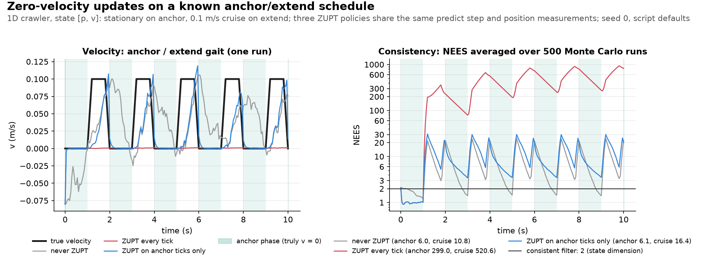

# Phase-conditional ZUPT: exploiting a known anchor/dwell schedule

## Intuition

An inchworm (real or robotic) doesn't move continuously - it cycles between two phases:

```text
ANCHOR                    EXTEND                     ANCHOR
(grip, hold still)   (release, push/pull body)   (grip again, hold still)

  ▓▓●━━━━━●            ▓▓●╲     ╱●--->              ●━━━━━●▓▓
   front anchored        body extends/stretches       new anchor set,
   to ground, v = 0      forward, then contracts       v = 0 again
```

*Illustrative: the toy itself is a point mass with a trapezoidal velocity.*

- **Anchor**: one end is planted on the ground, so that segment is, ideally, stationary ($v = 0$). In this toy the whole point mass stands still, so it's known ground truth.
- **Extend**: the anchor releases, the body pushes forward at some commanded speed, then the new end plants and grips.

The idea: during anchor, "velocity = 0" is a known, free measurement (a ZUPT, Zero-Velocity Update) that we can feed into the filter. It is valid only while we're still. Fed in during extend, it tells the filter something false with high confidence, which is the failure mode the `always` variant demonstrates.

The same idea is well established for foot-mounted pedestrian navigation (Foxlin 2005), where the shoe is still during each stance phase. For an inchworm robot, a sensor on the anchored segment gets up to three nearly free pieces of information while that segment is planted:

- **velocity ≈ 0**, a zero-velocity update (ZUPT);
- **angular rate ≈ 0**, a zero-angular-rate update (ZARU);
- **an accelerometer reading of gravity plus bias**, since the sensor isn't accelerating, which gives a tilt reference.

None of these holds during release and extend. Three caveats:

- **It applies to the anchored segment, not the whole robot.** In a real inchworm gait the rest of the body moves while one end is planted. This toy's point mass stands in for a sensor on the anchored segment.
- **"Stationary" is approximate.** Micro-slip and vibration mean the zero is never exact, so the ZUPT update below carries a noise $\sigma_{\text{zupt}}$ rather than being treated as exact.
- **Stillness isn't the only time the accelerometer sees just gravity.** Any unaccelerated motion does too. But only at rest do we know the velocity is zero without a motion model.

We work through the simplest concrete version using [`inchworm_zupt_ekf.py`](../../use_numpy/inchworm_zupt_ekf.py)'s 1D crawling point mass.


*Figure: the gait schedule at `use_numpy/inchworm_zupt_ekf.py`'s defaults, plotted by `uv run python assets/make_figures.py inchworm_zupt_ekf_concept`.*

**Scope**: this is deliberately a small slice of the real idea.

- It models translation only: ZUPT, not ZARU, which needs gyro-bias and orientation states this toy doesn't carry.
- It assumes the gait schedule (when anchor/extend happen) is *known*, not detected. What happens once the schedule itself is uncertain is the subject of [`hybrid_saltation_ekf.md` §8](hybrid_saltation_ekf.md#8-quantifying-contact-detection-timing-jitter), which we lean on rather than repeat.

---

## 1. Why this isn't a hybrid-reset problem

Unlike the bouncing point mass in `hybrid_saltation_ekf.md`, nothing here needs a guard, a reset map, or a saltation matrix. Velocity is externally commanded per phase - an ordinary **switched-linear system**, not a discontinuous *state* jump the filter's covariance has to be linearized through. The interesting question sits on the **measurement** side: does the filter exploit (or misuse) the zero-velocity information the anchor phase provides?

State is $x = [p, v]$ (1D). The gait cycle alternates:

- **anchor** (duration $t_{\text{anchor}}$): the point mass is exactly stationary, $v = 0$.
- **extend** (duration $t_{\text{extend}}$): the point mass ramps up to a commanded cruise speed $v_{\text{extend}}$, holds it, then ramps back down to exactly $0$ before the next anchor phase begins - continuous everywhere, no instantaneous jump (§2 explains why).

We compare three ways of using the ZUPT pseudo-measurement, sharing an identical predict step and the same noisy position measurement every tick - they differ *only* in when an additional ZUPT update runs:

| Variant | ZUPT applied when |
| --- | --- |
| `never` | Never - position-only, ignores the anchor phase entirely |
| `always` | Every tick, regardless of true phase - the schedule-unaware mistake |
| `phase_conditional` | Only on ticks the known schedule marks as anchor - the correct policy |

### 1.1 The filter math, concretely

All three variants run the same Kalman filter over $x = [p, v]^\top$. The script calls it an EKF to match the rest of this repo, but every model here is exactly linear, so there is no linearization error and it is really a plain KF. Each tick runs up to three steps, in this order: **predict**, **position update**, then (depending on the variant) a **ZUPT update** (`run_ekf`).

**Predict** (`predict`): a constant-velocity model, identical for all variants and both gait phases. The filter doesn't know the commanded velocity, only that it's roughly constant between ticks:

```math
\Phi = \begin{bmatrix} 1 & \Delta t \\ 0 & 1 \end{bmatrix}, \qquad
Q = \begin{bmatrix} \left(\tfrac{1}{2}\sigma_{\text{process}}\Delta t^2\right)^2 & 0 \\ 0 & \left(\sigma_{\text{process}}\Delta t\right)^2 \end{bmatrix}
```

```math
x^{-} = \Phi\,x, \qquad P^{-} = \Phi\,P\,\Phi^\top + Q
```

Superscripts mark the step: $x^-$, $P^-$ are predicted (before the update) and $x^+$, $P^+$ are updated ([kf_ekf_iekf.md §1](kf_ekf_iekf.md#1-standard-kalman-filter-everything-is-nicely-linear)).

$Q$ is a simple diagonal heuristic (the same formula as in `saltation_matrix_ekf.py`), not the textbook continuous white-noise-acceleration $Q$, which also has off-diagonal terms.

**Measurement updates** (`_kf_update`): both updates go through the same standard linear-Gaussian update and differ only in $z$, $H$ and $R$:

$$
r = z - H x^{-}, \qquad S = H P^{-} H^\top + R, \qquad K = P^{-} H^\top S^{-1}
$$

```math
x^{+} = x^{-} + K r, \qquad P^{+} = (I - K H)\,P^{-}
```

| Update | Function | $z$ | $H$ | $R$ | Runs |
| --- | --- | --- | --- | --- | --- |
| Position | `measurement_update_position` | noisy position reading | $`\begin{bmatrix} 1 & 0 \end{bmatrix}`$ | $`\sigma_{\text{pos}}^2`$ | every tick |
| ZUPT | `measurement_update_zupt` | $0$ (pseudo-measurement) | $`\begin{bmatrix} 0 & 1 \end{bmatrix}`$ | $`\sigma_{\text{zupt}}^2`$ | depends on the variant |

ZUPT is a *pseudo*-measurement: no sensor produces that $z = 0$. The filter is simply told "velocity is zero, give or take $\sigma_{\text{zupt}}$", which is only true if the robot really is stationary. The script's defaults are $\sigma_{\text{pos}} = 0.02$ m and $\sigma_{\text{zupt}} = 0.01$ m/s. Because the two measurement noises are independent, running the ZUPT update right after the position update in the same tick gives the same result as one joint update with both rows of $H$ stacked.

**The ZUPT update, written out.** With $`H = \begin{bmatrix} 0 & 1 \end{bmatrix}`$ everything reduces to scalars. Write the predicted covariance as

```math
P^{-} = \begin{bmatrix} P_{pp} & P_{pv} \\ P_{pv} & P_{vv} \end{bmatrix}
\quad\Longrightarrow\quad
S = P_{vv} + R_{\text{zupt}}, \qquad
K = \frac{1}{P_{vv} + R_{\text{zupt}}} \begin{bmatrix} P_{pv} \\ P_{vv} \end{bmatrix}, \qquad
r = 0 - v^{-} = -v^{-}
```

Substituting into the update above:

```math
v^{+} = \frac{R_{\text{zupt}}}{P_{vv} + R_{\text{zupt}}}\,v^{-}, \qquad
p^{+} = p^{-} - \frac{P_{pv}}{P_{vv} + R_{\text{zupt}}}\,v^{-}
```

```math
P_{vv}^{+} = \frac{P_{vv}\,R_{\text{zupt}}}{P_{vv} + R_{\text{zupt}}}, \qquad
P_{pp}^{+} = P_{pp} - \frac{P_{pv}^2}{P_{vv} + R_{\text{zupt}}}
```

Three things follow directly from these formulas:

- **It shrinks velocity toward zero.** The velocity estimate is multiplied by a factor between 0 and 1. The more the filter already trusts its velocity estimate (small $P_{vv}$) relative to the pseudo-measurement, the less it moves; the more uncertain it is, the harder it is pulled to $0$.

- **It corrects position too, through the cross-covariance.** $P_{pv}$ is how the filter has learned that position and velocity errors move together. If the velocity estimate turns out too high, the position estimate has probably drifted ahead too, so $p$ gets pulled back as well (for positive $P_{pv}$). This is how a velocity-only pseudo-measurement also affects position.

- **It always makes the filter more confident, whether or not the claim is true.** $P_{vv}^{+}$ is always smaller than both $P_{vv}$ and $R_{\text{zupt}}$. Nothing in the update checks whether the robot is stationary. So when `always` applies it during extend, the filter reports a velocity standard deviation of at most 0.01 m/s while the true velocity is up to $v_{\text{extend}} = 0.1$ m/s away from the zero it was just told. That built-in overconfidence drives the large `always` NEES values in §3.

---

## 2. Choosing the ramp: a step jump is an unmodeled acceleration

A true step in velocity ($0$ during anchor, $v_{\text{extend}}$ the instant extend begins) is an unmodeled acceleration spike at every phase transition, the same mechanism as in §3. The predict step's constant-velocity model with a finite process-noise budget can't represent it. So `true_velocity` ramps linearly over a $t_{\text{ramp}}$ window at each end of the extend phase, and velocity is continuous everywhere.

A ramp only helps if it is gentle enough. The rule: compare the true ramp acceleration $v_{\text{extend}} / t_{\text{ramp}}$ with $\sigma_{\text{process}}$, the filter's assumed acceleration disturbance. That ratio measures the mismatch.

| Case | $t_{\text{ramp}}$ | $v_{\text{extend}}$ | $\sigma_{\text{process}}$ | Ratio |
| --- | --- | --- | --- | --- |
| Bad ratio (illustration) | 0.1 s | 0.2 m/s | 0.05 m/s² | $40\times$ |
| Current defaults ($t_{\text{extend}} = 1.0$ s) | 0.2 s | 0.1 m/s | 0.15 m/s² | $\sim 3.3\times$ |

**Intuition:** the ratio counts how many times larger than its assumed disturbance the real acceleration is.
- $\sigma_{\text{process}}$ is an acceleration standard deviation (m/s²): the size of surprise the filter expects.
- At the defaults the ramp accelerates at $`0.1/0.2 = 0.5`$ m/s², against $`0.15`$ m/s² assumed.
- $`0.5/0.15 \approx 3.3`$: each ramp is about 3.3 "standard surprises", not 1.
- The bad-ratio row is the same idea, at $`40`$ standard surprises.

The defaults' $t_{\text{extend}}$ gives 12 cruise and 20 anchor ticks, enough to settle before being measured. The $40\times$ case is far worse, but $3.3\times$ is still a real mismatch, not a negligible one: §3 shows it sets every variant's NEES level and drives the `never`-vs-`phase_conditional` comparison.

The lesson matches the Zeno-regime pitfall in [`hybrid_saltation_ekf.md` §7](hybrid_saltation_ekf.md#7-two-things-worth-knowing-before-reusing-this-pattern): pick simulation parameters with real margin under a hard failure mode, not by trial against the first numbers that come out.

The headline NEES comparison below excludes the ramp ticks themselves (`is_cruise` excludes them, matching `is_anchor`'s own definition). They are a shared transition cost all three variants pay alike, not the phenomenon being measured, the same convention `hybrid_saltation_ekf.md` uses for its shared bounce-tick spike.

---

## 3. The finding: not just "always is wrong while moving"

One might expect `always` to match `phase_conditional` during genuine anchor ticks (both apply the identical, correct update there) and diverge only during motion. It doesn't (seeds 0-3, `n_trials=500`, mean NEES over the cruise-only/anchor-only windows):

**Intuition (per-tick scale, at the defaults $`\Delta t = 0.05`$ s):** the truth changes speed faster than the filter expects.
- During a ramp the speed really changes by $`0.5 \times 0.05 = 0.025`$ m/s per tick.
- The filter's process noise allows only $`0.15 \times 0.05 = 0.0075`$ m/s per tick (the $`\sigma_{\text{process}}\Delta t`$ in $Q$). That is $3.3\times$ too small.
- A confident ZUPT adds to the gap: after each update the filter claims $`\sigma_v \le 0.01`$ m/s, so the real change is about $2.5\times$ that claim.
- Confident and under-sized: that is why the NEES below is too high. This is a per-tick scale, not the exact NEES.



*Figure: `use_numpy/inchworm_zupt_ekf.py` at its defaults (seed 0), plotted by `uv run python assets/make_figures.py inchworm_zupt_ekf`.*

| Variant | anchor-only NEES | cruise-only NEES | velocity RMS (single run) |
| --- | --- | --- | --- |
| `never` | ~6.0 | ~10.8 | ~0.055-0.060 m/s |
| `always` | ~299 | ~521 | ~0.060 m/s |
| `phase_conditional` | ~6.1 | ~16.4 | ~0.043-0.045 m/s |

A consistent 2-DoF filter averages $\text{NEES} = 2$; for an average over 500 trials the 95% interval is about $[1.83, 2.18]$. None of the three is consistent: the three non-`always` windows (6.0-16.4) sit at ~3-8× that value.

**Why every variant is overconfident: the ramps.** The truth has no random disturbance at all. Its only departure from the filters' constant-velocity model is the ramp acceleration, $`v_{\text{extend}}/t_{\text{ramp}} = 0.5\,\text{m/s}^2`$, against the assumed $`\sigma_{\text{process}} = 0.15\,\text{m/s}^2`$ (the $3.3\times$ of §2). Two checks at seed 0 confirm this is the whole story:

| Setting | `never` anchor/cruise | `phase_conditional` anchor/cruise |
| --- | --- | --- |
| Defaults | 6.0/10.8 | 6.1/16.4 |
| No motion ($`v_{\text{extend}} = 0`$) | 1.1/1.0 | 0.8/0.7 |
| $`\sigma_{\text{process}} = 0.5\,\text{m/s}^2`$ (covers the ramps) | 1.4/1.6 | 0.9/1.7 |

- With no motion, every variant is at or below 2 (conservative, since the filters assume noise the truth doesn't have).
- With $\sigma_{\text{process}}$ large enough to cover the ramps, `never` and `phase_conditional` are close to consistent, slightly conservative: all four windows (0.9-1.7) fall below the interval's lower edge of 1.83.

**`always` is dramatically worse everywhere, not just during motion.** Misapplying ZUPT throughout every cruise phase drives the velocity variance artificially tight around a wrong belief. About 20 ticks of correct ZUPT evidence at the start of the next anchor phase can't undo that before the phase ends, so the corruption bleeds into the next cycle and compounds:

- `always`'s NEES at the first tick of anchor phases 2-5 (seed 0; phase 1 precedes any cruise, so it's still ~2 there) is 230, 564, 732, then 798, and within phase 4 it decays only from 732 to 266.
- `phase_conditional`'s starts near 20 and settles near 3.6 in each of those phases.
- `always` gets no accuracy benefit for the trouble. Its velocity RMS (~0.060 m/s) matches `never`'s, and its position RMS is far worse (0.060-0.062 m vs. `never`'s 0.011-0.015 m, single runs, seeds 0-3), while it is overconfident throughout.

**A second finding, and what actually causes it.** At the defaults, `phase_conditional` has the best *velocity* accuracy of the three, but not the best position accuracy or calibration:

- RMS position error (seeds 0-3): `never` 0.0107-0.0147 m vs. `phase_conditional` 0.0157-0.0184 m, worse in every seed.
- Cruise-window NEES: `never` ~10.8 vs. `phase_conditional` ~16.4.

The per-tick NEES shows the mechanism. By the end of an anchor phase, ZUPT has made `phase_conditional` very confident in its velocity (NEES about 3.5). Then the ramp-up arrives with an acceleration its process model doesn't allow for, and the more confident filter is hit harder: at the end of the ramp its NEES jumps to about 30, against about 25 for `never`, and it stays higher through the cruise. The lag in velocity also drags its position.

So this is a property of the under-sized process model, not of ZUPT. With $`\sigma_{\text{process}} = 0.5\,\text{m/s}^2`$, the finding reverses: `phase_conditional` is consistent and also the most accurate in position (0.0087 m vs. `never`'s 0.0123 m at seed 0). The general lesson is narrower than "trusting a pseudo-measurement is fragile": **an accurate pseudo-measurement makes an unmodeled disturbance hurt more**, because it removes the slack that would otherwise absorb it.

---

## 4. Takeaway for a real phase-gated measurement update

This toy's `never`/`always`/`phase_conditional` split is a minimal stand-in for a general design question in any estimator that fuses a phase-dependent pseudo-measurement: **gate which measurement terms are active by phase within the single update**, rather than applying them unconditionally or leaving them out for simplicity. The payoff is real: clearly better velocity tracking, and a mild failure mode (its worst window, 16.4, is ~30× below `always`'s 521). But it holds only once the rest of the model is sized honestly, especially at the transitions where the constraint switches on and off. Check calibration there rather than assuming a correctly gated filter wins everywhere (§3: gating bugs spill into the next phase, and a gated, confident filter has less slack for model error).

---

## 5. References

1. Foxlin, E. (2005). *Pedestrian Tracking with Shoe-Mounted Inertial Sensors*. IEEE Computer Graphics and Applications, 25(6), 38-46. https://doi.org/10.1109/MCG.2005.140 - foot-mounted inertial navigation with zero-velocity updates; the basis of this doc's `never`/`always`/`phase_conditional` split, there gated by a stance-phase detector rather than this toy's known anchor/extend schedule.
2. Lubbe, E., Withey, D., & Uren, K. R. (2015). *State Estimation for a Hexapod Robot*. 2015 IEEE/RSJ International Conference on Intelligent Robots and Systems (IROS), 6286-6291. https://doi.org/10.1109/IROS.2015.7354274 - state estimation for a physical hexapod robot, a larger-scale setting related to the one §4 discusses; its method is not reproduced here.
3. Liu, Y., Gao, H., Ding, L., Liu, G., Deng, Z., & Li, N. (2018). *State Estimation of a Heavy-Duty Hexapod Robot with Passive Compliant Ankles Based on the Leg Kinematics and IMU Data Fusion*. Journal of Mechanical Science and Technology, 32(8), 3885-3897. https://doi.org/10.1007/s12206-018-0741-4 - leg-kinematics and IMU fusion on a heavy-duty hexapod with passive compliant ankles, a much less idealized contact setting than this toy's stationary anchor phase.
4. Khalili, H. H., Cheah, W., Garcia-Nathan, T. B., Carrasco, J., Watson, S., & Lennox, B. (2020). *Tuning and Sensitivity Analysis of a Hexapod State Estimator*. Robotics and Autonomous Systems, 129, 103509. https://doi.org/10.1016/j.robot.2020.103509 - tuning and sensitivity analysis of a hexapod state estimator; related in spirit to §3's lesson that the process noise has to be sized honestly before the gating comparison means anything.
