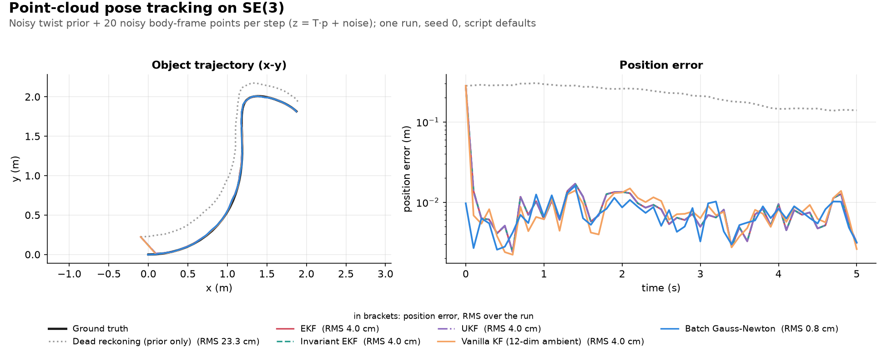

# EKF vs. IEKF vs. UKF vs. vanilla KF in `pointcloud_pose_tracking.py`: what is identical and what isn't

Applies to both [`use_numpy/pointcloud_pose_tracking.py`](../../use_numpy/pointcloud_pose_tracking.py) and [`use_manif/pointcloud_pose_tracking.py`](../../use_manif/pointcloud_pose_tracking.py), which implement four ways to turn the same predicted point-cloud measurements into a pose correction: `run_ekf`, `run_iekf`, `run_ukf`, `run_vanilla_kf`. "They all give similar numbers" hides three different facts on this benchmark:

- **EKF and IEKF are identical** (position and rotation agree to ~1e-14, i.e. floating-point round-off) - a proven property of this problem setup, not a coincidence (§2).
- **UKF is close to both, but is a different algorithm and does not match to round-off.** Its largest disagreement (~1.4 mm) is at the first update, while the filters correct the initial pose error; after that it settles to micrometers (~4e-6 to 2e-5 m at the default step) and grows with the step size, as the mechanism predicts (§3).
- **Vanilla KF is neither identical to nor merely "close" to the other three.** It changes the state representation, not the linearization, residual frame, or sampling scheme. Its gap is ~1-4 mm at the defaults (final vs. max after 1 s) and comes mainly from a first-order truncation of the motion step, so it shrinks roughly in proportion to $\Delta t$ (§4).

We keep the three claims separate and explain the mechanism behind each.

---

## 1. The setup

- **State**: a single rigid pose $T \in SE(3)$.
- **Motion model**: $`T_{\text{pred}} = T_{\text{prev}}\exp(u\,\Delta t)`$ - constant body-frame twist $u$ over a step of length $\Delta t$. Composing with this known relative motion makes the state-error propagation exact (the noise still enters to first order, §1.1).
  - This is the simplest **group-affine** system (right-multiplication by a known group element, listed by Barrau & Bonnabel 2017, Remark 1 [2]); IMU position/velocity/attitude propagation is a richer example of the same class.
  - EKF, IEKF and UKF all use it exactly; **vanilla KF does not**, it only approximates the composition (§4.2).
  - This is context, not part of the EKF/IEKF equivalence argument (§2.2).
- **Observation model**: a fixed body-frame point cloud $p_i$, observed as $z_i = T\cdot p_i + \text{noise}$ ($T\cdot p_i$ is the pose applied to a point, `T.act(p_i)` in code), with **isotropic** Gaussian noise ($R = \sigma^2 I$, same variance in every direction, uncorrelated across x/y/z).

All four filters run the same two-step loop at every time step: **predict** the pose from the known twist $u$, then **update** it with the point-cloud measurement. They differ in *which* step they change and *how*, so we compare them one step at a time.

**Predict - where the pose is propagated forward.** EKF, IEKF and UKF all use the exact motion model above on the minimal 6-dim $SE(3)$ tangent state; only vanilla KF changes it.

- **EKF and IEKF**: identical code. The covariance goes through the motion model's Jacobians. Because the motion is group-affine, the state-error term $J_{\text{self}}$ is exact; the noise term $J_\tau Q J_\tau^\top$ is first order in the input noise.
- **UKF**: no Jacobians. Sigma points sampled around the current estimate are retracted onto $SE(3)$, pushed through the same exact `motion_model`, and recombined into a predicted covariance (equations in §1.1).
- **Vanilla KF**: the odd one out. It never calls `motion_model`; instead it swaps the pose for a redundant 12-dim ambient state $`x = [\text{vec}(R) \in \mathbb{R}^9,\ t \in \mathbb{R}^3]`$ (with $\text{vec}$ taken **row-major**, as `R.flatten()` does - see §1.1) and propagates it with a fixed linear transition matrix. That matrix is only exact for the first-order truncation $`\exp(\omega^\wedge) \approx I + \omega^\wedge`$ of the motion step - the main source of its gap (§4).

**Update - where the measured points correct the predicted pose.** Every filter compares the measured points $z_i$ with the predicted ones $T_{\text{pred}}\cdot p_i$ and turns the mismatch into a correction; they differ in the frame and the tool used for that comparison.

**Intuition for $`H = [I \;\; -p^\wedge]`$ below (tiny example, $\sigma_p = 0.03$ m default):**
- The $I$ block is a shift: moving the pose by $t$ moves every point by the same $t$.
- The $`-p^\wedge`$ block is a rotation: it moves a point in proportion to its distance from the pose origin.
- A point $0.5$ m away, rotated by $0.02$ rad, moves $`0.5 \times 0.02 = 0.01`$ m (1 cm). A point at the origin does not move.
- Compare 1 cm with the 3 cm point noise: far points feel a small rotation more than near points do.

- **EKF**: residual and Jacobian in the **world frame**: $r_{\text{world}} = z_i - T_{\text{pred}}\cdot p_i$, $`H_{\text{world}} = R_{\text{pred}}\left[I \;\; -p_i^\wedge\right]`$. $H$ depends on the current rotation estimate $R_{\text{pred}}$, so it is rebuilt every step.
- **IEKF**: the same comparison pulled into the **object's own body frame**: $r_{\text{body}} = T_{\text{pred}}^{-1}\cdot z_i - p_i$, $`H_{\text{body}} = \left[I \;\; -p_i^\wedge\right]`$. $H$ now depends only on the object's known geometry, so it is fixed and precomputed once. This residual is **left-invariant**: redefining the world frame (left-multiplying both the true and the estimated pose by the same fixed transform) doesn't change it. The measurement shape $h(T) = T\cdot p_i$ is the $`X b`$ row of [left_right_invariant.md §4](left_right_invariant.md#4-why-it-actually-matters-not-just-bookkeeping)'s table, which pairs with the left-invariant choice.
- **UKF**: no Jacobian. Fresh sigma points around the predicted pose are pushed through the exact `observation_model`, and their spread gives the gain directly (equations in §1.1).
- **Vanilla KF**: in the 12-dim state the observation model is exactly linear, $`\text{pred}_i = R\,p_i + t`$, so $H$ is fixed and built once (it still builds $J(R)$ and $A$ every step, §4.5) - stronger than IEKF's still-$`SE(3)`$-flavored fixed $H$. The catch: nothing keeps $\text{vec}(R)$ orthonormal, so after every update it is re-projected onto $SO(3)$ via SVD (§4).

**Putting the two steps together:** EKF and IEKF share the predict step and differ only in the frame the update is linearized in - two algebraically related linearizations of the same model, which is why they can be proven identical (§2). UKF avoids linearizing in either step, so it can only be shown to be *close* (§3). Vanilla KF changes the state representation itself, which touches both steps (§4).


*Figure: the setup and the two residual frames at `use_numpy/pointcloud_pose_tracking.py`'s defaults (seed 0), plotted by `uv run python assets/make_figures.py pose_tracking_concept`.*



*Figure: `use_numpy/pointcloud_pose_tracking.py` at its defaults (seed 0), plotted by `uv run python assets/make_figures.py pose_tracking`.*

### 1.1 The filter math, concretely

This section maps each piece of math to the function in [`use_numpy/pointcloud_pose_tracking.py`](../../use_numpy/pointcloud_pose_tracking.py) that computes it. Lie-group helpers live in [`use_numpy/lie_utils.py`](../../use_numpy/lie_utils.py), and the UKF helpers live in [`utils.py`](../../utils.py). The `use_manif` version implements the same math with the `manif` library.

#### Conventions

A pose $T$ is a $4\times4$ matrix with rotation $R$ and translation $t$. A tangent vector is $`\xi = [v, \omega]`$, translation first. $\mathrm{Exp}$/$`\mathrm{Log}`$ are `se3_exp`/`se3_log`, and $a^\wedge$ is `skew(a)`. Every method except the vanilla KF perturbs and corrects on the right: $`T \leftarrow T\,\mathrm{Exp}(\delta)`$. `se3_log` returns zero rotation when the angle is below $10^{-6}$ rad (its small-angle branch). Superscripts mark the step: $T^-$, $P^-$ are the predicted pose and covariance ($T_{\text{pred}}$ in §1), and $T^+$, $P^+$ are the corrected ones.

#### Data and noise (`generate_ground_truth_and_data`, `main`)

The true twist $`u^{\text{true}}_k = [v, \omega]`$ comes from `true_body_rates(k*dt)`. The true pose starts at $T_0 = I$ and follows $`T_{k+1} = T_k\,\mathrm{Exp}(u^{\text{true}}_k\Delta t)`$, using the same `motion_model` the filters use. The filters receive $`u_k = u^{\text{true}}_k + n_k`$ with $`n_k \sim \mathcal N(0, Q_{\text{rate}})`$. The $M$ body points $p_i$ are drawn uniformly in $[-0.5, 0.5]^3$ (`make_body_point_cloud`). The measurements are $`z_{k,i} = T_k p_i + \nu`$ with $`\nu \sim \mathcal N(0, \sigma_p^2 I_3)`$, for $k = 0..N$. The filters use the generator's own noise levels, so $Q$ is matched to the data, not tuned:

```math
Q_{\text{rate}} = \mathrm{diag}(\sigma_v^2 I_3,\ \sigma_\omega^2 I_3), \qquad
Q = Q_{\text{tangent}} = \Delta t^2\, Q_{\text{rate}}, \qquad
R_{\text{diag}} = \sigma_p^2 I_{3M}
```

**Why $\Delta t^2$.** A velocity error held for one step becomes a pose error: 0.05 m/s for 0.1 s is 0.005 m.

- Std scales with $\Delta t$, so covariance scales with $\Delta t^2$: $`\mathrm{Cov}(n_k\Delta t) = \Delta t^2\,\mathrm{Cov}(n_k)`$.
- The same factor turns $`(\text{m/s})^2`$, $`(\text{rad/s})^2`$ into the pose's m², rad².

**Smaller `--dt` → less drift.** Independent step errors partly cancel, so the total grows like $`\sqrt{N}`$, not $N$. A 10× smaller step means 10× smaller errors but only $`\sqrt{10}`$× more steps' worth of accumulation. With the defaults ($\sigma_v$ = 0.05 m/s, 5 s, velocity noise only, first order), the accumulated figure is a per-axis std:

| `--dt` | $N$ | Per step | Accumulated per axis, $`\sqrt{N}\,\sigma_v\Delta t`$ |
| --- | --- | --- | --- |
| 0.1 s | 50 | 0.005 m | ≈ 0.035 m |
| 0.01 s | 500 | 0.0005 m | ≈ 0.011 m |

**Why not the textbook $`Q \approx Q_c\,\Delta t`$.** It depends on how the sensor behaves:

- **This simulator**: every reading has the same std, however fast we sample → $\Delta t^2$, the matched choice here (not a bug).
- **Continuous white noise** (how IMU datasheets specify it, per $`\sqrt{\text{Hz}}`$): faster sampling means noisier readings, std $`\propto 1/\sqrt{\Delta t}`$ → $Q \propto \Delta t$, and drift doesn't depend on `--dt`. So this simulator makes a smaller `--dt` look better than real hardware would.

Every method starts from the same guess, $`T_0^{\text{est}} = T_0\,\mathrm{Exp}(\varepsilon)`$ with $\varepsilon \sim \mathcal N(0, \sigma_0^2 I_6)$, and $P_0 = \sigma_0^2 I_6$. The four filters run in the same order each step: predict with $u_k$, then update with $z_{k+1}$. They never use $z_0$. Batch GN uses all of $z_0..z_N$.

| Argument | Symbol | Default |
| --- | --- | --- |
| `--dt`, `--duration` | $\Delta t$, $N$ | 0.1 s, 5 s ($N = 50$ steps, 51 poses) |
| `--n-points` | $M$ | 20 |
| `--vel-noise-std`, `--gyro-noise-std` | $\sigma_v$, $\sigma_\omega$ | 0.05 m/s, 0.02 rad/s |
| `--point-noise-std` | $\sigma_p$ | 0.03 m |
| `--init-pose-noise-std` | $\sigma_0$ | 0.1 |
| `--ukf-alpha`, `--ukf-beta`, `--ukf-kappa` | $\alpha, \beta, \kappa$ | 1.0, 2.0, -3.0 |
| `--gn-tol`, `--gn-max-iters` | | 1e-6, 20 |

#### Motion model (`motion_model`)

This is used by dead reckoning, EKF, IEKF, UKF and GN. With $w = u\Delta t$:

```math
T^- = T\,\mathrm{Exp}(w), \qquad
J_{\text{self}} = \mathrm{Ad}_{\mathrm{Exp}(-w)}, \qquad
J_\tau = J_r(w)
```

```math
\mathrm{Ad}_T = \begin{bmatrix} R & t^\wedge R \\ 0 & R \end{bmatrix}, \qquad
J_r(\xi) = \sum_{n=0}^{17} \frac{(-\mathrm{ad}_\xi)^n}{(n+1)!}, \qquad
\mathrm{ad}_\xi = \begin{bmatrix} \omega^\wedge & v^\wedge \\ 0 & \omega^\wedge \end{bmatrix}
```

$\mathrm{Ad}$ is `se3_adjoint`. $J_r$ is `se3_right_jacobian`, which sums the series to 18 terms instead of using a closed form. $J_r^{-1}$ (`compute_se3_inv_right_jacobian`) is the matrix inverse of that series, not a separate formula. $J_{\text{self}}$ is exact, because $`T\,\mathrm{Exp}(\delta)\,\mathrm{Exp}(w) = T\,\mathrm{Exp}(w)\,\mathrm{Exp}(\mathrm{Ad}_{\mathrm{Exp}(-w)}\delta)`$.

**Intuition for $J_{\text{self}} = \mathrm{Ad}_{\mathrm{Exp}(-w)}$ in the covariance predict:** it only re-expresses the old uncertainty in the new body frame.
- Toy case: "30 cm of uncertainty ahead" becomes "30 cm to my left" after I turn 90° right.
- The uncertainty is the same size. Only its axes are relabelled.
- So $`\mathrm{Ad}`$ rotates the covariance. It does not resize it. The noise term $Q$ is what adds new uncertainty.

#### Dead reckoning (`run_dead_reckoning`)

Applies $`T_{k+1} = T_k\,\mathrm{Exp}(u_k\Delta t)`$ only. Its trajectory is also batch GN's initial guess.

#### EKF (`run_ekf`)

**Predict step.**

```math
P^- = J_{\text{self}}\, P\, J_{\text{self}}^\top + J_\tau\, Q\, J_\tau^\top
```

**Update step.** It stacks all $M$ points. `observation_model` returns $h_i(T) = R p_i + t$ and, for a right perturbation, $`H_i = [\,R \;\; -R\,p_i^\wedge\,]`$:

```math
r = z_{k+1} - h(T^-), \qquad S = H P^- H^\top + R_{\text{diag}}, \qquad K = P^- H^\top S^{-1}
```

```math
T^+ = T^-\,\mathrm{Exp}(K r), \qquad P^+ = (I - K H)\,P^-
```

The **covariance update** uses the simple $(I-KH)P^-$ form, not the Joseph form, and $S$ is inverted explicitly. $P^+$ is not transported by $J_r(Kr)$ after the retraction. This is a common simplification.

#### IEKF (`run_iekf`)

**Predict step.** The same as the EKF's.

**Update step.** It uses the body-frame residual and a fixed Jacobian, built once before the loop:

```math
r_i = (R^-)^\top (z_{k+1,i} - t^-) - p_i, \qquad H_i = \begin{bmatrix} I_3 & -p_i^\wedge \end{bmatrix}
```

Here $R^-$ and $t^-$ come from $T^-$, so $r_i = (T^-)^{-1} z_{k+1,i} - p_i$. The gain, the retraction $`T^+ = T^-\,\mathrm{Exp}(Kr)`$ and $P^+$ are the same as the EKF's. Under isotropic $R_{\text{diag}}$, the resulting correction $Kr$ and $P^+$ are identical to the EKF's (§2.2).

#### UKF (`run_ukf`, with `unscented_weights` and `unscented_sigma_offsets` from `utils.py`)

It works on the $n = 6$ tangent space and uses scaled sigma-point weights (the Van der Merwe parameterization $\alpha, \beta, \kappa$, which follows the scaled unscented transform):

$$
\lambda = \alpha^2 (n + \kappa) - n, \qquad
W^m_0 = \frac{\lambda}{n + \lambda}, \qquad
W^c_0 = W^m_0 + 1 - \alpha^2 + \beta, \qquad
W^m_i = W^c_i = \frac{1}{2(n + \lambda)}, \quad i = 1..2n
$$

The defaults give $\lambda = -3$, $n + \lambda = 3$, $W^m_0 = -1$, $W^c_0 = 1$ and $W_i = 1/6$. The negative central mean weight is intentional. The sigma offsets are $\chi_0 = 0$ and $\chi_i, \chi_{n+i} = \pm$ the $i$-th column of $L$. Here $L L^\top = (n+\lambda)(P_{\text{sym}} + 10^{-9} I)$, and $P_{\text{sym}}$ is the symmetrized $P$.

**Intuition:** the UKF replaces the Gaussian by a few stand-in points that have the same mean and covariance.
- Here $`n = 6`$, so there are $`2n + 1 = 13`$ points: the centre and $`\pm`$ one point per axis.
- The weights add up to 1: $`-1 + 12/6 = 1`$.
- Check the spread: each $`\pm`$ pair contributes $`2\cdot(1/6)\,L_jL_j^\top`$. Summed over the 6 columns this is $`(1/3)\,LL^\top = (1/3)(3P) = P`$ exactly.
- The centre point sits at $`\chi_0 = 0`$, so it adds nothing to that sum. Its negative weight is bookkeeping that makes the weights total 1.

**Predict step.** It pushes each retracted sigma point through the exact `motion_model` $f$. The predicted mean is sigma point 0's own propagation, $\bar T^- = f(T, u)$:

```math
\zeta_i = \mathrm{Log}\!\left( (\bar T^-)^{-1} f\big(T\,\mathrm{Exp}(\chi_i), u\big) \right), \qquad
P^- = Q + \sum_{i=0}^{2n} W^c_i\, \zeta_i \zeta_i^\top
```

$Q$ is added outside the sum ("additive-noise" UKF), and the $\zeta_i$ (each propagated sigma point's deviation from $\bar T^-$) are not re-centered on their weighted mean.

**Update step.** It draws fresh offsets $\chi_i$ from $P^-$ rather than reusing the predict-step points. It passes them through the exact `observation_model` $h$:

```math
Z_i = h\big(\bar T^-\,\mathrm{Exp}(\chi_i)\big), \qquad
\hat z = \sum_i W^m_i Z_i
```

```math
P_{zz} = R_{\text{diag}} + \sum_i W^c_i (Z_i - \hat z)(Z_i - \hat z)^\top, \qquad
P_{xz} = \sum_i W^c_i\, \chi_i (Z_i - \hat z)^\top
```

```math
K = P_{xz} P_{zz}^{-1}, \qquad
T^+ = \bar T^-\,\mathrm{Exp}\big(K (z_{k+1} - \hat z)\big), \qquad
P^+ = P^- - K P_{zz} K^\top
```

$P_{xz}$ uses $\chi_i$ directly. Their weighted mean is exactly zero because the offsets come in $\pm$ pairs.

#### Vanilla KF (`run_vanilla_kf`)

The state is $x = [\mathrm{vec}(R), t] \in \mathbb R^{12}$. Here $\mathrm{vec}$ is **row-major**, as `R.flatten()` computes it: $\mathrm{vec}(R) = [R_{11}, R_{12}, R_{13}, R_{21}, \dots, R_{33}]$. This is not the column-stacking $\mathrm{vec}$ common in textbooks. With this layout the observation model $z_i = R p_i + t$ is exactly linear. $H$ is built once:

```math
H_i = \begin{bmatrix} I_3 \otimes p_i^\top & I_3 \end{bmatrix}
= \begin{bmatrix} p_i^\top & 0 & 0 & 1 & 0 & 0 \\ 0 & p_i^\top & 0 & 0 & 1 & 0 \\ 0 & 0 & p_i^\top & 0 & 0 & 1 \end{bmatrix}
```

The transition matrix (`vanilla_kf_transition_matrix`) uses $\omega = u_\omega \Delta t$ and $v = u_v \Delta t$. It implements $R^- = R(I + \omega^\wedge)$ and $t^- = t + R v$, which is linear in $x$ for a known input:

```math
A = \begin{bmatrix} I_3 \otimes (I + \omega^\wedge)^\top & 0 \\ I_3 \otimes v^\top & I_3 \end{bmatrix}
```

This truncates the exact step in two places. $\mathrm{Exp}(\omega^\wedge) \approx I + \omega^\wedge$ for rotation, and $V(\omega) \approx I$ for translation, where the exact increment is $`R\,V(\omega)\,v`$ (§4.2). The noise lift (`se3_tangent_to_ambient_jacobian`) maps a right tangent perturbation at $R$ into the ambient space:

```math
J(R) = \begin{bmatrix} 0 & \big[\mathrm{vec}(R e_1^\wedge)\ \ \mathrm{vec}(R e_2^\wedge)\ \ \mathrm{vec}(R e_3^\wedge)\big] \\ R & 0 \end{bmatrix}
```

The columns are $[v, \omega]$ and the rows are $[\mathrm{vec}(R), t]$. The 6-dim initial covariance is lifted once, $`P_0 = J(R_0)\, P_0^{\text{tan}}\, J(R_0)^\top`$.

**Predict step.**

```math
x^- = A x, \qquad
P^- = A P A^\top + J(R)\, Q\, J(R)^\top
```

**Update step.** The textbook linear KF update:

```math
K = P^- H^\top (H P^- H^\top + R_{\text{diag}})^{-1}, \qquad
x^+ = x^- + K (z_{k+1} - H x^-), \qquad
P^+ = (I - K H) P^-
```

$J$ is evaluated at the pre-predict $R$. The lifted $P_0$ has rank 6. After each update, the rotation block is projected back onto $SO(3)$ with an SVD: $U \Sigma V^\top = \mathrm{svd}(R^+)$, and $`R \leftarrow U\,\mathrm{diag}(1, 1, s)\,V^\top`$ with $s = \mathrm{sign}\det(U V^\top)$. $t^+$ and $P^+$ are left unchanged by that projection.

#### Batch Gauss-Newton (`run_batch_gn`)

It optimizes all poses $T_0..T_N$ jointly ($6(N+1)$ unknowns) against three factor types. $\bar T_0$ is the shared initial guess $T_0^{\text{est}}$:

```math
F = \big\| e_0 \big\|^2_{P_0^{-1}} + \sum_{k=1}^{N} \big\| e_k \big\|^2_{Q^{-1}} + \sum_{k=0}^{N} \sum_{i=1}^{M} \frac{\big\| z_{k,i} - T_k p_i \big\|^2}{\sigma_p^2}
```

```math
e_0 = \mathrm{Log}(\bar T_0^{-1} T_0), \qquad
e_k = \mathrm{Log}\Big( \big(T_{k-1}\,\mathrm{Exp}(u_{k-1}\Delta t)\big)^{-1} T_k \Big)
```

The Jacobians are taken with respect to right perturbations of each pose:

```math
\frac{\partial e_0}{\partial T_0} = J_r^{-1}(e_0), \qquad
\frac{\partial e_k}{\partial T_k} = J_r^{-1}(e_k), \qquad
\frac{\partial e_k}{\partial T_{k-1}} = -J_r^{-1}(-e_k)\, \mathrm{Ad}_{\mathrm{Exp}(-u_{k-1}\Delta t)}, \qquad
\frac{\partial (z_{k,i} - T_k p_i)}{\partial T_k} = -\begin{bmatrix} R_k & -R_k p_i^\wedge \end{bmatrix}
```

Each iteration solves the damped normal equations. It then updates every pose with $`T_k \leftarrow T_k\,\mathrm{Exp}(\delta_k)`$ and stops when $\lVert\delta\rVert$ drops below `gn_tol` or after `gn_max_iters`:

```math
\Big( \sum J^\top \Omega J + 10^{-6} I \Big)\, \delta = -\sum J^\top \Omega\, e
```

There is no line search or Levenberg-Marquardt schedule. It starts from the dead-reckoning trajectory, and with the defaults it converged in 5 iterations. The motion factor uses $Q$ directly as the covariance of $e_k$. It does not use the EKF predict's $J_\tau Q J_\tau^\top$.

#### Error metrics (`pose_errors`, `rotation_geodesic_error`)

- The **rotation error** is the angle $\theta$ of the relative rotation $`W = R^\top \hat R`$, in degrees. It is computed as $`\mathrm{atan2}(s, c)`$, where $`c = (\mathrm{tr}\,W - 1)/2 = \cos\theta`$ is read off the symmetric part of $W$ and $`s = \tfrac12 \lVert (W - W^\top)^\vee \rVert = \sin\theta`$ off its skew part. Unlike $\arccos(c)$, this stays accurate for tiny angles, down to round-off. The `use_manif` version computes the same angle as $`\lVert \hat R\ \text{rminus}\ R \rVert`$, and manif's $SO(3)$ $\mathrm{Log}$ also uses `atan2`, so the same accuracy holds there.
- The **position error** is $\lVert t - \hat t \rVert$.

"Final" is the error in the last pose, whereas "RMS" is calculated over all $N+1$ poses, including $k = 0$. At $k = 0$ the five recursive methods (dead reckoning, EKF, IEKF, UKF, vanilla KF) all still sit at the initial guess, so they share the same initial error in their RMS, while batch GN already re-optimizes $T_0$. Small RMS gaps between GN and the recursive filters therefore partly reflect this difference at $k = 0$.


---

## 2. EKF vs. IEKF: exact, by construction

### 2.1 Intuitive explanation

Both filters answer the same question - "how far off is my predicted point cloud, and what pose correction explains the gap?" - and only *describe* the mismatch in different axes. Take a 2 cm mismatch with the object's nose pointing 45° south of east:

- **EKF** describes it in world axes: "2 cm east".
- **IEKF** describes the same arrow in the object's axes: "1.4 cm toward the nose and 1.4 cm to its left" (since $1.4^2 + 1.4^2 \approx 2^2$).

Converting between them applies the current rotation estimate, a rigid relabeling of axes that preserves lengths. If both the *error* and the *sensitivity* (how a pose tweak moves the points) are converted consistently, the correction we get back is the same: it is the same arrow described in different axes.

The one thing that could break this is measurement noise that "looks different" depending on the direction we face (e.g. a sensor noisier sideways than in depth). Here the noise is **isotropic**, a sphere of uncertainty around each point, and a sphere looks the same however we rotate it. That is the ingredient that makes the two filters land on identical corrections (to round-off) every step: $`R\,(\sigma^2 I)\,R^\top = \sigma^2 I`$ for any rotation $R$.

### 2.2 The algebra

Per point $p_i$:

```math
r_{\text{body},i} = T_{\text{pred}}^{-1}\cdot z_i - p_i = R_{\text{pred}}^\top\big(z_i - T_{\text{pred}}\cdot p_i\big) = R_{\text{pred}}^\top\, r_{\text{world},i}
```

```math
H_{\text{world}} = R_{\text{pred}}\,H_{\text{body}}
```

Stack over all $M$ points; let $R_{\text{big}}$ = block-diagonal repeat of $R_{\text{pred}}$, $M$ times (still orthogonal). Then $r_{\text{body}} = R_{\text{big}}^\top r_{\text{world}}$ and $`H_{\text{world}} = R_{\text{big}}\,H_{\text{body}}`$. Push this through the Kalman update:

```math
\begin{aligned}
S_{\text{world}} &= H_{\text{world}}\,P\,H_{\text{world}}^\top + R_{\text{diag}} \\ 
&= R_{\text{big}}\big(H_{\text{body}}\,P\,H_{\text{body}}^\top + R_{\text{diag}}\big)R_{\text{big}}^\top && \text{needs } R_{\text{big}}\,R_{\text{diag}}\,R_{\text{big}}^\top = R_{\text{diag}} \\ 
&= R_{\text{big}}\,S_{\text{body}}\,R_{\text{big}}^\top \\ 
K_{\text{world}} &= P\,H_{\text{world}}^\top S_{\text{world}}^{-1} \\ 
&= P\,H_{\text{body}}^\top R_{\text{big}}^\top\big(R_{\text{big}}\,S_{\text{body}}\,R_{\text{big}}^\top\big)^{-1} \\ 
&= K_{\text{body}}\,R_{\text{big}}^\top \\ 
\delta_{\text{world}} &= K_{\text{world}}\,r_{\text{world}} = K_{\text{body}}\,R_{\text{big}}^\top r_{\text{world}} = K_{\text{body}}\,r_{\text{body}} = \delta_{\text{body}}
\end{aligned}
```

The step $`R_{\text{big}}\,R_{\text{diag}}\,R_{\text{big}}^\top = R_{\text{diag}}`$ is exactly where isotropy is used - it's the only place the argument could fail. $P$ and $T_{\text{est}}$ then update identically every step, so the two trajectories never diverge. The argument never mentions sigma points or a noise-injection scheme: it is a statement about two *linearizations* of the same model agreeing, which is why it has no counterpart for UKF (§3).

### 2.3 Empirical verification

- Printed final/RMS rotation+position error rows are identical between EKF and IEKF across seed 0 (default args) and stress tests (`--init-pose-noise-std 0.5`/`0.8`, `--duration 8`).
- Direct numerical diff of the full trajectory (duration 5.0, seed 0, 51 poses): max position diff ~2e-14 m, and max rotation diff ~6e-13 deg (~1e-14 rad) from the script's own `rotation_geodesic_error`. Both are floating-point round-off. Don't measure this with $`\lVert\mathrm{Log}(R_{\text{EKF}}^\top R_{\text{IEKF}})\rVert`$: `se3_log`'s small-angle branch returns exactly 0 for any angle below $10^{-6}$ rad, so it can't show differences this small.
- Saved trajectory/error plots show the IEKF line drawn exactly on top of the EKF line everywhere (invisible because identical).

### 2.4 What actually differs between them: speed, not accuracy

$H_{\text{body}}$ depends only on the object's known geometry, so it is computed once outside the step loop; $H_{\text{world}}$ depends on the current $R_{\text{pred}}$, so the EKF rebuilds it every step. Result: IEKF is ~30% faster per step (e.g. 260 vs 369 microseconds/step in one run) at nearly identical memory - the entire practical benefit on this benchmark.

---

## 3. UKF vs. EKF/IEKF: close, but not exact

### 3.1 Why they're close in the first place

`run_ukf` alternates predict/update like `run_ekf`, and the per-step twist increment ($`u\,\Delta t`$, with $\Delta t = 0.1$ and the modest rates from `true_body_rates`) is small, so the region the EKF linearizes around is nearly flat. A first-order Jacobian is an excellent local approximation there, so the two land close together. "Close" is not §2's "identical"; the two mechanisms below are why.

### 3.2 Two sources of disagreement

1. **Additive vs. Jacobian-scaled process noise.**
   - `run_ekf` propagates process noise through the motion model's noise Jacobian: $`P_{\text{pred}} = J_{\text{self}}\,P\,J_{\text{self}}^\top + J_\tau\,Q_{\text{tangent}}\,J_\tau^\top`$, where $J_\tau$ is the right Jacobian of $`u\,\Delta t`$ (`se3_right_jacobian(twist * dt)`).
   - `run_ukf`, by design (see its docstring), adds $Q_{\text{tangent}}$ directly to the recombined covariance - the standard "additive-noise UKF" simplification, which spares the sigma points extra dimensions for process noise.
   - The two agree exactly only if $J_\tau = I$. That holds to first order for a small twist increment, but $J_\tau$ departs from $I$ by a term of order $`u\,\Delta t`$.
2. **Second-order curvature of the observation model.**
   - `observation_model` is nonlinear in the rotation (it composes through the $\exp$ map under the retraction). The EKF Jacobian captures only the first-order (tangent-plane) behavior.
   - UKF sigma points sample the *exact* function and rebuild the posterior mean/covariance from exact evaluations, which is what lets a UKF beat an EKF when nonlinearity is strong. Here the nonlinearity is mild, so this term is small but not zero.

Both effects shrink as the per-step rotation increment shrinks (smaller $\Delta t$, slower true angular rate, or a tighter prior needing a smaller correction) - which is also a testable prediction (§3.4).

### 3.3 Empirical verification

Direct numerical diff of the full trajectory against EKF (`use_numpy`, duration 5.0, seed 0, 51 poses, default UKF tuning $\alpha = 1.0,\ \beta = 2.0,\ \kappa = -3.0$). Rotation differences are measured with `rotation_geodesic_error` (§1.1):

```text
EKF vs IEKF: max pos diff = 1.6e-14 m                                     max rot diff = 5.5e-13 deg
EKF vs UKF : max pos diff = 1.445e-03 m (at k = 1)  final pos diff = 3.8e-06 m   max rot diff = 6.3e-02 deg
```

The UKF gap is real and structural, not floating-point noise, but *where* it happens matters:

- **The maximum sits at $k = 1$**, the first update, when every filter corrects the initial pose error ($\sigma_0 = 0.1$, so a correction of order 0.1 m/0.1 rad). That is the largest correction in the run, and §3.2's second-order term scales with its size. Seeds 1 and 2 show the same (maximum at $k = 1$).
- **Once the filters have converged, they agree far more closely**: at the final pose the difference is 3.8e-6 m, about 0.1% of the final position error (0.0031 m, the same for both).
- The "Final/RMS errors" table the script prints only shows 3-4 decimal places, which is why EKF, IEKF and UKF look identical there.

### 3.4 How the gap moves as the step size changes

Both mechanisms in §3.2 scale with the per-step increment, so the steady-state gap should grow with $\Delta t$. The first update dominates the whole-run maximum, so the sweep reports two numbers: the maximum position gap during the first second (initial transient) and after it (steady state). Same seed and duration throughout:

```text
dt      first 1 s (m)   after 1 s (m)   after 1 s, rot (deg)
0.001   7.2e-04         2.6e-04         4.4e-02
0.002   1.1e-03         1.4e-04         2.5e-02
0.005   6.1e-04         3.4e-05         6.7e-03
0.01    1.1e-03         1.1e-05         2.6e-03
0.02    8.9e-04         4.3e-06         1.5e-03
0.05    1.0e-03         8.6e-06         2.9e-03
0.10    1.4e-03         1.9e-05         9.5e-03
0.20    2.9e-03         6.4e-05         2.5e-02
0.40    4.4e-03         6.2e-04         3.3e-02
```

Split rule: "first 1 s" holds the poses with $k\,\Delta t \le 1$ s, the rest are "after 1 s" (so $\Delta t = 0.4$ puts poses $k = 0..2$, up to $t = 0.8$ s, in the first group). Three things show up:

- **The transient depends little on $\Delta t$** (6e-4 to 1.4e-3 m up to $\Delta t = 0.1$, rising to 4.4e-3 m only at the largest step): it is set mainly by the size of the initial correction.
- **From $\Delta t = 0.02$ upward, the steady-state gap grows with $\Delta t$**, as the mechanism predicts, for position and rotation alike.
- **Below $\Delta t = 0.02$ it grows again**, to 2.6e-4 m at $\Delta t = 0.001$. This is not floating-point precision.
  - `unscented_sigma_offsets` ([`utils.py`](../../utils.py)) adds a fixed $10^{-9} I$ to $P$ before the Cholesky factor.
  - As $\Delta t$ shrinks, so do $Q = \Delta t^2 Q_{\text{rate}}$ and the converged $P$, until that fixed term is no longer small next to $P$ and visibly widens the sigma points.
  - Setting it to $10^{-15}$ or $0$ (a local experiment; the code still uses $10^{-9}$) drops the whole-run max gap at $\Delta t = 0.001$ from 2.8e-4 m to 4.2e-6 m, with $\sigma_0 = 0.01$; the table's after-1 s metric gives 2.6e-4 m before and 5.3e-8 m after the same change.
  - So the small-$`\Delta t`$ rise is an artifact of a numerical-safety constant, not of the EKF/UKF mechanisms.

Seeds 1 and 2 show the same pattern (steady state at $\Delta t = 0.001/0.02/0.1/0.4$: 2.3e-4/5.1e-6/2.4e-5/7.8e-4 m and 2.8e-4/6.0e-6/2.0e-5/3.9e-4 m).

### 3.5 A small accuracy gap, and a real cost gap

Unlike EKF vs. IEKF (§2.4, speed only, zero accuracy difference), UKF's disagreement with EKF/IEKF is a real (if tiny) accuracy difference in *both* directions:

- **Neither is strictly more correct.** Both approximate the true nonlinear posterior, for different reasons: EKF's is a linearization error; UKF's is the additive-noise simplification of §3.2's point 1, combined with a finite, unscented-only sample of the nonlinearity.
- **The cost is unambiguous.** `run_ukf` calls `motion_model` and `observation_model` $2n+1 = 13$ times per step (sigma points for $n=6$), redrawing a fresh set for the update, versus one Jacobian-inclusive call each for EKF/IEKF - measured at roughly 5-13x the per-step wall-clock time of EKF/IEKF on this benchmark.
- **The gain is small**: the accuracy difference (per §3.3) matters mainly during the initial correction and is about 0.1% of the final error once converged, at this problem's scale of nonlinearity.

---

## 4. Vanilla KF vs. EKF/IEKF/UKF: diverges by construction, not just approximation

### 4.1 What "vanilla" buys and costs

`run_vanilla_kf` changes *what the state itself is*, instead of choosing a residual frame (§2) or a linearization strategy (§3):

- **The gain.** Reparameterizing the pose as an ambient $x = [\text{vec}(R) \in \mathbb{R}^9,\ t \in \mathbb{R}^3]$ vector makes the observation model $`\text{pred}_i = R\,p_i + t`$ **exactly linear**: a textbook linear-KF update with a fixed $H$ and no Jacobian in the update.
- **Stronger than IEKF's fixed $`H`$ (§2.4).** IEKF's $`H_{\text{body}}`$ is still the linearization of a manifold-valued observation model (just a state-independent one); vanilla KF's $H$ is linear in the literal sense, because its state is a plain Euclidean vector.
- **Not Jacobian-free overall.** The predict step still builds $J(R)$ and $A$ every step (§4.5).
- **The costs.** Three costs come bundled with the gain. None is part of textbook linear-KF theory; they are bolted on so a linear KF can handle a manifold-valued quantity at all (§4.2).

### 4.2 Three genuine sources of divergence

1. **First-order truncation of the mean itself.**
   - Every other method composes the mean exactly: $`T_{\text{pred}} = T_{\text{prev}}\exp(u\,\Delta t)`$. `vanilla_kf_transition_matrix` builds a matrix that is exact only for the truncation $\exp(\omega^\wedge) \approx I + \omega^\wedge$.
   - The translation step is truncated too: it uses $`t + R\,v`$, while the exact $SE(3)$ increment is $`t + R\,V(\omega)\,v`$ with $V(\omega) = I + \tfrac{1}{2}\omega^\wedge + O(\lVert\omega\rVert^2)$, i.e. it assumes $V(\omega) \approx I$ (§1.1).
   - Unlike §3.2's point 1 (UKF's additive noise, which only affects *covariance* propagation), this is a real, growing error in the point estimate itself, with no counterpart in EKF, IEKF, UKF, or batch GN.
2. **Ambient (12-dim, redundant) vs. minimal (6-dim tangent) covariance.** $P$ is lifted from the initial $6\times6$ tangent covariance into the 12-dim ambient space via `se3_tangent_to_ambient_jacobian`, and the whole recursion - predict, update, gain - runs in that redundant linear space. This $P$ isn't directly comparable to the other four methods' $6\times6$ tangent covariance (see [minimal vs. ambient parameterization](../glossary.md#1-geometry-and-lie-groups) in the glossary).
3. **Post-hoc SVD re-projection.** Nothing in a linear KF keeps a 9-vector an orthonormal rotation matrix. After every update, $\text{vec}(R)$ is re-projected onto $SO(3)$ via SVD ($`U\,\text{diag}\big(1, 1, \mathrm{sign}(\det(UV^\top))\big)\,V^\top`$) and fed back into the recursion. This is bolted on from outside, not part of the KF math; EKF/IEKF/UKF never need it because they stay on the manifold ($\exp$/$`\log`$ for EKF/IEKF, retraction for UKF's sigma points).

How the mechanisms should scale, and what §4.4 shows:

- **Mechanism 1** is a small-angle approximation whose per-step error grows with the per-step motion, so over a fixed duration it should shrink roughly in proportion to $\Delta t$.
- **Mechanisms 2 and 3** don't depend on the step size, but bite hard only when the ambient-space linearization is poor, i.e. when the correction is large.
- **Measured (§4.4):** after the initial transient the gap shrinks roughly in proportion to $\Delta t$ (mechanism 1 dominates the steady state), while the first-second gap is large and irregular at every $\Delta t$ (mechanisms 2 and 3).

**None of these three mechanisms involves noise shape, a residual frame, or a Jacobian-linearization choice**, so this divergence axis is orthogonal to §2's/§5's isotropy argument. It is fully present under the default isotropic point noise, and anisotropic noise would neither create nor fix it.

### 4.3 Empirical verification

Direct numerical diff of the full trajectory (`use_numpy`, duration 5.0, seed 0, 51 poses, default args), same protocol as §3.3:

```text
EKF vs UKF: max pos diff = 1.445e-03 m (at k = 1)   final pos diff = 3.8e-06 m   max rot diff = 6.3e-02 deg
EKF vs VKF: max pos diff = 1.349e-02 m (at k = 1)   final pos diff = 1.4e-03 m   max rot diff = 1.4e-01 deg
```

- Vanilla KF's maximum is also at the first update, about 9x UKF's.
- The bigger difference is at the end: after convergence UKF agrees with EKF to micrometers, while vanilla KF is still 1.4 mm away, about 45% of the final error.
- The script's printed "Final/RMS errors" table makes this easy to miss: at default args, EKF's final rot/pos reads `0.289 deg/0.0031 m` against vanilla KF's `0.314 deg/0.0026 m`, which looks like noise at 3-4 decimal places. Vanilla KF happens to land slightly closer to the truth in position at this final pose, but it follows a different trajectory, not the same one with rounding.

### 4.4 How the gap moves as the step size changes

Same sweep and split rule as §3.4 ("first 1 s" = poses with $k\,\Delta t \le 1$ s; $\Delta t = 0.4$ puts $k = 0..2$, up to 0.8 s, in the first group):

```text
dt      first 1 s (m)   after 1 s (m)   after 1 s, rot (deg)
0.001   1.1e-02         5.0e-05         3.7e-03
0.002   2.1e-02         8.9e-05         1.4e-02
0.005   3.4e-03         2.4e-04         1.0e-02
0.01    2.0e-02         5.0e-04         2.1e-02
0.02    7.8e-03         8.9e-04         5.7e-02
0.05    8.9e-03         2.1e-03         1.4e-01
0.10    1.3e-02         3.8e-03         1.4e-01
0.20    8.1e-03         6.1e-03         6.2e-01
0.40    4.6e-03         9.1e-03         2.3e+00
```

- **The steady-state position gap shrinks roughly in proportion to $\Delta t$**, from 9.1e-3 m at $\Delta t = 0.4$ to 5.0e-5 m at $\Delta t = 0.001$, monotonically. That is mechanism 1, the truncated motion step, whose accumulated error over a fixed duration scales with $\Delta t$. Seeds 1 and 2 agree (5.5e-5/8.9e-4/3.3e-3/1.4e-2 m and 5.2e-5/8.8e-4/3.6e-3/1.3e-2 m at $\Delta t = 0.001/0.02/0.1/0.4$).
- **The steady-state rotation gap grows fast at large $\Delta t$** (0.14° → 0.62° → 2.3° from $\Delta t = 0.1$ to 0.4), consistent with the per-step truncation error growing with the per-step rotation.
- **The first-second gap is large and irregular at every $\Delta t$** (3e-3 to 2e-2 m). That is the initial correction, consistent with the ambient-space linearization and the SVD re-projection (mechanisms 2 and 3) doing the most damage when the correction is large (not isolated separately here). A whole-run maximum would mix this transient into the step-size trend and hide it.

Unlike UKF, vanilla KF's steady-state gap is not limited by a numerical-safety constant; it keeps shrinking down to the smallest step tested.

### 4.5 A different cost trade-off

Measured on one run of `use_numpy/pointcloud_pose_tracking.py` at default args. Time is per step; memory is the whole-run peak (tracemalloc). Both depend on the machine:

```text
EKF (recursive)    avg time=  338.08 µs/step | peak mem=  135.117 KB
IEKF (invariant)   avg time=  245.18 µs/step | peak mem=  134.773 KB
UKF (unscented)    avg time= 2163.72 µs/step | peak mem=  174.981 KB
Vanilla KF         avg time=  216.26 µs/step | peak mem=  145.960 KB
```

Timing is noisy. Across four re-runs on the same machine, vanilla KF took 210-379 µs/step and IEKF 196-245 µs/step, so their order flipped between runs. What held in every run: EKF is slower than IEKF, and UKF is several times slower than everything else.

So vanilla KF runs at about IEKF's speed, not faster, even though its update needs no Jacobian (§4.1). It pays elsewhere:

- Building the $12\times12$ transition matrix $A$ and the $12\times6$ ambient-lift Jacobian $J$ (`se3_tangent_to_ambient_jacobian`) with basis-vector loops every step.
- The per-step SVD re-projection (§4.2, point 3).

IEKF gets its speed with the same accuracy as EKF (§2.4); vanilla KF gets about the same speed; its trajectory differs from the EKF's by ~1 mm, with no measurable accuracy loss against truth at these defaults.

---

## 5. When would each actually diverge more?

The EKF/IEKF equivalence (§2) rests on **isotropic noise**, not on rigidity per se. Three situations to separate:

1. **Anisotropic noise fixed in the world frame** (e.g. a sensor noisier along the world's vertical than horizontally, whatever the object's orientation).
   - If both filters are handed the *same* fixed $\Sigma$, then $R_{\text{big}}\,\Sigma\,R_{\text{big}}^\top \neq \Sigma$ and their corrections differ.
   - That is a difference in the noise model each filter is given, not a different estimator: with the covariance transformed consistently ($R^\top \Sigma R$ in the body frame), the corrections coincide and §2.2's algebra still goes through.
   - A *diagonal* covariance isn't enough for the shortcut either: only a scalar one, $\sigma^2 I$, is unchanged by every rotation. This script's $R_{\text{diag}}$ is in fact scalar, despite its name.
2. **Structured noise tied to the object's own frame** (non-rigid deformation absorbed as extra noise).
   - If the wobble is isotropic, the two filters still match: isotropic noise is rotation-invariant whatever its source.
   - Real deformation is often *structured*: a flag flexing along its pole, a limb bending more along its length than sideways - an ellipsoid aligned with the object's axes, not the world's.
   - **EKF (world frame)** sees that ellipsoid rotate with the object every step, so it must re-derive (rotate) its noise model each step; skipping that silently uses the wrong noise shape.
   - **IEKF (body frame)** sees the ellipsoid sitting still, so a constant, correctly shaped body-fixed $\Sigma$ is enough.
   - Given the right covariance in each frame, the two agree. The practical difference is the modeling burden, and IEKF is arguably the more natural model, not just the faster one.
3. **Non-rigid motion** (no single rigid $T$ explains the point cloud at all). Then the question "does EKF or IEKF do better" is ill-posed: both core assumptions ($z_i = T\cdot p_i + \text{noise}$ for one shared rigid $T$) have failed. That needs a richer state (pose plus deformation/shape parameters), not a filter swap.

**Rules of thumb**

- **EKF vs. IEKF:** what decides it is not rigid vs. non-rigid but **whether the uncertainty is isotropic or anisotropic-and-tied-to-the-object's-frame** (and whether each filter's covariance is expressed in its own frame). Non-rigid objects are a common source of the latter.
- **UKF vs. EKF/IEKF:** the gap is largest when the correction is large (the initial convergence here) and in steady state grows with the per-step motion (bigger $\Delta t$, faster rotation), per §3.4. It has no isotropy precondition and never matches to round-off the way EKF/IEKF do. At very small $\Delta t$ in this code, the fixed $10^{-9} I$ safety term in the sigma-point construction, not the filters, sets the gap.
- **Vanilla KF vs. the other three:** no isotropy precondition, and not a linearization/sampling gap either; it comes from swapping the state representation (ambient vs. minimal, §4.2 and the [glossary](../glossary.md#1-geometry-and-lie-groups)), and is already fully present under the default isotropic noise (§4). In steady state its gap shrinks roughly in proportion to $\Delta t$ (truncated motion step, §4.4); during large corrections the ambient representation and SVD re-projection add a larger, irregular error at any step size. At the default step it stays millimeters from the other three after convergence, where UKF is within micrometers.

---

## 6. References

1. Julier, S. J., & Uhlmann, J. K. (1997). *A New Extension of the Kalman Filter to Nonlinear Systems*. Proceedings of SPIE, 3068 (Signal Processing, Sensor Fusion, and Target Recognition VI), 182-193. - the original unscented transform/UKF this doc's §3 empirically compares against EKF/IEKF.
2. Barrau, A., & Bonnabel, S. (2017). *The Invariant Extended Kalman Filter as a Stable Observer*. IEEE Transactions on Automatic Control, 62(4), 1797-1812. https://doi.org/10.1109/TAC.2016.2594085 - the invariant EKF and the group-affine class cited in §1.

### Further reading

- Lee, D., Jung, M., Yang, W., & Kim, A. (2024). *LiDAR Odometry Survey: Recent Advancements and Remaining Challenges*. Intelligent Service Robotics, 17(2), 95-118. https://doi.org/10.1007/s11370-024-00515-8 - a survey of the problem this benchmark deliberately skips. Here every measured point $z_i$ arrives already paired with its body point $p_i$; a real LiDAR odometry pipeline has to find those correspondences (scan matching) before any filter or optimizer sees a residual.
