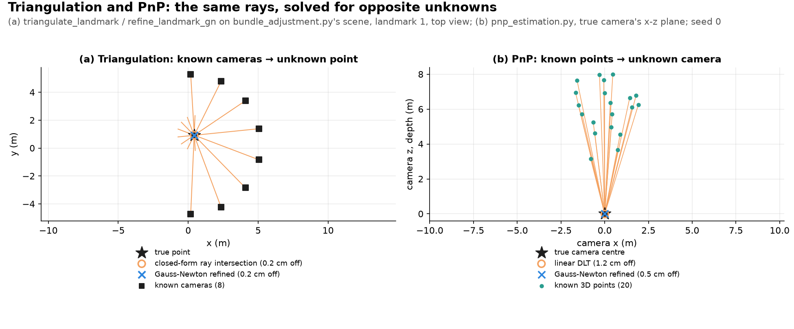
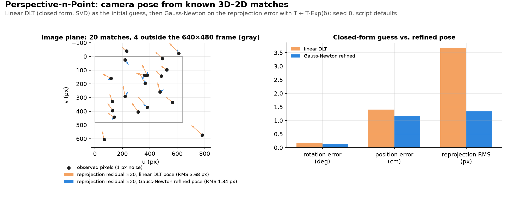

# Triangulation and PnP: two sides of one geometric problem

- **Triangulation:** given known camera poses and a 2D observation in each, where is the 3D point?
- **PnP:** given several known 3D points and their observed pixels, where is the camera?
- **Why PnP needs several points:** one point/pixel pair pins down a ray, not a unique pose.
  - P3P (3 correspondences) gives up to four candidate poses, so a fourth point picks the right one.
  - Our own DLT implementation needs at least 6 (§3 and §5).
- **Same recipe for both:** both reduce to the same reprojection residual. We solve each with a closed-form linear initial guess, then a few Gauss-Newton iterations.

This builds directly on:
- The **reprojection error** and **"bundle of rays"** intuition from [bundle_adjustment.md §5](../optimization/bundle_adjustment.md#5-why-is-it-called-bundle-adjustment).
- **Gauss-Newton** from [gauss_newton.md](../optimization/gauss_newton.md).

---

## 1. The two problems, stated symmetrically

| | Triangulation | PnP (Perspective-n-Point) |
|---|---|---|
| Known | Camera poses, 2D observations | A 3D point (or several), 2D observations |
| Unknown | One 3D point | One camera pose (6 DOF) |
| Residual | Reprojection error (§2) | Reprojection error (§3) |
| Implemented in this repo | `bundle_adjustment_advanced.py`'s `triangulate_landmark`/`refine_landmark_gn` | `pnp_estimation.py`'s `linear_pnp_dlt`/`refine_pose_gn` |

Both are front-end problems in the [front-end/back-end split](../frontend_backend.md): a front-end needs to turn "I see this pixel" into either a 3D map point (triangulation, to grow the map) or a camera pose (PnP, to localize against an already-known map) *before* any back-end optimization ([bundle_adjustment.md](../optimization/bundle_adjustment.md), [pose_graph_optimization.md](../optimization/pose_graph_optimization.md)) can refine it further.



*Figure: (a) `triangulate_landmark`/`refine_landmark_gn` from `use_numpy/bundle_adjustment_advanced.py`, run on `use_numpy/bundle_adjustment.py`'s wide-baseline scene; (b) `use_numpy/pnp_estimation.py` at its defaults (seed 0), plotted by `uv run python assets/make_figures.py pnp_estimation_concept`.*

---

## 2. Triangulation, worked from the real code

`triangulate_landmark` in `bundle_adjustment_advanced.py` solves triangulation in closed form. It is the "closest point to N lines" problem:

- Each observing camera gives a calibrated ray: direction $d$ from the camera center through the observed pixel.
- The best point minimizes the sum of squared perpendicular distances to every ray.
- For one ray (unit $d$, through camera center $o$), the projector $M = I - dd^\top$ measures that perpendicular distance.
- Summing $M$ and $Mo$ over all observers and solving the resulting $3\times3$ linear system gives the point directly, with no iteration.

```text
Camera 1               Camera 2
   [cam]                  [cam]
    \                      /
     \                    /
      \                  /
       \                /
        *  <- closed-form least-squares point
              (noise-free picture: with noise the rays are skew)
```

Then we polish and validate:

- **Polish.** `refine_landmark_gn` runs a few Gauss-Newton iterations on the *true* nonlinear reprojection error, seeded from the closed-form guess (the same "linear guess, then GN polish" pattern used throughout this repo).
- **Validate.** `passes_cheirality` checks that the point has positive depth in every observing camera. Since `pixel = f*x/z` is invariant to negating a camera-frame point's $x,y,z$ together, the Gauss-Newton step on a weakly-constrained point (few observers, little parallax) can walk to a *reflection* behind a camera that still fits every pixel almost exactly (see the `refine_landmark_gn` and `passes_cheirality` docstrings).
- **Reject.** A point failing the check is never committed to the map (see the [`bundle_adjustment_advanced.py` README description](../../README.md#7-local--global-bundle-adjustment-bounded-windows-vs-whole-map-re-solves)). It stays pending until another observation gives it more parallax.

**The triangulation math, concretely.** Poses are camera-to-world: observer $k$ has rotation $R_k$ and camera center $o_k$ (its translation). `triangulate_landmark` rotates each pixel's calibrated ray into the world frame and normalizes it:

```math
\tilde d_k = \begin{bmatrix} (u_k - c_x)/f_x \\ (v_k - c_y)/f_y \\ 1 \end{bmatrix}, \qquad
d_k = \frac{R_k \tilde d_k}{\left\| R_k \tilde d_k \right\|}
```

$$
A = \sum_k \left(I - d_k d_k^\top\right), \qquad
b = \sum_k \left(I - d_k d_k^\top\right) o_k, \qquad
P_0 = \left(A + 10^{-9} I\right)^{-1} b
$$

- **Conditioning.** The depth error along the rays grows as the parallax (baseline) shrinks.
- **Tiny example** (toy case: two rectified cameras, baseline $`B`$, focal length $`f`$, depth $`Z`$, pixel noise $`\sigma`$). Depth error is about $`Z^2\sigma/(fB)`$. With $`f=800`$ px, $`Z=10`$ m, $`\sigma=1`$ px: $`B=1`$ m gives 0.125 m of error, and $`B=0.1`$ m gives 1.25 m. A 10 times smaller baseline means a 10 times larger depth error.
- **The $10^{-9} I$ term.** It keeps the solve defined when all rays are parallel. The depth along the rays is then arbitrary (the term pins the point's coordinate along the ray direction to 0, measured from the world origin).

`refine_landmark_gn` then runs Gauss-Newton on the point alone, with $J_{\text{point}}$ from [bundle_adjustment.md Section 6.1](../optimization/bundle_adjustment.md#61-the-ba-math-concretely):

$$
\left(\sum_k J_{\text{point},k}^\top J_{\text{point},k} + 10^{-9} I\right)\delta = \sum_k J_{\text{point},k}^\top r_k, \qquad
r_k = z_k - \pi\left(R_k^\top (P - o_k)\right), \qquad
P \leftarrow P + \delta
$$

It stops when the step norm drops below `gn_tol`. `passes_cheirality` then requires a strictly positive depth in every observer, using `point_depth`:

$$
\left[R_k^\top (P - o_k)\right]_z > 0 \quad \text{for every observer } k
$$

In `bundle_adjustment_advanced.py`, a landmark is triangulated once it has `min_observations` = 3 observers (the default), with that script's `gn_tol` = $10^{-6}$ and `gn_max_iters` = 15.

---

## 3. PnP as the inverse problem

`pnp_estimation.py` solves the exact mirror image. Given $n$ known 3D points $P_i$ and their observed pixels, first form the calibrated ray for each: $d_i = \left[\frac{u_i-c_x}{f_x}, \frac{v_i-c_y}{f_y}, 1\right]$. Because $d_i$ is parallel to the camera-frame point $R_{cw}P_i + t_{cw}$ ($R_{cw}, t_{cw}$ the unknown world-to-camera pose), their cross product must vanish:

$$d_i \times (R_{cw}P_i + t_{cw}) = 0$$

**Intuition:** count the unknowns.
- The 12 entries of $`[R_{cw} \mid t_{cw}]`$ are only defined up to scale, so there are 11 unknowns.
- Each point gives 2 equations. 5 points give 10, which is less than 11. 6 points give 12, which is enough.

This is **linear and homogeneous** in the 12 flattened entries of $[R_{cw} \mid t_{cw}]$ - exactly the classical **Direct Linear Transform (DLT)** camera-resectioning setup, specialized to *known* intrinsics. Stacking two independent rows of this constraint per correspondence gives an overdetermined homogeneous system $Ax=0$, solved via `linear_pnp_dlt` as the smallest right-singular vector of $A$ (`np.linalg.svd`).

**Intuition:** the smallest singular vector is the direction that $A$ squashes the most. Toy case: $`A = \mathrm{diag}(3, 0.1)`$ stretches $`(1,0)`$ to length 3 but shrinks $`(0,1)`$ to 0.1, so $`(0,1)`$ is the best answer to $`Ax \approx 0`$.

> **Note**: SVD (Singular Value Decomposition) factors any matrix as $A=U\Sigma V^\top$, with $U, V$ orthogonal and $\Sigma$ diagonal (the singular values, ranking how much each orthogonal direction contributes to $A$).
> - The smallest right-singular vector of $A$ (the column of $V$ paired with the smallest singular value) is the least-squares null-space solution `linear_pnp_dlt` uses above.
> - Taking $UV^\top$ from a matrix's own SVD gives the nearest orthogonal matrix (a rotation once $\det > 0$, handled below). The orthogonalization step below uses this.

Concretely, each correspondence adds two rows to $A$: the first two rows of the cross-product matrix $`[d_i]_\times`$, times a $`3\times12`$ matrix that maps $x$ to $R_{cw}P_i + t_{cw}$. Here $r_1, r_2, r_3$ are the rows of $R_{cw}$:

```math
A_i = \left([d_i]_\times\right)_{\text{rows }1,2}
\begin{bmatrix} P_i^\top & 0 & 0 & 1 & 0 & 0 \\ 0 & P_i^\top & 0 & 0 & 1 & 0 \\ 0 & 0 & P_i^\top & 0 & 0 & 1 \end{bmatrix}, \qquad
x = \begin{bmatrix} r_1 & r_2 & r_3 & t_{cw}^\top \end{bmatrix}^\top
```

The third row is dropped because it is a combination of the first two (the third entry of $d_i$ is always 1). $A$ is $2n\times12$ and needs rank 11 for a one-dimensional null space. That is why §5 asks for at least 6 points.

The recovered $3\times3$ block is only a *scaled, possibly reflected* rotation - not yet a valid element of $SO(3)$. `linear_pnp_dlt` turns $x$ into a pose in this order:

1. **Unpack.** $x$ is the last row of $V^\top$. Its first 9 entries, row-major, give $R_{\text{raw}}$. The last 3 give $t_{\text{raw}}$.
2. **Fix the sign.** $x$ and $-x$ both solve $Ax = 0$. If the median over all points of the raw depth $`(R_{\text{raw}}P_i + t_{\text{raw}})_z`$ is negative, both $`R_{\text{raw}}`$ and $`t_{\text{raw}}`$ are negated (see §4). This runs *before* orthogonalization.
3. **Orthogonalize.** With $R_{\text{raw}} = U\Sigma V^\top$, set $R_{cw} = UV^\top$. If $\det(R_{cw}) < 0$, the last row of $V^\top$ is negated and $R_{cw}$ is recomputed, so the result is a proper rotation.
4. **Recover scale.** $s = (\sigma_1 + \sigma_2 + \sigma_3)/3$, the mean of the singular values of $R_{\text{raw}}$. Then $t_{cw} = t_{\text{raw}}/s$.
5. **Invert.** The function returns the camera-to-world pose, with rotation $R_{cw}^\top$ and translation $-R_{cw}^\top t_{cw}$.

With noise-free pixels, this recovers the true pose to floating-point precision.

`refine_pose_gn` then runs Gauss-Newton on the true reprojection error, updating the pose via a right-multiplicative correction $T \leftarrow T\cdot\mathrm{Exp}(\delta)$ - following `refine_landmark_gn`'s loop (minus its early exit on non-positive depth), solving a $6\times6$ system for the pose instead of a $3\times3$ system for the point. It uses the same $J_{\text{pose}}$ as bundle adjustment ([bundle_adjustment.md Section 6.1](../optimization/bundle_adjustment.md#61-the-ba-math-concretely)), for $\delta = [\delta v, \delta\omega]$:

$$
\left(\sum_i J_{\text{pose},i}^\top J_{\text{pose},i} + 10^{-9} I_6\right)\delta = \sum_i J_{\text{pose},i}^\top r_i, \qquad
r_i = z_i - \pi\left(T^{-1} P_i\right)
$$

It stops when the step norm drops below `gn_tol`. Script defaults: 20 points, sampled at camera-frame depth 3 to 8 m, $f_x = f_y = 800$ px on a 640×480 image, pixel noise $\sigma = 1$ px, `gn_tol` = $10^{-8}$, at most 20 iterations.

---

## 4. The shared reflection/cheirality risk

A pinhole projection is invariant to certain sign flips, and a linear solve sees only the projection's algebraic structure, not "in front of the camera". So both problems can return a geometrically nonsensical but numerically consistent answer. The remedy is the same positive-depth reasoning in both:

- **Triangulation:** `passes_cheirality` (§2) rejects a point unless its depth is positive in *every* observer. It guards the reflection that Gauss-Newton can produce.
- **PnP:** the sign fix in step 2 of §3 (`np.median(depths_raw) < 0.0`) is *analogous*, not identical. It guards a global $x$ versus $-x$ ambiguity of the DLT null vector, and it uses the *median* of the raw depths to choose a sign, where `passes_cheirality` demands all depths positive.

With noise, neither linear step is accurate enough alone; the Gauss-Newton refinement and the depth checks both matter.

---

## 5. What the accompanying scripts do and don't do

`linear_pnp_dlt` is the simplest *correct* version of linear PnP, not a production algorithm. It needs $n \geq 6$ correspondences for $A$ to reach rank 11 (§3). Its limits are about accuracy, not cost:

- **Cost is not the issue.** A version linear in $n$ would take the SVD of the fixed $12\times12$ matrix $A^\top A$ (or use `full_matrices=False`). Our code takes the SVD of the full $2n\times12$ matrix $A$ directly, which is fine at these sizes.
- **Accuracy is.** It solves for 12 unconstrained numbers and minimizes an **algebraic error**, ignoring that 9 of them must form a rotation until the orthogonalization step afterwards. More points help, but with few points, noticeable noise, or points close to a plane it is less accurate than purpose-built solvers.
- **Exactly coplanar points break it.** $A$ then loses rank and the null space is no longer one-dimensional; planar scenes need a homography-based method instead.

**EPnP** (Lepetit, Moreno-Noguer & Fua, 2009 - see References) expresses every 3D point as a weighted combination of four virtual control points, so the problem becomes recovering just those four points' camera-frame coordinates. The $`O(n)`$ in its title is relative to earlier non-iterative PnP methods (the paper cites $`O(n^5)`$ and $`O(n^8)`$), not to the DLT. Its advantage over the DLT is accuracy.

In practice, PnP commonly runs inside **RANSAC**, because some 2D-3D matches are wrong:

- A minimal solver (P3P, three points) generates candidate poses from random subsets.
- The pose with the most inliers wins.
- A non-minimal solver and/or nonlinear refinement then uses all inliers.
- Library examples (for example, ORB-SLAM with EPnP inside RANSAC, COLMAP with P3P in RANSAC, OpenCV's `solvePnP` with `SOLVEPNP_EPNP` and `solvePnPRansac`) vary in the details. We have not re-checked them here.
- We implement the simpler DLT without RANSAC (our synthetic correspondences have no outliers), matching `triangulate_landmark`'s choice of a simple closed-form solve.



*Figure: `use_numpy/pnp_estimation.py` at its defaults (seed 0), plotted by `uv run python assets/make_figures.py pnp_estimation`.*

---

## 6. Summary

> **Triangulation and PnP are the same reprojection problem run in opposite directions (poses fixed, solve a point; points fixed, solve a pose). We solve both with a closed-form linear guess followed by Gauss-Newton, guarded by positive-depth checks.**

---

## 7. References

1. Hartley, R., & Zisserman, A. (2004). *Multiple View Geometry in Computer Vision* (2nd ed.). Cambridge University Press. - the standard reference for DLT camera resectioning behind §3's derivation.
2. Lepetit, V., Moreno-Noguer, F., & Fua, P. (2009). *EPnP: An Accurate O(n) Solution to the PnP Problem*. International Journal of Computer Vision, 81(2), 155-166. https://doi.org/10.1007/s11263-008-0152-6 - the more accurate linear-time PnP algorithm contrasted with the DLT in §5.
3. Triggs, B., McLauchlan, P. F., Hartley, R. I., & Fitzgibbon, A. W. (2000). *Bundle Adjustment - A Modern Synthesis*. In Vision Algorithms: Theory and Practice (pp. 298-372). Springer. - already cited in [bundle_adjustment.md](../optimization/bundle_adjustment.md), covering the triangulation-within-BA context behind §2.
