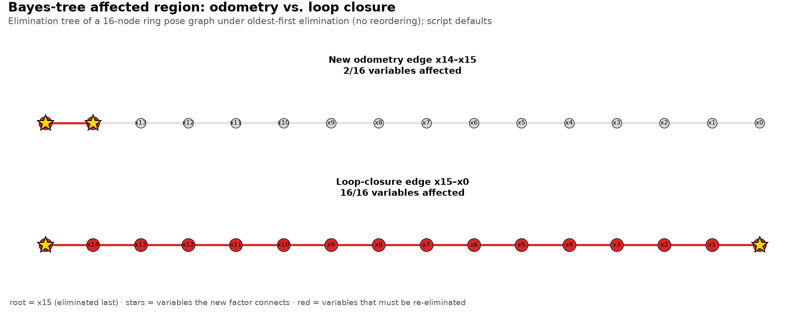

# Bayes tree

The name sounds probabilistic, but for SLAM, you can understand it mainly as a **smart tree representation of the factorization of your optimization problem**.

---

## 1. Start with the factor graph

Suppose your robot has four poses:

```text
x1 ───── x2 ───── x3 ───── x4
   odom12   odom23   odom34
```

And suppose it observes a landmark:

```text
        l1
       /  \
      /    \
     x1    x3
```

The factor graph represents **constraints**:

- $x_1$ → $x_2$: odometry
- $x_2$ → $x_3$: odometry
- $x_3$ → $x_4$: odometry
- $x_1$ → $l_1$: observation
- $x_3$ → $l_1$: observation

The goal is still:

```math
X^* = \arg\min_X \sum_i \|r_i(X)\|^2
```

---

## 2. Linearization gives us a big equation

After Gauss-Newton linearization, we get something like:

$$H\Delta x=-g$$

These are the normal equations of the linear least-squares problem

```math
\min_{\Delta x} \lVert A\Delta x - b \rVert^2, \qquad H = A^\top A, \quad g = -A^\top b
```

Now we need to solve this large sparse system.

This is where **Sparse Cholesky Factorization** becomes important - see [`sparse_cholesky_factorization.md`](sparse_cholesky_factorization.md) if you want the full explainer: $H = LL^\top$, solved via two triangular substitutions instead of a full inversion, exploiting the fact that $H$ is mostly zero.

We want to factorize the system efficiently.

---

## 3. Elimination is the key idea

Imagine we have:

```text
x1 ─── x2 ─── x3
```

Suppose we decide to eliminate $x_1$.

Originally:

```text
x1 ─── x2
```

After eliminating $x_1$, we no longer need $x_1$ in the remaining problem.

But its information has to go somewhere.

It gets **summarized into a new constraint involving $x_2$**.

Conceptually:

```text
Before:

x1 ─── x2 ─── x3


Eliminate x1:

        x2 ─── x3
         ↑
    summarized
    information
    from x1
```

This is the fundamental idea behind elimination. See [`elimination_tree.md`](elimination_tree.md) for the full explainer of the dependency structure this produces.

(Here $x_1$ is eliminated as part of building a solve order - it's still part of the problem, and a later update re-eliminates it if that update affects it. [marginalization.md](marginalization.md) reuses this exact step for a different purpose: permanently discarding an old state to bound a sliding-window estimator's size.)

---

## 4. Why elimination creates a tree

Let's use a slightly bigger example:

```text
x1 ─── x2 ─── x3 ─── x4
```

Suppose we eliminate from left to right:

```text
x1
 ↓
x2
 ↓
x3
 ↓
x4
```

The resulting dependency structure can be represented as a tree, drawn with its root at the top:

```text
x4   ← root (eliminated last)
│
x3
│
x2
│
x1   ← leaf (eliminated first)
```

This structure tells us:

> **Which variables depend on which other variables after elimination.**

That is essentially what the **Bayes tree** captures.

### 4.1 The elimination game, concretely

`bayes_tree_construction.py` builds this structure with `symbolic_eliminate` in `utils.py`. The function is purely symbolic: it only looks at which variables share a factor, never at numeric values. Variables are integers `0..n-1`, and `order` is the elimination order (`order[0]` goes first, `order[-1]` becomes the root). For each variable $v$ in `order`:

1. **Separator.** $S(v)$ is the set of $v$'s neighbors at the moment it is eliminated. Only variables still in the graph count, because each eliminated variable has already been removed from its neighbors' lists.
2. **Fill-in.** Every pair of variables in $S(v)$ gets connected, then $v$ is removed from the graph. This is the "summarized information" arrow of §3: the new constraint links all of $v$'s remaining neighbors.
3. **Parent.** $\text{parent}(v)$ is the member of $S(v)$ that comes earliest in `order`, i.e. the next of them to be eliminated. If $S(v)$ is empty, $v$ is the root.

The node $`\{v\} \cup S(v)`$ is what the docstring calls a clique. The script keeps one node per variable and never merges nodes with nested separators into larger cliques (§13), so strictly it builds the elimination tree.

**Worked example: a 5-node ring.** Take odometry edges 0–1, 1–2, 2–3, 3–4 plus a loop-closure edge 4–0, eliminated oldest-first (`order = [0, 1, 2, 3, 4]`, as the script does):

| Eliminate | Neighbors left ($`S(v)`$) | Fill-in added | Parent |
| --- | --- | --- | --- |
| 0 | {1, 4} | 1–4 | 1 |
| 1 | {2, 4} | 2–4 | 2 |
| 2 | {3, 4} | none (3–4 already exists) | 3 |
| 3 | {4} | none | 4 |
| 4 | {} | none | root |

The result is a straight chain `0 → 1 → 2 → 3 → 4`. Each separator holds at most 2 variables, because the loop edge keeps dragging node 4 along. The script's 16-node ring gives the same shape, and it prints "Largest separator: 2".

**Affected-path query** (`bayes_tree_affected_path`). Given the variables a new factor touches, walk `parent` pointers from each one up to the root and return the union of all nodes visited. A walk stops early when it reaches a node that is already in the set. In the ring above, the odometry edge (3, 4) affects {3, 4}. The loop-closure edge (4, 0) starts from the deepest leaf, 0, so it affects all five nodes. This is §8's worst case.

---

## 5. But there's an important difference from an ordinary tree

A Bayes tree is not simply:

> "My robot trajectory looks like this."

It is a tree representing the **conditional dependencies produced by eliminating variables from the factor graph**.

That's why you shouldn't think:

```text
Bayes tree = SLAM trajectory
```

Instead think:

```text
Factor graph
     ↓
elimination
     ↓
Bayes tree
```

The factor graph describes the **problem**.

The Bayes tree describes an efficient **solution structure**.

---

## 6. The probabilistic interpretation

The name "Bayes tree" comes from probability.

Suppose we have variables:

$$x_1,x_2,x_3$$

Their joint probability can always be decomposed with the chain rule:

$$P(x_1,x_2,x_3) = P(x_1|x_2,x_3)P(x_2|x_3)P(x_3)$$

That holds for any three variables, so it says nothing yet. What elimination adds is structure. For the chain $x_1$ ─ $x_2$ ─ $x_3$, eliminating $x_1$ first finds that it connects only to $x_2$, so the first factor simplifies:

```math
P(x_1,x_2,x_3) = P(x_1 \mid x_2)\,P(x_2 \mid x_3)\,P(x_3)
```

Each variable ends up conditioned only on its separator, and the separator's next-eliminated member is its parent in the tree (§4.1). The tree represents exactly these conditional relationships.

For SLAM, however, you don't need to become a probability expert to understand iSAM2.

A useful mental translation is:

> **Bayes tree = conditional dependency tree created by variable elimination.**

---

## 7. Here's where it becomes powerful for [iSAM2](isam2_optimization.md)

Suppose we have:

```text
x1 ─ x2 ─ x3 ─ x4 ─ x5
```

The robot gets a new measurement involving $x_5$.

iSAM2 doesn't want to rebuild everything.

Because it has the Bayes tree, it can ask:

> "Which part of my factorization is affected by this new factor?"

For example:

```text
       x5  ← root; the new information arrives here
       │
       x4
       │
       x3
       │
       x2
       │
       x1  ← leaf
```

An update only has to redo the path from the touched variables up to the root. Here $x_5$ *is* the root, so only the top of the tree changes, and $x_1$-$`x_4`$ below it are left alone.

---

## 8. Even more interesting: loop closure

Suppose we have:

```text
x1 ─ x2 ─ x3 ─ x4 ─ x5
│                    │
└──── loop closure ──┘
```

The new loop-closure factor connects $x_1$ and $x_5$.

This can change the solution for many variables.

The Bayes tree lets iSAM2 identify the affected portion of the tree.

Conceptually:

```text
       x5    ← affected (root)
       │
       x4    ← affected
       │
       x3    ← affected
       │
       x2    ← affected
       │
       x1    ← affected (leaf)
```

$x_1$ is affected too, not just $x_2$-$`x_5`$: the new factor touches $x_1$ directly, and $x_1$ is also the deepest leaf under this chain's elimination order, so it must be re-eliminated along with everything above it on the path to $x_5$. (The repo's own `bayes_tree_construction.py` demonstrates exactly this on its square-loop topology: with the default 16 nodes, a single loop-closure edge affects all 16/16 *variables*, including the one at the very bottom of the chain. The script counts elimination-tree nodes, one per variable, not merged cliques; see §4.1 and §15.)

The affected section is removed/re-eliminated and then reinserted into the Bayes tree.

That's much smarter than rebuilding the entire factorization blindly.

---

## 9. Bayes tree + sparse Cholesky

This connects directly to [`sparse_cholesky_factorization.md`](sparse_cholesky_factorization.md) and to iSAM2's use of it in [`isam2_optimization.md` §7](isam2_optimization.md#7-bayes-tree---the-most-important-intuition).

You can think of the pipeline as:

```text
Factor Graph
     │
     ▼
Linearization
     │
     ▼
Sparse Linear System
     │
     ▼
Variable Elimination
     │
     ▼
Sparse Factorization
     │
     ▼
Bayes Tree
```

Then when a new measurement arrives:

```text
New Factor
    │
    ▼
Which variables are affected?
    │
    ▼
Find affected Bayes-tree region
    │
    ▼
Remove/relinearize/reorder
    │
    ▼
Re-eliminate
    │
    ▼
Updated Bayes Tree
```

This is the core mechanism behind **[iSAM2](isam2_optimization.md)'s incremental efficiency** - the older [iSAM](isam_optimization.md) algorithm gets its own incremental updates from QR row insertion alone, without a Bayes tree at all.

---

## 10. A very intuitive analogy

Imagine you have a company hierarchy:

```text
               CEO
                │
        ┌───────┴───────┐
    Manager A       Manager B
        │               │
   Team Leader     Team Leader
        │               │
    Engineer        Engineer
```

Each level summarizes information from the level below.

If an engineer in Manager A's branch changes something, you don't need to reorganize the entire company.

You update the chain of summaries above them:

```text
Engineer
   ↓
Team Leader
   ↓
Manager A
   ↓
CEO
```

while leaving Manager B's branch alone. The CEO is always on the path: in a Bayes tree, every update reaches the root.

The Bayes tree gives iSAM2 a similar ability to **localize the computational consequences of new information**.

---

## 11. Why not just use the factor graph directly?

You might ask:

> "If the factor graph already tells us the relationships, why do we need a Bayes tree?"

Because the factor graph is good at representing **constraints**, but not necessarily the most convenient structure for **incrementally solving the linearized system**.

Think:

```text
Factor graph
    =
"What measurements constrain what?"

Bayes tree
    =
"How can I efficiently solve these constraints?"
```

That's a very useful distinction.

---

## 12. Bayes tree vs factor graph

| Factor Graph                        | Bayes Tree                                       |
| ----------------------------------- | ------------------------------------------------ |
| Represents measurements/constraints | Represents elimination/conditional structure     |
| Bipartite graph                     | Tree structure                                   |
| Variables + factors                 | Conditional relationships                        |
| Describes the SLAM problem          | Describes its factorized solution                |
| Natural representation of SLAM      | Efficient representation for incremental solving |

---

## 13. One more important concept: cliques

A Bayes tree doesn't necessarily contain one variable per node.

Its nodes are actually **cliques**.

For example:

```text
      {x3, x4}     ← root clique
          │
      {x2 | x3}
          │
      {x1 | x2}
```

This is the Bayes tree of §4's chain $x_1$ ─ $x_2$ ─ $x_3$ ─ $x_4$, eliminated left to right. $`\{x_2 \mid x_3\}`$ reads "$`x_2`$, given $x_3$": the variable eliminated at that node, then its separator. The cliques come from merging:

- $x_3$'s separator, $`\{x_4\}`$, is exactly the root's variables, so $x_3$ joins the root clique instead of getting its own node.
- $x_2$'s separator, $`\{x_3\}`$, is smaller than the clique $`\{x_3, x_4\}`$ it hangs from, so $x_2$ starts a new clique. So does $x_1$.

`bayes_tree_construction.py` skips this merging and keeps one node per variable (§4.1, §15).

This is important because when iSAM2 updates the graph, it often works with **cliques/subtrees**, rather than individual variables.

You don't need to master cliques yet, but keep the word in mind.

---

## 14. The connection to [iSAM2](isam2_optimization.md) becomes very clean

Now you can understand iSAM2 as:

> **Maintain a factor graph + maintain its Bayes-tree factorization + incrementally modify the affected part when new information arrives.**

So:

```text
             iSAM2
               │
       ┌───────┴────────┐
       │                │
 Factor Graph       Bayes Tree
       │                │
 measurements      efficient
 constraints       factorization
       │                │
       └───────┬────────┘
               ↓
       incremental SLAM
```

---

## 15. Where this is implemented in this repo

Partially. [`bayes_tree_construction.py`](../../use_numpy/bayes_tree_construction.py) builds the *elimination tree* of this repo's pose-graph topology - one node per variable, without merging nodes into the cliques of §13, so it is the structure a Bayes tree is built from rather than a full Bayes tree. `symbolic_eliminate`/`bayes_tree_affected_path` in `utils.py` run the elimination-game construction from §3-§4 (spelled out in §4.1) and the root-ward affected-path query from §7-§9. Every "N/16 affected" count is a count of variables, not cliques. The tree is built once from all edges, the loop-closure edge included, and then queried for each scenario's edge; for this topology, building it without the loop edge gives the same chain and the same affected sets. Defaults: `--nodes-per-side 4`, so 16 nodes; the newest odometry edge (14, 15) affects 2/16 variables and the loop-closure edge (15, 0) affects 16/16. The script plots the "small vs. large affected region" contrast this doc argues for in prose (§7 vs. §8) using a real, computed example instead of an ASCII sketch. It fixes the elimination order (oldest node first) rather than choosing one dynamically, so **iSAM2's variable reordering (CCOLAMD) is still not implemented** - worth noting since, under that fixed order, this repo's loop-closure edge happens to produce the worst possible case (it invalidates the *entire* tree, not just a subtree), which is exactly the scenario dynamic reordering exists to avoid. There is also still no numeric fluid-relinearization solve integrated with this tree - [`pose_graph_incremental.py`](../../use_numpy/pose_graph_incremental.py) (both `use_numpy/` and `use_manif/`) separately implements the older [iSAM v1](isam_optimization.md) algorithm (incremental QR row insertion, no Bayes tree at all); see [`isam_optimization.md` §14](isam_optimization.md#14-where-this-is-implemented-in-this-repo) and [`isam2_optimization.md` §19](isam2_optimization.md#19-where-this-is-implemented-in-this-repo) for exactly where that numeric-solve line is drawn.



*Figure: `use_numpy/bayes_tree_construction.py` at its defaults (seed 0), plotted by `uv run python assets/make_figures.py bayes_tree_construction`.*

So this page's data structure now has a real, runnable counterpart - but the rest of [iSAM2](isam2_optimization.md) (dynamic reordering, fluid relinearization integrated with an actual solve) still exists only conceptually here.

---

## 16. References

1. Kaess, M., Johannsson, H., Roberts, R., Ila, V., Leonard, J. J., & Dellaert, F. (2012). *iSAM2: Incremental Smoothing and Mapping Using the Bayes Tree*. International Journal of Robotics Research, 31(2), 216–235. https://doi.org/10.1177/0278364911430419 - the Bayes tree itself: its construction via variable elimination (§3-§4), the clique structure (§13), and how it localizes incremental updates (§7-§9).
2. Kaess, M., Ranganathan, A., & Dellaert, F. (2008). *iSAM: Incremental Smoothing and Mapping*. IEEE Transactions on Robotics, 24(6), 1365–1378. https://doi.org/10.1109/TRO.2008.2006706 - the predecessor algorithm that reaches incremental updates without a Bayes tree, contrasted in §9 and implemented by `pose_graph_incremental.py`.

See also [`isam2_optimization.md`](isam2_optimization.md) for how the Bayes tree fits into the full iSAM2 algorithm, and [`isam_optimization.md`](isam_optimization.md) for the non-Bayes-tree predecessor this repo actually implements.
3. Kaess, M., Ila, V., Roberts, R., & Dellaert, F. (2010). *The Bayes Tree: An Algorithmic Foundation for Probabilistic Robot Mapping*. In Algorithmic Foundations of Robotics IX (WAFR 2010), Springer Tracts in Advanced Robotics, 157-173. https://doi.org/10.1007/978-3-642-17452-0_10 - the paper that introduced the Bayes tree, which iSAM2 (reference 1) then builds on.
