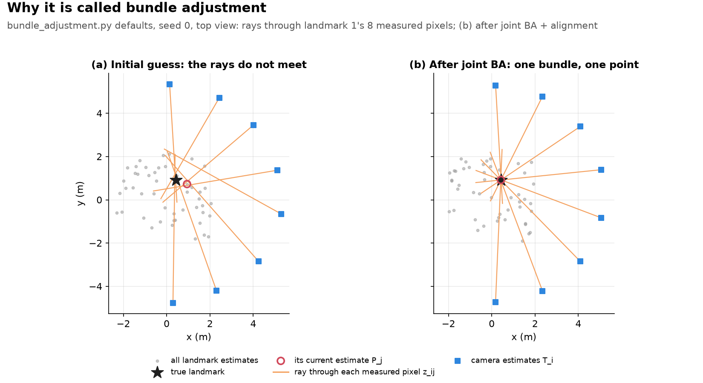
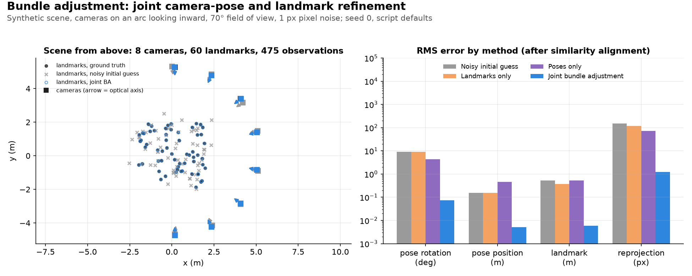

# Bundle Adjustment

**Bundle Adjustment (BA)** in one line:

> **Bundle Adjustment = jointly adjusting camera poses and 3D points so that the observed image measurements are explained as accurately as possible.**

The key word is **jointly**.

---

## 1. Start with a simple camera + 3D point

Imagine a camera looking at a 3D point:

```text
        3D point
           ● P
          / 
         /
        /
       📷 Camera
```

The 3D point $P$ gets projected onto the camera image:

```text
     P ●              3D point, world frame
        \
         \            ray from P to the camera center
  ────────•────────   image plane: the ray crosses it at the pixel p
           \
            \
             📷       camera center
```

If we know:

- camera pose
- camera intrinsics
- 3D point position

we can predict where $P$ should appear in the image.

Mathematically:

$$p = \pi(T^{-1}P)$$

where:

- $P$ = 3D point, in world coordinates
- $T$ = camera pose, camera-to-world (it maps camera-frame points into the world), so $T^{-1}P$ is the point expressed in the camera frame
- $\pi$ = camera projection function
- $p$ = predicted 2D pixel location

---

## 2. But our estimates are imperfect

Suppose the actual image measurement is:

```text
observed point:       ●
predicted point:          ×
```

There is an error:

```text
     ● observed
      \
       \   reprojection error e
        \
         × predicted
```

This is the **reprojection error**. For one observation:

$$e = p_{\text{observed}} - p_{\text{predicted}}$$

BA tries to make this error as small as possible.

---

## 3. Now add multiple cameras

Suppose the camera moves:

```text
Camera 1          Camera 2          Camera 3

  📷                📷                📷
   \                 \                 \
    \                 \                 \
     ● P               ● P               ● P
```

The same physical 3D point is observed from multiple camera positions.

Each camera produces a 2D observation:

```text
Camera 1 → p₁
Camera 2 → p₂
Camera 3 → p₃
```

We want to find:

- Camera 1 pose
- Camera 2 pose
- Camera 3 pose
- 3D position of P

such that **all projections agree with the observations**.

---

## 4. Here's the important part: both cameras AND points are adjusted

Suppose our initial reconstruction is wrong:

```text
Camera poses:

📷₁       📷₂       📷₃

 \         |         /
  \        |        /
   \       |       /
       ● P
```

Maybe the camera poses are slightly wrong, maybe the 3D point is slightly wrong, maybe **both** are.

BA doesn't say "the cameras are correct, I'll fix the points" or "the points are correct, I'll fix the cameras". Instead:

> **"I'll adjust everything together until the entire reconstruction explains the image measurements as well as possible."**

---

## 5. Why is it called "bundle" adjustment?

Each image observation defines a **ray** from the camera through the observed pixel. Two cameras give two rays, which ideally meet at the 3D point:

```text
📷₁ --------\
             \
              ● P
             /
📷₂ --------/
```

With noise and imperfect estimates, they don't intersect perfectly:

```text
📷₁ --------\
             \       ●
              \
               \

📷₂ -----------\
```

We can think of BA as adjusting the **bundle of rays** and the camera poses together until everything fits.

(Recovering a single point from rays with already-known poses, rather than adjusting everything jointly, is triangulation on its own. See [frontend/triangulation_pnp.md](../frontend/triangulation_pnp.md) for the closed-form math this repo implements, plus its inverse problem, PnP.)



*Figure: the bundle of rays for one landmark in `use_numpy/bundle_adjustment.py`'s default scene (seed 0), plotted by `uv run python assets/make_figures.py bundle_adjustment_concept`.*

---

## 6. A more useful SLAM example

A robot/camera moves through a room. Consecutive cameras see overlapping sets of landmarks (✓ = observed):

| | A | B | C | D | E |
| --- | --- | --- | --- | --- | --- |
| camera $t_0$ | ✓ | ✓ | | | |
| camera $t_1$ | | ✓ | ✓ | | |
| camera $t_2$ | | | ✓ | ✓ | |
| camera $t_3$ | | | | ✓ | ✓ |

Every observation creates a constraint, and the system can have **thousands or millions** of them.

Each constraint compares the predicted pixel (from camera pose + 3D landmark) with the observed pixel.

BA solves:

```math
\min_{\{T_i\},\{P_j\}} \sum_{(i,j) \in \mathcal{O}} \left\|z_{ij} - \pi(T_i^{-1} P_j)\right\|^2
```

where:

- $T_i$ = pose of camera `i`, camera-to-world (as in Section 1)
- $P_j$ = 3D landmark `j`, in world coordinates
- $z_{ij}$ = observed pixel
- $\pi(T_i^{-1}P_j)$ = predicted pixel
- $\mathcal{O}$ = the set of (camera, landmark) pairs that were actually observed - not every camera sees every landmark, so the sum only runs over real observations, not all $i,j$ combinations


In plain English: **find the camera poses and 3D points that make the predicted image points match the actual image points as closely as possible.**

Real implementations usually wrap the squared reprojection error in a **robust loss** (e.g. Huber) instead of squaring it directly, so a handful of bad feature matches can't drag the whole reconstruction toward them - see [pose_graph_optimization.md](pose_graph_optimization.md#16-robust-loss-functions-used-to-handle-false-loop-closures)'s "Robust loss functions" section for the exact same idea applied to pose graphs. `bundle_adjustment.py` keeps the plain, un-robustified squared error above, matching the objective as written here.

### 6.1 The BA math, concretely

`bundle_adjustment.py` minimizes the objective above with plain Gauss-Newton. Each pose $T_i$ is a $4\times4$ camera-to-world matrix with rotation $R_i$ and translation $t_i$. Each landmark $P_j$ is a world point. Pose corrections are 6-vectors $\delta = [\delta v, \delta\omega]$, translation first.



*Figure: `use_numpy/bundle_adjustment.py` at its defaults (seed 0), plotted by `uv run python assets/make_figures.py bundle_adjustment`.*

**Projection** (`camera_project`): move the point into the camera frame, then apply the pinhole model with intrinsics $(f_x, f_y, c_x, c_y)$:

```math
p_c = R_i^\top (P_j - t_i) = \begin{bmatrix} x \\ y \\ z \end{bmatrix}, \qquad
\pi(p_c) = \begin{bmatrix} f_x\, x/z + c_x \\ f_y\, y/z + c_y \end{bmatrix}
```

The code clamps $|z|$ to at least $10^{-9}$, keeping its sign, so a point at the camera center can't divide by zero.

**Jacobians** (`camera_project(..., with_jacobians=True)`): both go through $p_c$ by the chain rule.

```math
J_{\text{proj}} = \frac{\partial \pi}{\partial p_c} = \begin{bmatrix} f_x/z & 0 & -f_x x/z^2 \\ 0 & f_y/z & -f_y y/z^2 \end{bmatrix}
```

```math
J_{\text{pose}} = J_{\text{proj}} \begin{bmatrix} -I_3 & [p_c]_\times \end{bmatrix}, \qquad
J_{\text{point}} = J_{\text{proj}}\, R_i^\top
```

$J_{\text{pose}}$ is for a right perturbation $`T_i \leftarrow T_i\,\mathrm{Exp}(\delta)`$. The block $`[-I_3 \;\; [p_c]_\times]`$ comes from inverting the perturbed pose, which puts the perturbation on the left with a minus sign:

```math
\left(T_i\,\mathrm{Exp}(\delta)\right)^{-1} P_j = \mathrm{Exp}(-\delta)\, p_c \approx p_c - \delta v - \delta\omega \times p_c = p_c - \delta v + [p_c]_\times \delta\omega
```

**Gauss-Newton step.** The residual is $r_{ij} = z_{ij} - \pi(p_c)$. It linearizes to $r_{ij} - J\delta$, so every solver builds and solves the same normal equations:

```math
H\,\delta = g, \qquad H = \sum_{(i,j)} J^\top W J, \qquad g = \sum_{(i,j)} J^\top W r_{ij}
```

| Solver | Unknowns | $J$ per observation | $W$ | Added to $H$ |
| --- | --- | --- | --- | --- |
| `run_ba_landmarks_only` | one landmark at a time (poses fixed): a separate $3\times3$ solve per landmark | $J_{\text{point}}$ | $1$ | $`10^{-9} I_3`$ |
| `run_ba_poses_only` | one camera at a time (landmarks fixed): a separate $6\times6$ solve per camera | $J_{\text{pose}}$ | $1$ | $`10^{-9} I_6`$ |
| `run_bundle_adjustment` | every pose and landmark: one dense system of size $6N + 3M$ | both blocks | $`\omega_{\text{px}} = 1/\sigma_{\text{px}}^2`$ | $`10^{-6} I`$ plus the gauge prior below |

All three solvers then apply $`T_i \leftarrow T_i\,\mathrm{Exp}(\delta_i)`$ and $P_j \leftarrow P_j + \delta_j$. They stop when the step norm $`\|\delta\|`$ drops below `gn_tol`. The joint system has the arrow-head block structure described in Section 12, but the script solves it densely.

**Gauge prior** (`run_bundle_adjustment`): joint BA has a 7-DoF gauge freedom (rigid motion plus scale). The script fixes it with a prior factor on cameras 0 and 1. The prior mean $\bar T_k$ is each camera's own noisy initial guess:

```math
e_k = \mathrm{Log}\left(\bar T_k^{-1} T_k\right), \qquad
J_k = J_r^{-1}(e_k), \qquad
\Omega_{\text{prior}} = \frac{I_6}{\sigma_{\text{pose}}^2}
```

```math
H_{kk} \mathrel{+}= J_k^\top \Omega_{\text{prior}} J_k, \qquad g_k \mathrel{+}= -J_k^\top \Omega_{\text{prior}}\, e_k
```

$J_r^{-1}$ is `compute_se3_inv_right_jacobian`.

- One prior pose would remove only the 6 rigid DoF. The second also pins the distance between the two cameras, which fixes scale.
- The prior is finite ($\sigma_{\text{pose}}$ is the same 0.1 used to perturb the initial guess), so camera 1's actual error can still be corrected by its observations.
- So `run_bundle_adjustment` minimizes the objective above weighted by $\omega_{\text{px}}$, plus these two prior terms.

**Initial guess** (`perturb_initial_guess`): $`T_i \leftarrow T_i\,\mathrm{Exp}(\xi)`$ with $`\xi \sim \mathcal{N}(0, \sigma_{\text{pose}}^2 I_6)`$, and $P_j \leftarrow P_j + \mathcal{N}(0, \sigma_{\text{lm}}^2 I_3)$.

Script defaults:

- Scene: 8 cameras on a 180° arc of radius 5 m, 60 landmarks sampled. A camera sees a landmark only if it projects inside the image, and landmarks seen by fewer than 2 cameras are dropped. The defaults keep 48 landmarks and 292 observations.
- Camera: $f_x = f_y = 800$ px on a 640×480 image (about 44°×33° field of view).
- Noise: $\sigma_{\text{pose}} = 0.1$, $\sigma_{\text{lm}} = 0.3$ m, $\sigma_{\text{px}} = 1$ px.
- Solver: `gn_tol` = $10^{-6}$, at most 30 iterations.
- `reprojection_rms` reports the RMS of $`\|z_{ij} - \pi(T_i^{-1}P_j)\|`$. It is unaffected by the Umeyama alignment of Section 14, because reprojection error is invariant to a similarity transform.


---

## 7. Why BA is so powerful

Suppose the estimated trajectory is off. The observations say the cameras should be somewhere else, and the landmarks move too (× = initial estimate, ● = after BA):


```text
             Before             After

Camera 1       ×                  ●
Camera 2       ×                  ●
Camera 3       ×                  ●
Camera 4       ×                  ●

Landmark A     ×                  ●
Landmark B     ×                  ●
Landmark C     ×                  ●
```

Everything moves together to minimize the total reprojection error.

---

## 8. Connection to SLAM optimization

BA is an **optimization-based SLAM technique**. Recall the two estimation strategies from [filtering_smoothing.md](../filtering_smoothing.md):

- Filtering: maintain the current belief.
- Optimization: maintain many states and jointly improve them.

BA is the latter. We solve one giant optimization problem:

```text
        Camera poses
             ↓
     T₀ T₁ T₂ T₃ T₄
      ↘  ↓  ↙ ↘  ↓
       landmarks
      P₀ P₁ P₂ P₃
             ↓
       projection
             ↓
     predicted pixels
             ↓
     compare with data
             ↓
      total error
             ↓
       optimization
             ↓
      better poses +
      better points
```

---

## 9. BA vs Pose Graph Optimization

| | Optimizes | Constraints |
| --- | --- | --- |
| **Pose graph** | $`\{T_0, T_1, \ldots, T_n\}`$ only (landmarks already marginalized or not in the problem) | relative poses |
| **Bundle adjustment** | camera poses + 3D landmarks | image reprojection errors |

```text
Pose graph:                          Bundle adjustment:

T₀ ───── T₁ ───── T₂ ───── T₃              T₀       T₁       T₂
│                          │                \        |       /
└────── loop closure ──────┘                 \       |      /
                                              P₁    P₂    P₃
```

- **Pose graph:** "Make the poses geometrically consistent."
- **Bundle adjustment:** "Make the entire camera + 3D structure explain the images."

---

## 10. Why BA can be computationally expensive

Imagine 1,000 camera poses, 100,000 landmarks and millions of image observations. That is a huge number of variables.

But there is useful structure:

```text
Camera variables ─── Landmark variables
       ↕                    ↕
       └──── observations ──┘
```

- Camera $T_1$ only directly interacts with the landmarks it observes.
- That makes the problem **sparse**, which is one of the fundamental reasons efficient BA algorithms are possible.

---

## 11. The intuition in one picture

Imagine a pile of photographs and a rough miniature 3D reconstruction. We ask: "If this really were the correct 3D world, would these cameras see these landmarks at exactly these pixels?" If not, something is wrong:

- camera 1 is slightly misplaced
- camera 2 is rotated incorrectly
- landmark 1 is too far away
- landmark 2 is too high

So we keep adjusting poses and landmarks, re-projecting and measuring the image error, until the reconstruction is as consistent with the images as possible (the loop in Section 8).

---

## 12. Block sparsity and the Schur complement

Section 10 named the sparsity that makes large BA tractable. Here are the mechanics. A residual for point $P_j$ seen by camera $T_i$ depends **only** on $T_i$ and $P_j$ (the diagram in Section 10).

That gives the linearized normal-equations Hessian $`H = J^\top J`$ an **arrow-head** block structure: block-diagonal camera-camera blocks, block-diagonal point-point blocks, and camera-point coupling blocks, with no direct camera-camera or point-point coupling anywhere.

```text
        Cameras          Points
      ┌──────────┬────────────────┐
Cams  │  block-  │                │
      │ diagonal │    coupling    │
      ├──────────┼────────────────┤
Pts   │ coupling │     block-     │
      │          │    diagonal    │
      └──────────┴────────────────┘
```

Real scenes usually have far more points than cameras, so solvers use the **Schur complement trick**:

1. Marginalize out the point block (cheap, since it is block-diagonal and each point's small block inverts independently).
2. Solve the much smaller reduced camera-only system.
3. Back-substitute to recover the points.

It is the same style of sparsity exploitation that makes [`sparse_cholesky_factorization.md`](sparse_cholesky_factorization.md) tractable at scale.

`bundle_adjustment.py` doesn't need this trick. Its toy scenes are small (8 cameras and 48 landmarks by default), so `run_bundle_adjustment` solves the full dense joint system every iteration. Schur-complement marginalization is what a production solver (COLMAP, g2o, GTSAM, Ceres) does at real scene sizes, not something this demo implements.

$H = J^\top J$ above is the plain textbook form. The scripts' actual $H$ has extra terms:

- `run_bundle_adjustment` weights every reprojection block by $\omega_{\text{px}} = 1/\sigma_{\text{px}}^2$, adds the gauge-prior blocks on cameras 0 and 1, and adds $10^{-6} I$ (see [Section 6.1](#61-the-ba-math-concretely)).
- `run_windowed_gn_lm` in `bundle_adjustment_advanced.py` uses no weighting but solves $`(H + \lambda\,\mathrm{diag}(H))\,\delta = g`$ (see Section 13).
- All of these terms sit on diagonal blocks, so none changes the sparsity pattern.

---

## 13. Local vs. Global Bundle Adjustment (real systems)

Local BA and Global BA minimize the same reprojection objective from Section 6. Local BA uses only the window's own terms, with the other variables held fixed. The two differ in how much of the problem gets optimized at once, a choice driven by very different system constraints.

| Metric | **Local BA** (e.g. ORB-SLAM) | **Global BA** (e.g. COLMAP) |
| --- | --- | --- |
| System paradigm | Visual SLAM (real-time, online) | Structure-from-Motion (offline, batch) |
| Optimization scope | A local window of recent keyframes + covisible neighbors | Every registered camera pose and every 3D point |
| Input | Sequential video with continuous tracking | Unordered photo collections (or long video) |
| Frequency | Continuous, runs on every new keyframe | Periodic (e.g. every ~10-20% map growth) or a final pass |
| Outlier handling | Fast local robust cost (Huber) + chi-square gating | Heavy re-triangulation, track merging/filtering |
| Scaling | Roughly constant per window | Grows up to cubically with the number of camera poses (dense reduced system) |


The example systems name where each style is the *workhorse*, not the only one used: ORB-SLAM2 also runs a full BA after a loop closure, and COLMAP runs a local BA after every image it registers (§13.4).

### 13.1 Why not re-solve everything every time?

Picture the map as a long chain of cameras linked by shared landmarks.

- A new keyframe's measurements pull directly only on the landmarks it sees, and those landmarks are seen only by nearby keyframes.
- The pull reaches further back only through more shared landmarks, weakening at every hop, so cameras far behind barely move.
- Re-solving the whole map to move a handful of nearby poses wastes almost all of the work, and Sections 10-12 show how fast that work grows with the number of cameras.

Local BA exploits this. It re-solves only the neighborhood the new keyframe actually affects and holds everything else where it is. That neighborhood stays roughly the same size however big the map gets, so each solve takes bounded, real-time-friendly time.

The price is in "holds everything else where it is." Each window treats the poses on its border as exact, so any small error in them is frozen into the new estimates, and every window adds a little more. Over a long trajectory these small errors compound into **drift**, the same compounding as dead-reckoning drift in [pose_graph_optimization.md §3](pose_graph_optimization.md#3-why-do-we-need-optimization).

### 13.2 Choosing the window: covisibility, not recency

Which keyframes count as "the neighborhood"? The obvious answer, the last $N$ keyframes, fails whenever the camera turns around or revisits a place: an old keyframe that sees the same landmarks is more tightly coupled to the new one than a recent keyframe facing the other way.

The right measure of coupling falls out of Section 12:

- After the Schur complement eliminates the landmarks, the reduced camera system has a nonzero block between cameras $i$ and $j$ exactly when they share at least one landmark.
- The **covisibility graph** (keyframes as nodes, an edge wherever two keyframes share landmarks, weighted by how many) is that sparsity pattern, kept up to date as keyframes arrive.
- Choosing the new keyframe's strongest covisible neighbors means choosing the cameras its measurements are most strongly coupled to. (ORB-SLAM draws an edge at 15 or more shared points.)

```text
  [Fixed Keyframe]  sees -> (Fixed Map Point)
         |                             |
  (Covisible Link)               (Observed by)
         |                             v
 [Active Keyframe] < optimizes > [Active Map Point]
```


*Figure: windows recorded from `use_numpy/bundle_adjustment_advanced.py`'s own `build_active_window` calls at its defaults (seed 0), plotted by `uv run python assets/make_figures.py bundle_adjustment_advanced_concept`.*

- **Active keyframes**: the new keyframe plus its neighbors in the covisibility graph.
- **Active points**: every 3D point observed by an active keyframe.
- **Fixed keyframes**: other keyframes that also see an active point, held fixed as rigid anchors.


**Fixed, not marginalized.** The fixed keyframes do two jobs:

- They pin the gauge, so the window can't slide, rotate or rescale as a whole (Section 14). Rescaling is blocked only when at least 2 keyframes are fixed.
- Their observations of the active points add constraints.

But fixing a pose treats it as exactly known, which throws its uncertainty away. Two ways to handle the border:

- **Marginalize it**, keeping what it knew as a prior on the window ([marginalization.md §2](marginalization.md#2-marginalization-keep-the-information-drop-the-variable)), as sliding-window visual-inertial estimators such as OKVIS and VINS-Mono do. That keeps the information, but the prior is dense ([marginalization.md §5](marginalization.md#5-the-fill-in-consequence)) and its linearization point is frozen, which causes the consistency problem in [marginalization.md §6](marginalization.md#6-the-consistency-gotcha-why-fej-exists).
- **Fix it** - ORB-SLAM's cheaper route: accept the drift that causes, and correct the drift when it closes a loop.


### 13.3 What Local BA can't fix, and what can

Drift has two parts, and they need different cures.

- **Inconsistency between windows.** Each window was solved against a slightly different frozen border, so neighboring windows disagree a little about the landmarks they share. The measurements *can* see this: solved jointly, the disagreement shows up as reprojection error. A Global BA pass removes it.
- **Error the measurements can't see.** On a path that never revisits a place, nothing ties the end of the map to its start. The measurements only fix each part of the map relative to its neighbors, so the uncertainty in where the far end is grows with distance from the anchor. Even a perfect joint solve has this drift. A monocular camera adds **scale drift** on top, since images only determine the scene up to a scale factor (Strasdat et al. 2010).

Only new information cures the second part: a **loop closure** (seeing a place again, which ties the far end back to the start) or another sensor, such as GPS, or an IMU, which makes roll, pitch and metric scale observable. So real systems split the work. ORB-SLAM runs Local BA on every keyframe. When it detects a loop, it estimates a similarity transform between the two ends (7 DoF, so scale drift is corrected too) and spreads the correction along the trajectory with pose-graph optimization ([pose_graph_optimization.md](pose_graph_optimization.md)). ORB-SLAM2 then runs a full BA in a separate thread to refine the result.


### 13.4 Global BA in practice (COLMAP)

Offline SfM pipelines sacrifice real-time speed for maximum accuracy. COLMAP, for example:
- runs a local BA around each newly registered image as it incrementally registers new images;
- once the model has grown by a set percentage, re-optimizes **every** camera and **every** point jointly in one large least-squares problem;
- then uses the resulting global residuals to prune bad matches and re-triangulate points - something a local window can never do, since it never sees the whole map at once.

The cost is that even after the Schur complement from Section 12, the reduced camera-only system still grows up to cubically with the number of camera poses - and assembling that Schur complement in the first place costs roughly linear time in the number of points/observations - so this can only run periodically or as a final step, not every frame.


### 13.5 Choosing between them

Use **Local BA** for real-time robotics/AR/VR where sub-30ms latency matters more than perfect global consistency (loop closure repairs that later).

Use **Global BA** for offline reconstruction - meshes, NeRF/Gaussian-Splatting input scenes, photogrammetric surveys - where total geometric fidelity matters more than runtime.

### 13.6 In this repo
`bundle_adjustment.py`'s three solvers (`run_ba_landmarks_only`, `run_ba_poses_only`, `run_bundle_adjustment`) are single-batch joint solves over the whole toy scene, closest in spirit to a (tiny) Global BA pass. They have no windowing, no covisibility graph and no incremental registration, so they don't model Local BA's real-time behavior at all.

`bundle_adjustment_advanced.py` fills that gap. A camera moves keyframe-by-keyframe through a landmark corridor while a covisibility graph is built incrementally:

- **Local BA**: every new keyframe triggers a bounded solve over an active window (the new keyframe plus its covisible neighbors, with other observing keyframes held fixed) - §13.2's diagram, made concrete.
- **Global BA**: a periodic pass over the whole map runs alongside for comparison.


*Figure: `use_numpy/bundle_adjustment_advanced.py` at its defaults (seed 0), plotted by `uv run python assets/make_figures.py bundle_adjustment_advanced`.*


**What it confirms:** the "Scaling" row above. Measured wall-clock solve time stays roughly flat for the local window as the map grows, while Global BA's grows with it.

**What it doesn't confirm:** a reliable accuracy payoff from Global BA on this small scene.

- **Open path (default):** the default seed happens to look like a loss for Global BA (final RMS trajectory error 2.1359 m Local-only → 2.7124 m Local+Global, +27%), and no single seed is representative.
  - The 15-seed sweep in the script's regression test gives 6/15 wins and a median difference of +0.06 m. That test uses a different scene: 12 keyframes, 10 landmarks per keyframe, 8 m view range, `min_observations` = 2 and a Global pass every 4 keyframes.
  - A 20-seed sweep at the script's defaults gives 11/20 wins and a median of −0.02 m.
  - That's a wash either way, plus an occasional seed that diverges to thousands of meters in *either* mode from a rare bad local minimum in the windowed GN/LM solve.
- **Loop closure** (`--arc-span-deg 350 --n-keyframes 190`): the path swings back within view of its start, and the script reports `Loop closure detected at keyframe K ...`.
  - No code changes are needed, because the covisibility bookkeeping, window builder and Global BA solve don't assume temporal locality. The extra keyframes only keep the default run's ~0.5 m spacing (at 50 keyframes it grows to ~1.9 m, and too few landmarks get triangulated for the closure to register).
  - Over seeds 0-4 the closure is detected on all 5 paths (keyframes 183-186). The Local-only final error on the default seed is 13.46 m.
  - The Local+Global result on this long run is unstable. In our re-runs it varied widely across seeds (better than Local-only on only 1 of 5 seeds in one single-thread run, often much worse) and even changed with the BLAS thread count.
  - So this scenario doesn't show that a Global pass reliably helps after a loop closure.

So judge Global BA's benefit here from the aggregate statistics, not from any single run's printed numbers.

**Why Global BA rarely helps on the open path.** §13.3 predicts the answer: most of the error is the kind Global BA can't see. A one-off check over seeds 0-4 at the script's defaults (not part of the test suite) confirms this, and finds a second, script-specific error source:

- **Most of the final error is one transform of the whole map.** Aligning each final trajectory to ground truth with a single similarity transform (Umeyama, Section 14) removes 47-97% of the Local-only RMS position error over keyframes 2-49 (default seed: 1.27 m → 0.44 m). What remains, the inconsistency Global BA can actually fix, is small.
- **That transform has two parts:**
  - **Orientation drift** of up to ~7° (0.9-7.3°), which stays even with a perfect anchor: §13.3's unobservable drift.
  - **Scale error.** Keyframes 0 and 1 are hard-fixed and keyframe 1 keeps its noisy front-end pose. The anchor pair sets the map's scale, and its errors (with keyframe 1's orientation error and window-to-window scale drift) contribute to the scale error. The Local-only fitted scale is off by up to ~19% (0.81-1.08).
  - Re-running with keyframe 1 fixed at its true pose brings the scale within 3% of correct on three of the five seeds (the default seed stays at 1.25) and lowers the median final Local-only error from 2.92 m to 1.33 m. The mean doesn't improve, because seed 3 falls into a mirrored local minimum (a 171° orientation offset) once the anchor changes.
- **Global BA can make the scale worse.** On seed 2 with the noisy anchor, Global BA pulls the rest of the map into agreement with the wrong baseline: the fitted scale goes from 0.89 to 0.67 and the final error from 2.92 m to 9.55 m. With keyframe 1 at its true pose, the same seed improves instead (1.33 m → 0.70 m).

(Final errors are the script's own metric, RMS over the last 10 keyframes. The alignment figures use keyframes 2-49 on both sides.)

The anchor choice mirrors real monocular SLAM, where the first two keyframes' baseline sets the map's otherwise arbitrary scale. That's why monocular results are normally scored after a similarity alignment (Section 14), and why this script's raw, unaligned error mostly measures drift and gauge rather than what BA itself can fix.


**The windowed solver** (`run_windowed_gn_lm`). Local and Global BA call the same solver. They differ only in which poses and points are unknowns:

- **Local** (`build_active_window`, `run_local_ba_step`): the new keyframe $k$ plus up to `max_window_keyframes` − 1 of its covisible neighbors (keyframes sharing at least `min_shared_for_covisibility` landmarks with $k$, strongest first) are active. Every already-triangulated landmark those keyframes see is active too. Every other keyframe that observes an active landmark is held fixed.
- **Global** (`run_global_ba`): every keyframe processed so far and every triangulated landmark are unknowns.
- **Gauge**: keyframes 0 and 1 (`anchor_keyframes`) are never unknowns in either solve. Keyframe 0 starts at its true pose. Keyframe 1 keeps its front-end estimate. There is no prior factor.

It uses the residual and Jacobians from [Section 6.1](#61-the-ba-math-concretely), unweighted ($W = I$). An observation from a fixed keyframe adds only its $J_{\text{point}}$ block. Each iteration solves a Levenberg-Marquardt system:

```math
\left(H + \lambda\,\mathrm{diag}(H)\right)\delta = g, \qquad \text{cost} = \sum \|z - \pi(T^{-1}P)\|^2
```

Diagonal entries of $H$ below $10^{-12}$ are floored to $10^{-12}$ before scaling. $\lambda$ starts at $10^{-3}$ in every call. A trial step is accepted only if it lowers the cost, and then $\lambda \leftarrow \max(\lambda/2, 10^{-7})$. Otherwise $\lambda \leftarrow 2\lambda$ and the solve is retried, up to 10 times. The loop stops when no step is accepted after 10 retries, when the step norm drops below `gn_tol`, or after `gn_max_iters` iterations.

Two cheirality rules protect the solve, using `point_depth` (the $z$ of $`R^\top(P - t)`$). First, any observation whose point is already behind its camera when the call starts is dropped for this call (gating). Second, a trial that puts any remaining point behind its camera gets infinite cost, so it is rejected. New landmarks are triangulated once they have `min_observations` observers (`triangulate_landmark`, then `refine_landmark_gn`, see [triangulation_pnp.md](../frontend/triangulation_pnp.md)). They are committed only if `passes_cheirality` holds. After each local and global solve, `cull_invalid_points` deletes any landmark that is now behind one of its observers, so it can be triangulated again later.

Script defaults: 50 keyframes on a 90° arc of radius 15 m, 8 landmarks per keyframe, 6 m view range, `min_observations` = 3, `min_shared_for_covisibility` = 2, `max_window_keyframes` = 6, a Global BA pass every 8 keyframes (plus one at the end), `gn_tol` = $10^{-6}$, `gn_max_iters` = 15, front-end se3 twist noise std 0.02 per step, $\sigma_{\text{px}} = 1$ px.

---

## 14. Evaluating the result: gauge freedom and Umeyama alignment

Monocular BA recovers the scene only up to an unknown similarity transform (rigid + scale). Shifting, rotating or uniformly rescaling the whole scene and every camera pose together leaves reprojection error unchanged.

- **`bundle_adjustment.py`** pins that freedom with a soft gauge-prior factor on the first two camera poses, but the resulting frame still won't match ground truth's frame or scale exactly. So before computing pose/landmark error, the script fits one scale + rotation + translation by Umeyama on the camera positions only, then applies it to the cameras and the landmarks. See [umeyama_alignment.md](../foundations/umeyama_alignment.md) for how the alignment is computed and why it's needed. Reprojection error is unaffected by the alignment.
- **`bundle_adjustment_advanced.py`** hard-fixes two anchor keyframes instead of using a soft prior, which removes all gauge freedom up front, and it reports raw, unaligned error. The catch is *where* the gauge gets pinned: keyframe 0 sits at its true pose, but keyframe 1 keeps its noisy front-end pose, so the scale and orientation it fixes are wrong, and that error is part of what the script reports. [§13.6](#136-in-this-repo) measures it: up to ~19% off in scale over seeds 0-4.

---

## 15. Summary

> **Bundle Adjustment is the process of jointly refining camera poses and 3D landmarks so that their projections agree as closely as possible with the observed image features.**

The conceptual hierarchy:

```text
SLAM
 │
 ├── Filtering
 │     └── EKF-SLAM
 │
 └── Optimization/Smoothing
       │
       ├── Pose Graph Optimization
       │
       └── Bundle Adjustment
              │
              ├── optimize camera poses
              └── optimize 3D landmarks
```

For **visual SLAM**, BA is essentially the workhorse behind *"make my entire reconstructed 3D world and camera trajectory agree with all the pixels/features I've observed."*

---

## 16. References

1. Triggs, B., McLauchlan, P. F., Hartley, R. I., & Fitzgibbon, A. W. (2000). *Bundle Adjustment - A Modern Synthesis*. In B. Triggs, A. Zisserman, & R. Szeliski (Eds.), Vision Algorithms: Theory and Practice (Vol. 1883, pp. 298-372). Springer. https://doi.org/10.1007/3-540-44480-7_21 - the standard reference survey behind this whole doc's framing (joint pose+landmark refinement, the Schur complement in §12, and the "modern synthesis" of BA as a sparse nonlinear least-squares problem rather than a purely photogrammetric one).
2. Mur-Artal, R., Montiel, J. M. M., & Tardós, J. D. (2015). *ORB-SLAM: A Versatile and Accurate Monocular SLAM System*. IEEE Transactions on Robotics, 31(5), 1147-1163. https://doi.org/10.1109/TRO.2015.2463671 - the Local BA window (covisible keyframes active, other observers fixed), the covisibility graph, and Sim(3) loop closure with pose-graph optimization in §13.
3. Mur-Artal, R., & Tardós, J. D. (2017). *ORB-SLAM2: An Open-Source SLAM System for Monocular, Stereo, and RGB-D Cameras*. IEEE Transactions on Robotics, 33(5), 1255-1262. https://doi.org/10.1109/TRO.2017.2705103 - the full BA run in a separate thread after loop closure, in §13.3.
4. Schönberger, J. L., & Frahm, J.-M. (2016). *Structure-from-Motion Revisited*. CVPR 2016, 4104-4113. https://doi.org/10.1109/CVPR.2016.445 - COLMAP's local BA after each registration and global BA after model growth, with re-triangulation and filtering, in §13.4.
5. Strasdat, H., Montiel, J. M. M., & Davison, A. J. (2010). *Scale Drift-Aware Large Scale Monocular SLAM*. Robotics: Science and Systems VI. https://doi.org/10.15607/RSS.2010.VI.010 - monocular scale drift and why loop closure must correct a 7-DoF similarity, in §13.3.
6. Leutenegger, S., Lynen, S., Bosse, M., Siegwart, R., & Furgale, P. (2015). *Keyframe-based visual-inertial odometry using nonlinear optimization*. The International Journal of Robotics Research, 34(3), 314-334. https://doi.org/10.1177/0278364914554813 - OKVIS, a keyframe window that marginalizes its border instead of fixing it, in §13.2.
7. Qin, T., Li, P., & Shen, S. (2018). *VINS-Mono: A Robust and Versatile Monocular Visual-Inertial State Estimator*. IEEE Transactions on Robotics, 34(4), 1004-1020. https://doi.org/10.1109/TRO.2018.2853729 - the other marginalizing sliding-window estimator in §13.2, already cited in [marginalization.md §11](marginalization.md#11-references).
