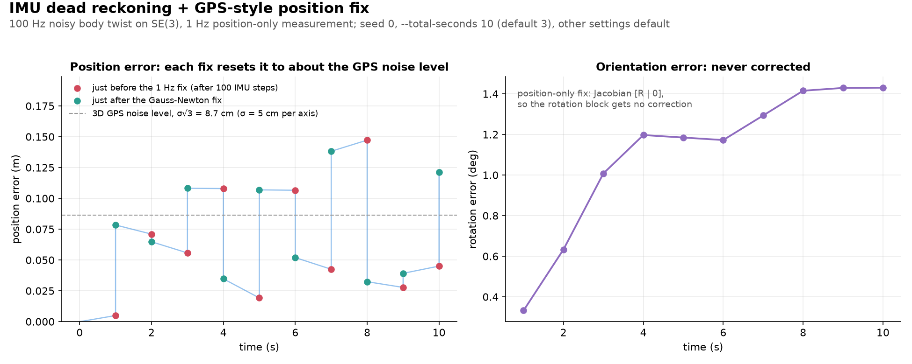
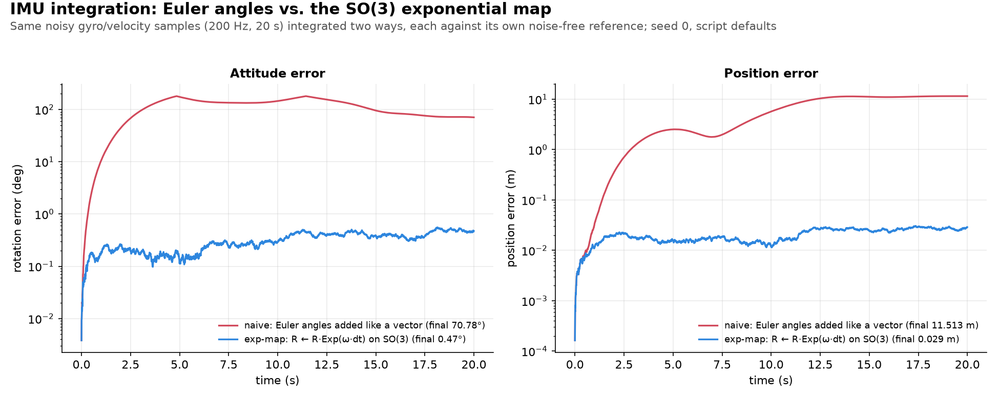

# IMU preintegration

An IMU (Inertial Measurement Unit: a gyroscope for angular rate plus an accelerometer for linear acceleration, sampled at 100-1000 Hz) produces **hundreds of raw samples between two keyframes**. IMU preintegration compresses them into **one relative-motion factor**, and lets that factor be recomputed instantly when the bias estimate changes, without re-touching a single raw sample.

It builds on two earlier ideas:

- The **node/edge language** from [pose_graph_optimization.md](pose_graph_optimization.md#2-where-do-the-edges-come-from): an edge is a relative-motion constraint between two nodes.
- The **right Jacobian** from [jacobian.md §11](../foundations/jacobian.md#11-left-and-right-jacobians-sensitivity-on-a-curved-space): $`\text{Exp}(\varphi+\delta\varphi) \approx \text{Exp}(\varphi)\cdot\text{Exp}\big(J_r(\varphi)\,\delta\varphi\big)`$, where the extra rotation is composed on the *right*, i.e. in the object's own body frame.

---

## 1. The problem

An IMU reports angular rate and acceleration at 100-1000 Hz. The keyframes or loop closures that a pose-graph or bundle-adjustment back-end optimizes over arrive at about 1-10 Hz. That gap means 10-1000 raw samples per keyframe, and it causes two problems:

- **Problem A - too many samples.** One node per raw sample would add 100+ nodes per second, and the back-end only needs the *net* relative motion between keyframes.
- **Problem B - bias re-linearization.** The gyro/accel biases ($b_g$, $b_a$) are part of the optimized state, and the optimizer changes them on essentially every iteration. Every raw sample was integrated with the *old* bias, so in principle each segment must be re-integrated (100+ samples, for every IMU segment, every iteration).

Preintegration solves both:

- It folds all samples between two keyframes into one **relative-motion bundle** ($\Delta R$, $\Delta v$, $\Delta p$), which solves **A**.
- While integrating, it tracks **bias-sensitivity Jacobians**, so the bundle can be corrected for a bias change with one matrix-vector multiply instead of a re-integration, which solves **B**.


*Figure: problems A and B at `use_numpy/imu_preintegration.py`'s defaults, plotted by `uv run python assets/make_figures.py imu_preintegration_concept`.*

---

## 2. The analogy: a trip summary, not a replayed dashcam

A car's odometer logs every trip as wheel revolutions times wheel circumference. We then learn the wheel size was calibrated slightly wrong (say 1% too small).

- **Replay:** re-read every logged trip and recompute each distance.
- **Summary plus sensitivity:** the log already keeps the running total and knows that total distance scales with circumference (about +1% per +1%). Applying the calibration change is one multiplication on the total.

$\Delta R, \Delta v, \Delta p$ are the trip summary. $J_{R,b_g}, J_{v,b_g}, J_{v,b_a}, J_{p,b_g}, J_{p,b_a}$ (§4) are the sensitivities.

---

## 3. What gets compressed

At every raw IMU sample, [`use_numpy/imu_preintegration.py`](../../use_numpy/imu_preintegration.py)'s `PreintegratedIMUBundle.integrate_measurement` folds one micro-step into three running quantities, all expressed relative to the body frame at the *start* of the window (`imu_preintegration.py:62-64`):

```math
\Delta p \leftarrow \Delta p + \Delta v\,dt + \tfrac{1}{2}\Delta R\,(\tilde v - b_a)\,dt^2
```

```math
\Delta v \leftarrow \Delta v + \Delta R\,(\tilde v - b_a)\,dt
```

```math
\Delta R \leftarrow \Delta R \cdot \text{Exp}\big((\tilde\omega - b_g)\,dt\big)
```

**Why the start-of-window frame?** Think of a trip summary like "go 3 m forward, turn 20° left".
- It holds wherever the trip starts. It does not depend on the start place.
- In the same way, $\Delta p, \Delta v, \Delta R$ stay valid when the optimizer moves the start pose or velocity.
- Only a bias change needs the Jacobian correction (§4).

Here $\tilde\omega, \tilde v$ are the raw sensor readings and $b_g, b_a$ are the bias estimates *in effect when this bundle started*.

- **Update order matters.** Every right-hand side uses the value from *before* this step. $\Delta p$ needs the old $\Delta v$ and old $\Delta R$, and $\Delta v$ needs the old $\Delta R$. So $\Delta p$ is updated first, then $\Delta v$, then $\Delta R$ last. The code does this by saving `R_prev` before touching `self.delta_R`.
- **Rotations compose, they don't add.** $\Delta R$'s update is the $\text{Exp}$-map composition from [jacobian.md §11.1](../foundations/jacobian.md#111-why-plain-addition-breaks): each micro-step's tiny rotation is *composed onto* the running $\Delta R$.
- **Labelling quirk.** The scripts call their linear input a commanded *velocity* (`--linear-vel`), but the recursions treat it as an accelerometer reading: $\tilde v$ is integrated twice, into $\Delta v$ and then $\Delta p$. With the defaults, one second of "1 m/s" gives $\Delta p_x \approx 0.48$ m. That is $\tfrac12 a t^2$ for $a = 1$ m/s², shortened slightly by the turn, not the roughly 1 m a true velocity would give. So we read $\tilde v$ as an acceleration in m/s². The math is the standard accelerometer recursion minus the gravity term (§4), and the $\Delta R$ recursion, which is what this doc is about, is unaffected.

---

## 4. The bias-sensitivity Jacobians

This is what makes preintegration more than "add up the samples." Alongside $\Delta R, \Delta v, \Delta p$, the bundle propagates five Jacobians, one per compressed quantity and bias:

$$J_{R,b_g} = \frac{\partial \Delta R}{\partial b_g} \qquad J_{v,b_g} = \frac{\partial \Delta v}{\partial b_g} \qquad J_{v,b_a} = \frac{\partial \Delta v}{\partial b_a} \qquad J_{p,b_g} = \frac{\partial \Delta p}{\partial b_g} \qquad J_{p,b_a} = \frac{\partial \Delta p}{\partial b_a}$$

These are the "sensitivity map" from [jacobian.md §3](../foundations/jacobian.md#3-think-of-it-as-a-sensitivity-map) ("if I nudge the input a little, how much does the output move?"), tracked incrementally one micro-step at a time. Each step uses the current micro-step's rotation $dR = \text{Exp}((\tilde\omega-b_g)dt)$ and right Jacobian $J_r = J_r\big((\tilde\omega-b_g)dt\big)$, in the same old-value order as §3 (`imu_preintegration.py:68-74`): $p$-Jacobians first, then $v$-Jacobians, then $J_{R,b_g}$ last.

**Intuition (why bias moves $\Delta v$ and $\Delta p$):**
- An accelerometer bias is plain "bias × time" in velocity and "bias × time²/2" in position.
- A gyro bias is sneakier. It tilts the integrated frame, so the accelerometer reading gets pushed the wrong way.
- **Tiny example (toy case: small angle, ignore the turn):** accel reading 1 m/s², gyro bias error 0.01 rad/s, 1 s.
  - The tilt grows as $`0.01\,t`$ rad, so about 0.01 rad at the end.
  - Sideways velocity error: $`\int a\,\theta\,dt = 0.005`$ m/s.
  - Sideways position error: about $`0.01/6 \approx 0.0017`$ m.
- This is the effect that $`J_{v,b_g}`$ and $`J_{p,b_g}`$ (the $`[\tilde v-b_a]_\times J_{R,b_g}`$ terms below) capture.

```math
J_{p,b_g} \leftarrow J_{p,b_g} + J_{v,b_g}\,dt - \tfrac{1}{2}\Delta R\,[\tilde v-b_a]_\times J_{R,b_g}\,dt^2 \qquad J_{p,b_a} \leftarrow J_{p,b_a} + J_{v,b_a}\,dt - \tfrac{1}{2}\Delta R\,dt^2
```

```math
J_{v,b_g} \leftarrow J_{v,b_g} - \Delta R\,[\tilde v-b_a]_\times J_{R,b_g}\,dt \qquad J_{v,b_a} \leftarrow J_{v,b_a} - \Delta R\,dt
```

```math
J_{R,b_g} \leftarrow dR^\top J_{R,b_g} - J_r\,dt
```

**Tiny example (toy case: one axis, constant rate):** $N=100$, $dt=0.01$ s, so $T=1$ s.
- On one axis $dR^\top = I$ and $J_r \approx I$, so each step is just $J \leftarrow J - dt$.
- After 100 steps $J_{R,b_g} \approx -T = -1$ rad per (rad/s).
- A bias error of 0.01 rad/s then changes $\Delta R$ by 0.01 rad (0.57°) after 1 s.
- The minus sign: a larger bias estimate subtracts more rotation, so the correction in §5 points opposite the bias change.

**Why $J_{R,b_g}$ is the one to study.** It is a direct instance of [jacobian.md §11.4](../foundations/jacobian.md#114-closed-form-for-so3)'s identities, and every other $J_{\cdot,b_g}$ inherits from it:

- $-J_r\,dt$: $J_r$ is the right Jacobian of the micro-step's rotation. The $dt$ is the chain-rule factor from $`\partial\big((\tilde\omega-b_g)dt\big)/\partial b_g = -dt\,I`$, which also supplies the minus sign.
- $dR^\top J_{R,b_g}$: the sensitivity accumulated so far is a right perturbation on the old $\Delta R$, and the new step composes $dR$ after it. Moving that perturbation past $dR$ uses the adjoint identity $\text{Exp}(x)\,dR = dR\,\text{Exp}(dR^\top x)$, which is where the $dR^\top$ comes from.

**Implementation notes.**

- Both `lie_utils.py` helpers switch to first-order forms when $\theta = \lVert(\tilde\omega-b_g)dt\rVert < 10^{-6}$: `so3_exp` returns $`I + [\phi]_\times`$ and `so3_right_jacobian` returns $`I - \tfrac{1}{2}[\phi]_\times`$. Otherwise they use the closed forms (Rodrigues and the $J_r$ formula from [jacobian.md §11.4](../foundations/jacobian.md#114-closed-form-for-so3)).
- The demo omits two things a real preintegrated factor needs. There is **no gravity term** (a real accelerometer's specific force must have gravity removed, usually in the residual). There is **no preintegrated noise covariance**: the script propagates the bias Jacobians but not Forster et al.'s $\Sigma$ recursion, so the bundle carries no uncertainty.
- The demo builds its raw readings as the commanded twist plus the *estimated* bias, so $`\tilde v - b_a`$ and $`\tilde\omega - b_g`$ equal the commanded values exactly.

---

## 5. The payoff: correcting for a bias change without re-integrating

After the bundle has absorbed, say, 100 raw samples, the optimizer updates the bias, $b_g \to b_g'$ with $\delta b_g = b_g' - b_g$. A first-order Jacobian is valid while the bias correction $\delta b_g$ stays small ([jacobian.md §8](../foundations/jacobian.md#8-one-subtle-point-jacobian-is-local)). `get_corrected_measurement` then applies the Taylor correction directly, touching no raw samples:

```math
\Delta R' \approx \Delta R\cdot\text{Exp}\big(J_{R,b_g}\,\delta b_g\big) \qquad \Delta v' \approx \Delta v + J_{v,b_g}\,\delta b_g + J_{v,b_a}\,\delta b_a \qquad \Delta p' \approx \Delta p + J_{p,b_g}\,\delta b_g + J_{p,b_a}\,\delta b_a
```

- **Asymmetry:** $\Delta v'$ and $\Delta p'$ are corrected by plain addition because velocity and position are ordinary vectors. $\Delta R'$ goes back through $\text{Exp}(\cdot)$ and is *composed* onto $\Delta R$, because rotations don't add ([jacobian.md §11.1](../foundations/jacobian.md#111-why-plain-addition-breaks)).
- **Cost:** one matrix-vector multiply per bias component, independent of how many samples fed the bundle: $O(1)$ instead of $O(N)$.
- **Caveat on the script's claim:** it prints "took less than 1 microsecond to solve, completely bypassing the need to loop through the 100 raw sensor inputs again." That is a hard-coded string, not a measurement; the script never times anything.

---

## 6. Where this fits in a SLAM back-end

A preintegrated bundle becomes one **edge** in the sense of [pose_graph_optimization.md §2](pose_graph_optimization.md#2-where-do-the-edges-come-from), except that it connects two *(pose, velocity, bias)* node sets instead of two pose nodes:

```text
(pose_i, v_i, b_i) ──── ΔR, Δv, Δp ────  (pose_j, v_j, b_j)
                     preintegrated
                      IMU factor
```

A full VIO (Visual-Inertial Odometry)/VI-SLAM back-end (GTSAM's `CombinedImuFactor`, ORB-SLAM3, VINS-Mono, etc.) builds a residual comparing this corrected bundle with what the two nodes' current estimates imply: the same "measured vs. predicted, then `Log`" pattern as [pose_graph_optimization.md §7](pose_graph_optimization.md#7-the-mathematics-is-actually-quite-intuitive). Because the bias correction is $O(1)$, the residual and its Jacobian can be re-evaluated at every optimizer iteration without revisiting the raw 100+ Hz stream.

---

## 7. What the accompanying scripts actually do (and don't)

- **`imu_preintegration.py`** (both [`use_numpy/`](../../use_numpy/imu_preintegration.py) and [`use_manif/`](../../use_manif/imu_preintegration.py)) implements §3-§5: compress raw samples into a bundle, track the bias Jacobians, apply the $O(1)$ correction. The two versions are line-for-line equivalent (`use_manif`'s docstring spells out the correspondence: its `rplus()` returns the same `dR`/right-Jacobian pair the numpy version computes by hand). **Neither builds the graph residual of §6**; both stop at compression plus correction.
- **`robot_imu_simulation.py`** is related but different: it [dead-reckons](factor_graph.md#2-why-do-we-need-it) noisy body-twist readings directly on $SE(3)$ every micro-step (chaining `se3_exp`, no bundle, no bias Jacobians). Its "IMU" reports a 6-D velocity twist, so there is no accelerometer, no bias and no gravity. It periodically runs a small damped Gauss-Newton correction against a separate GPS-like position fix. It is about *twist dead-reckoning + periodic on-manifold correction*, not preintegration.
- **`imu_integration_comparison.py`** is also related but different. Like [pointcloud_pose_tracking_empirical_note.md](../filtering/pointcloud_pose_tracking_empirical_note.md), it is an empirical comparison note, not a concept explainer: it plots naive Euler-angle (vector-space) integration against proper $SO(3)$ Exp-map integration. The Exp-map estimate still drifts from gyro noise, just far less: with the defaults, it ends at about 0.47° rotation error vs. about 70.8° for naive. Each method is scored against its own noise-free ground truth (§7.1). No bias correction is involved.


*Figure: `use_numpy/imu_preintegration.py` at its defaults (seed 0), plotted by `uv run python assets/make_figures.py imu_preintegration`.*


*Figure: why the 1 Hz fix in `use_numpy/robot_imu_simulation.py` never corrects orientation (Jacobian from `position_observation_jacobian` at the end of a 10 s run, seed 0), plotted by `uv run python assets/make_figures.py robot_imu_tracking_concept`.*



*Figure: `use_numpy/robot_imu_simulation.py` at its defaults except a 10 s run (seed 0), plotted by `uv run python assets/make_figures.py robot_imu_tracking`.*



*Figure: `use_numpy/imu_integration_comparison.py` at its defaults (seed 0), plotted by `uv run python assets/make_figures.py imu_integration_comparison`.*

### 7.1 The comparison and correction math, concretely

The scripts share `lie_utils.py`. The $SO(3)$ exponential `so3_exp` is Rodrigues' formula, with the $I + [\phi]_\times$ fallback below $\theta < 10^{-6}$ noted in §4:

$$\text{Exp}(\phi) = I + \frac{\sin\theta}{\theta}[\phi]_\times + \frac{1-\cos\theta}{\theta^2}[\phi]_\times^2, \qquad \theta = \lVert\phi\rVert$$

**`imu_integration_comparison.py`, measurements** (`run_simulation`). True body rates $\omega$, $v$ come from `utils.true_body_rates(t)`. Both estimators consume the *same* noisy readings each step:

$$\tilde\omega = \omega + n_\omega,\quad n_\omega \sim \mathcal N(0, \sigma_g^2 I), \qquad \tilde v = v + n_v,\quad n_v \sim \mathcal N(0, \sigma_v^2 I)$$

Defaults: $\sigma_g = 0.02$ rad/s, $\sigma_v = 0.05$ m/s, $dt = 0.005$ s, 20 s, seed 0.

**Naive update.** Attitude is kept as a ZYX Euler vector $\theta_{rpy}$ and rebuilt with `euler_to_R`, which returns $`R_z(\text{yaw}) R_y(\text{pitch}) R_x(\text{roll})`$:

```math
\theta_{rpy} \leftarrow \theta_{rpy} + \tilde\omega\,dt, \qquad R \leftarrow \texttt{euler\_to\_R}(\theta_{rpy}), \qquad p \leftarrow p + R\,\tilde v\,dt
```

**Exp-map update.**

```math
R \leftarrow R\,\text{Exp}(\tilde\omega\,dt), \qquad p \leftarrow p + R\,\tilde v\,dt
```

In both, the position step uses the rotation *after* this step's update. That is the opposite of the preintegration order in §3, which uses the old $\Delta R$.

**Ground truths.** One per estimator, each built from the noise-free rates with that estimator's own composition rule: $`R^{gt}_{\text{naive}} \leftarrow R^{gt}_{\text{naive}}\,\texttt{euler\_to\_R}(\omega\,dt)`$ and $`R^{gt}_{\text{exp}} \leftarrow R^{gt}_{\text{exp}}\,\text{Exp}(\omega\,dt)`$, with positions integrated as above. Rotation error is the geodesic angle (`rotation_geodesic_error`, computed equivalently with `atan2` for precision), plotted in degrees; position error is the Euclidean norm:

```math
e_R = \arccos\!\left(\frac{\mathrm{tr}(R_{gt}^\top R_{est}) - 1}{2}\right),\qquad e_p = \lVert p_{gt} - p_{est}\rVert
```

**`robot_imu_simulation.py`, propagation** (`run_simulation`). The true twist $\xi = [v, \omega]$ (translation first) is drawn once, uniformly per axis from $\pm 1.0$ m/s and $\pm 0.5$ rad/s. Each IMU step ($dt = 0.01$ s, 100 steps per second):

```math
T_{true} \leftarrow T_{true}\,\text{Exp}(\xi\,dt), \qquad T_{est} \leftarrow T_{est}\,\text{Exp}\big((\xi + n)\,dt\big),\quad n \sim \mathcal{N}(0, 0.02^2 I_6)
```

The 0.02 noise is hard-coded. `se3_exp` builds $\text{Exp}(\xi)$ with rotation $\text{Exp}(\omega)$ and translation $V v$, where

$$V = I + \frac{1-\cos\theta}{\theta^2}[\omega]_\times + \frac{\theta-\sin\theta}{\theta^3}[\omega]_\times^2$$

falling back to $`I + [\omega]_\times`$ and $`V = I + \tfrac{1}{2}[\omega]_\times`$ below $\theta < 10^{-6}$.

**Position fix.** Once per second: $z = t_{true} + n_z$ with $n_z \sim \mathcal N(0, \sigma_{pos}^2 I)$, $\sigma_{pos} = 0.05$ m by default. It measures translation only, never orientation.

**Residual and Jacobian** (`position_observation_jacobian`). For a right perturbation $T_{est} \text{Exp}(\delta\xi)$:

$$r = z - t_{est}, \qquad J = \frac{\partial t}{\partial \delta\xi} = \begin{bmatrix} R_{est} & 0_{3\times 3} \end{bmatrix}$$

**Solve and retract.** With $\Omega = I/\sigma_{pos}^2$ (built in `__main__` as `pos_info`):

```math
\left(J^\top \Omega J + 10^{-4} I_6\right)\delta\xi = J^\top \Omega\, r, \qquad T_{est} \leftarrow T_{est}\,\text{Exp}(\delta\xi)
```

The loop stops when $\lVert\delta\xi\rVert$ drops below `gn_tol` ($10^{-6}$) or after `gn_max_iters` (10) iterations. With the defaults, it converges in 2 iterations each second.

The $10^{-4} I$ damping is required, not cosmetic:

- $J$'s angular block is zero, so $J^\top \Omega J$ has rank 3 and plain Gauss-Newton's normal matrix would be singular. The damping makes it solvable and leaves the rotational part of $\delta\xi$ at exactly zero, so orientation is never corrected; only the IMU dead-reckoning sets it.
- $\Omega = 400 I$ dwarfs the damping, so each solve moves $t_{est}$ essentially all the way onto the noisy $z$. The post-correction error is then about the size of the fix noise, and can exceed the pre-correction error (seed 0, second 1: 0.0050 m before, 0.0785 m after).

---

## 8. One-sentence summary

> **Preintegration turns "re-run 100+ raw IMU samples every time the bias estimate changes" into "one matrix-vector multiply," by tracking - while integrating - exactly how sensitive the compressed relative-motion bundle is to the bias, using the same right-Jacobian machinery ([jacobian.md §11](../foundations/jacobian.md#11-left-and-right-jacobians-sensitivity-on-a-curved-space)) that converts a tangent-space nudge into a body-frame rotation.**

---

## 9. References

1. Forster, C., Carlone, L., Dellaert, F., & Scaramuzza, D. (2017). *On-Manifold Preintegration for Real-Time Visual-Inertial Odometry*. IEEE Transactions on Robotics, 33(1), 1-21. https://doi.org/10.1109/TRO.2016.2597321 - the on-manifold, right-Jacobian bias-correction preintegration formulation this doc follows (§3-§5).
