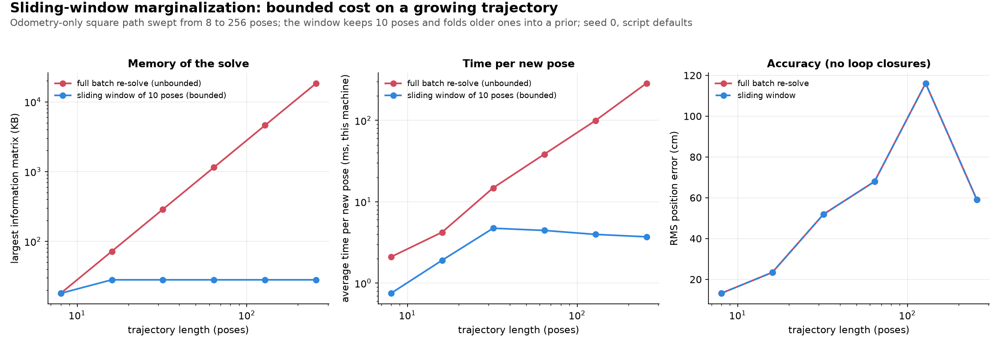

# Marginalization and sliding-window smoothing

Marginalizing a variable means permanently removing it from the optimization while keeping everything it taught you about its neighbors, packaged as one new prior factor - so a real-time estimator can bound its problem size without lying to itself about what it used to know.

This doc builds on two earlier ones:
- **Variable elimination** from [`bayes_tree.md`](bayes_tree.md) §3 ("eliminate $x_1$ → its info gets summarized into a new constraint on $x_2$"). We reuse that mechanic for a different purpose.
- **Full vs. fixed-lag smoothing** from [filtering_smoothing.md §9](../filtering_smoothing.md#9-the-precise-distinction) (filtering marginalizes old information, smoothing keeps it). This doc is the mechanical middle ground the diagram there only names.

---

## 1. The problem sliding-window smoothing needs to solve

Full batch optimization (plain [bundle_adjustment.md](bundle_adjustment.md)/[pose_graph_optimization.md](pose_graph_optimization.md)) keeps every pose ever seen in the optimization forever - the problem grows without bound as the robot keeps moving. [isam2_optimization.md](isam2_optimization.md) fixes the *recompute* cost (only touch the part of the Bayes tree a new factor actually affects) but not the *memory* cost - every variable is still in the graph, just efficiently re-solved.

A real-time VIO/VI-SLAM front-end (MSCKF, VINS-Mono, OKVIS) can't afford either: fixed onboard memory, fixed per-frame compute, running forever. We must **forget** old states, but forget the *variable* while keeping the *information* it contributed. That is marginalization.

---

## 2. Marginalization: keep the information, drop the variable

The elimination picture from `bayes_tree.md §3`:

```text
Before:

x1 ─── x2 ─── x3

Eliminate x1:

        x2 ─── x3
         ↑
    summarized
    information
    from x1
```

That is marginalization. `bayes_tree.md` uses it to build a *solve order*, where nothing is thrown away for good. We use the same step to drop $x_1$ **permanently**, on purpose: it is the oldest pose in the window and the estimator will never touch it again.

---

## 3. Three flavors of elimination, compared

| | Structural (BA landmarks) | Solve-order (Bayes tree/iSAM2) | Temporal (this doc) |
|---|---|---|---|
| What's eliminated | 3D landmarks | any variable, in a chosen order | the oldest pose/state in the window |
| Is it recoverable? | **Yes** - back-substitution recovers it | **Yes** - it stays in the graph, and is re-eliminated whenever a later update affects it | **No** - gone for good |
| Why eliminate it | Landmarks outnumber cameras; cheap to invert | Reuse most of the last solve; minimize fill-in | Bound memory/compute to a fixed window size |
| Where it's covered | [bundle_adjustment.md §12](bundle_adjustment.md#12-block-sparsity-and-the-schur-complement) | [bayes_tree.md](bayes_tree.md), [isam2_optimization.md](isam2_optimization.md) | §4-§7 below |

The math (§4) is the same Schur-complement elimination in all three rows. Only the fate of the eliminated variable differs.

---

## 4. The math: turning an eliminated pose into a prior

**A two-variable example first.** Take $`\Lambda = \begin{bmatrix} 2 & -1 \\ -1 & 2 \end{bmatrix}`$ and drop the first variable:
- Naively keeping only the second diagonal entry says the surviving variable has information 2.
- The Schur correction subtracts what $x_1$ borrowed from it: $`\Lambda' = 2 - (-1)(1/2)(-1) = 1.5`$.
- Check: $`\Sigma = \Lambda^{-1} = \begin{bmatrix} 2/3 & 1/3 \\ 1/3 & 2/3 \end{bmatrix}`$, so the marginal variance of the second variable is $`2/3 = 1/1.5`$. The correction is exactly what marginalizing means.

In general, suppose the current window has poses $x_a$ (the oldest, about to be dropped) and $x_b$ (everything still connected to it - odometry neighbors, and any landmark/IMU-bias variables it shares factors with). After linearization, the joint Gaussian is described by an information matrix $\Lambda$ and information vector $\eta$, partitioned to match:

```math
\Lambda = \begin{bmatrix} \Lambda_{aa} & \Lambda_{ab} \\ \Lambda_{ba} & \Lambda_{bb} \end{bmatrix}, \qquad \eta = \begin{bmatrix} \eta_a \\ 
\eta_b \end{bmatrix}
```

Marginalizing out $x_a$ means integrating it out of the joint distribution, which has a closed form - the same Schur complement `bundle_adjustment.md §12` uses on the point block, just kept in information form here instead of being back-substituted afterward:

$$
\Lambda_b' = \Lambda_{bb} - \Lambda_{ba}\Lambda_{aa}^{-1}\Lambda_{ab}, \qquad \eta_b' = \eta_b - \Lambda_{ba}\Lambda_{aa}^{-1}\eta_a
$$

One precision point: here $\Lambda$ and $\eta$ are built only from the factors that touch $x_a$. Factors among the $x_b$ variables alone stay in the graph unchanged, so if their contribution to $\Lambda_{bb}$ were also folded into the prior, it would be counted twice. §8.1 shows how the script does this.

$(\Lambda_b', \eta_b')$ is a brand-new **prior factor** over exactly the variables $x_a$ used to connect to. It enters the graph like any other factor, as in the §2 diagram with $x_a = x_1$: $x_a$ disappears and the summarized information sits on its former neighbors.

The difference from BA's version of this trick:
- BA computes $\Lambda_b'$ *only to solve the reduced system faster*, then back-substitutes to recover $x_a$ from $x_b$.
- Here there is no back-substitution: $x_a$ is never coming back. That is what makes this *temporal* marginalization rather than a solver optimization.

---

## 5. The fill-in consequence

$\Lambda_{ba}\Lambda_{aa}^{-1}\Lambda_{ab}$ is a dense (or denser) block whenever $x_a$ touched more than one neighbor. If $x_a$ was connected to, say, three other poses that were previously unconnected to each other, marginalizing $x_a$ makes all three of them mutually connected in the new prior:

```text
Before:                  After eliminating x_a:

     x_a                       x1 ─── x2
    / | \                       \    /
   x1 x2 x3                      \  /
                                  x3

(x1,x2,x3 only connect        (x1,x2,x3 now all
 through x_a)                  directly connected)
```

This is the **fill-in** that [elimination_tree.md §9](elimination_tree.md#9-why-ordering-matters-so-much) shows the elimination order can control, and that iSAM2's reordering ([isam2_optimization.md §12](isam2_optimization.md#12-variable-ordering-is-also-crucial)) keeps small. Sliding-window marginalization has no such choice: we always eliminate the oldest pose, whatever it is connected to. That cost is accepted, and it is why systems keep the window small: a bigger window costs $O(W^3)$ per step, and the dense prior can span more states.

---

## 6. The consistency gotcha: why FEJ exists

$(\Lambda_b', \eta_b')$ is computed by linearizing at the *current* estimates of $x_a$ and $x_b$ at the moment of marginalization. That linearization point is then frozen into the prior's $\Lambda_b'$ and $\eta_b'$. The surviving variables in $x_b$ keep being relinearized at new estimates on every later iteration, at a *different* point from the one the prior was built at. (This repo's prior differs: it re-linearizes its Jacobian at every solve, and only $\Omega$ and $X_{\text{ref}}$ are frozen; see §8.)

This mismatch injects spurious information into directions of the state that should be unobservable (the same class of problem [kf_ekf_iekf.md §2](../filtering/kf_ekf_iekf.md#2-extended-kalman-filter-the-world-is-nonlinear-so-ill-approximate-it-locally) describes for plain EKF-SLAM), making the estimator overconfident.

The standard fix is **First-Estimate Jacobians (FEJ)**: once a variable has contributed to a marginalization, all *future* Jacobians involving it are evaluated at that same first-linearization point, not the newest estimate. The linearized system then keeps the correct unobservable directions, which markedly improves consistency. Who uses it:
- The original MSCKF (Mourikis & Roumeliotis, 2007) predates FEJ. It was added in the later MSCKF 2.0 (Li & Mourikis, 2012/2013).
- VINS-Mono does not use FEJ. Its §VI-D notes that marginalization fixes linearization points early, which may give suboptimal estimates, and argues that since small drift is acceptable for VIO, the negative impact is not critical.

See Huang, Mourikis & Roumeliotis (2009) in the references below for the FEJ derivation itself - we don't reproduce it here.

---

## 7. Sliding-window and fixed-lag smoothing: the payoff

`filtering_smoothing.md §10`'s diagram names this strategy; here it is as a loop:

```text
new keyframe/measurement arrives
        ↓
add its variables + factors to the window
        ↓
   is the window full?
    ↙          ↘
  no            yes
   │             ↓
   │      marginalize the oldest state
   │      (§4: produces a new prior,
   │       §5: densifies its neighbors)
   ↓             ↓
        repeat
```

The window never grows past a fixed size, so cost and memory stay **bounded by the window size**, independent of run time. For $W$ poses, a dense solve takes $O(W^3)$ time and $O(W^2)$ memory.
- Full batch smoothing is unbounded.
- iSAM2 is bounded by how much of the Bayes tree a new factor *changes*, not by a fixed window. A loop closure can still touch a large chunk of history (`isam2_optimization.md §9`).

This is what `filtering_smoothing.md §10`'s "fixed-lag smoothing" box and its MSCKF/VINS-Mono bullets refer to:
- MSCKF keeps a sliding window of camera poses and marginalizes a landmark's constraint into them once triangulated (see [kf_ekf_iekf.md](../filtering/kf_ekf_iekf.md)'s MSCKF paragraph).
- VINS-Mono keeps a sliding window of keyframes and marginalizes the oldest one with the Schur-complement step in §4, without FEJ (§6).


*Figure: windows and information matrices recorded from `use_numpy/sliding_window_marginalization.py`'s own `run_sliding_window_pose_graph` calls (16 poses, window 10, seed 0), plotted by `uv run python assets/make_figures.py sliding_window_marginalization_concept`.*

---

## 8. What this repo implements

[`sliding_window_marginalization.py`](../../use_numpy/sliding_window_marginalization.py) streams a chain of odometry edges one node at a time, keeps at most `window_size` poses live in memory, and marginalizes the oldest one out via §4's Schur complement whenever a new node would exceed that.
- **The marginal is a genuine prior factor** - a frozen reference pose plus an information matrix, re-linearized against the *current* estimate every solve, exactly like an ordinary edge - rather than a frozen linear term. This is one valid representation (an alternative to storing a fixed linear factor) and it keeps the prior consistent as the surviving poses move across later windows.
- **It keeps §4's $\Lambda_b'$ as the prior's information matrix, but does not store $\eta_b'$.** Instead, the prior is anchored at a frozen reference pose, so its linear term is zero at the moment it is created. That is exact only when $\eta_b' = 0$, and it is here: see §8.1.

Two deliberate scope choices, both flagged in the script:
- **Pure odometry chain, no loop closures.** The oldest pose in a chain window is connected to exactly one surviving neighbor, so marginalizing it produces a *provably unary* prior - verified directly by a test that checks the Schur-complement correction term is zero (to 1e-8) everywhere outside that one block. §5's fill-in appears once a marginalized node has *multiple* neighbors (a landmark, an IMU-bias variable, a loop closure). That is a different problem, covered by [`bayes_tree.md`](bayes_tree.md)/[`isam2_optimization.md`](isam2_optimization.md) and by `pose_graph_incremental.py`'s loop-closure handling. This script isolates the memory-*bounding* property alone.
- **No First-Estimate Jacobians (§6).** Every pose's Jacobian, including the prior factor's own, is re-evaluated at its newest estimate on every solve, the textbook source of the mild overconfidence FEJ fixes. Like `pose_graph_incremental.py` with iSAM2, the script flags what it omits.

### 8.1 The math, concretely

Poses $X_k$ are $4 \times 4$ SE(3) matrices, and tangent vectors follow the repo's `[vx, vy, vz, wx, wy, wz]` order. We solve every window by plain Gauss-Newton over two factor types, both linearized at the current estimate on every iteration (no First-Estimate Jacobians).

**Odometry edge** (`linearize_edge`, reused from `pose_graph_incremental.py`). Here $\mathcal{J}_r^{-1}$ is the inverse right Jacobian of SE(3) (`compute_se3_inv_right_jacobian`) and $\mathrm{Ad}$ is the adjoint:

```math
e_{ij} = \mathrm{Log}\big((X_i Z_{ij})^{-1} X_j\big), \qquad
J_j = \mathcal{J}_r^{-1}(e_{ij}), \qquad
J_i = -\mathcal{J}_r^{-1}(-e_{ij})\,\mathrm{Ad}(Z_{ij}^{-1})
```

**Prior on the oldest window pose** (`assemble_window_system`). $X_{\text{ref}}$ is a frozen reference pose and $\Omega_p$ is the prior's information matrix:

$$
e_p = \mathrm{Log}(X_{\text{ref}}^{-1} X_0), \qquad J_p = \mathcal{J}_r^{-1}(e_p)
$$

The first prior is the gauge anchor, with $X_{\text{ref}}$ equal to the ground-truth first pose and $\Omega_p = 10^6 I$ (`--anchor-weight`). Every later prior comes from marginalization (below).

**Gauss-Newton step** (`assemble_window_system`, `solve_to_convergence`). Each edge uses the information matrix $\Omega = I_6$. The script accumulates

```math
H = \sum J^\top \Omega\, J, \qquad g = -\sum J^\top \Omega\, e, \qquad H\delta = g, \qquad X_k \leftarrow X_k \exp(\delta_k)
```

It stops when $\lVert\delta\rVert$ < `gn_tol` ($10^{-6}$) or after `gn_max_iters` (10) iterations. With $W$ poses in the window, $H$ is $6W \times 6W$.

**Marginalizing the oldest pose** (`marginalize_oldest`). The window has already converged. Let $a$ be the oldest pose, `x_window[0]`, and $b$ the next one, `x_window[1]`. In a pure chain, $a$ touches exactly two factors: its prior and the single a–b edge. The script asserts that there is exactly one such edge. It takes $\Lambda_{aa}$, $\Lambda_{ab}$ and $\Lambda_{ba}$ from the full window $H$; those blocks only ever involve factors touching $a$. It builds $\Lambda_{bb}^{(ab)}$ from a separate system containing only the a–b edge:

$$
\Omega_p' = \Lambda_{bb}^{(ab)} - \Lambda_{ba}\Lambda_{aa}^{-1}\Lambda_{ab}, \qquad X_{\text{ref}}' = X_b \text{ (current estimate, frozen)}
$$

Taking $\Lambda_{bb}$ from the full $H$ instead would also include the b–c edge. That edge stays in the window, so it would be counted twice. $\Omega_p'$ equals §4's Schur complement of the system built from $a$'s prior plus the a–b edge.

**Why storing no $\eta_b'$ is exact here.** Because $X_{\text{ref}}' = X_b$, the new prior's residual is zero when it is created, so its linear term is zero too. §4's $\eta_b'$ really is zero in this setting. The chain has a single anchor and no loop closures, so every factor can be satisfied exactly. Each new pose also starts at $X_{\text{last}} Z_{ij}$, which already zeroes its edge residual. So at the optimum, every residual, and therefore every gradient term, is zero. This depends on the pure-chain scope. With a loop closure or a shared landmark, residuals would not vanish, and dropping $\eta_b'$ would lose information.

**Ordering** (`run_sliding_window_pose_graph`). For each new node, the script:

1. Marginalizes the oldest pose first, if the window already holds `window_size` poses, using the linearization point from the previous solve.
2. Appends the new pose, initialized as $X_{\text{last}} Z_{ij}$, together with its edge.
3. Solves the window to convergence.

The solve therefore never exceeds `window_size` poses, so `max_dof` is capped at 6 × `window_size`. A marginalized pose keeps the estimate it had when it was dropped.

**Baseline** (`run_full_batch_growing`). For $k = 1 \dots n$, the baseline re-solves the whole graph of the first $k$ poses from scratch. It uses `pose_graph.run_pose_graph_optimization` (adaptive Levenberg-Marquardt starting at λ = 0, via `damping=0.0`), starting from dead reckoning from the first ground-truth pose, with node 0 anchored by $10^6 I$ inside that function. Its `max_dof` is $6n$.

**Defaults:** `--window-size 10`; `--nodes-per-side-sweep 2 4 8 16 32 64` (8 to 256 poses); `--side-length 2.0` m; `--pos-noise-std 0.05` m; `--rot-noise-std 0.01` rad; `--anchor-weight 1e6`; `--gn-tol 1e-6`; `--gn-max-iters 10`; `--seed 0`.

---

## 9. Empirical verification: bounded vs. unbounded

`sliding_window_marginalization.py` compares this bounded approach against `run_full_batch_growing` - the unbounded baseline that re-solves the entire graph from scratch at every new node, exactly the strategy §1 opens with. Since output bookkeeping (final pose estimates for every node, kept only for this script's own error reporting) is unavoidably $O(n)$ for *both* approaches alike, the metric that actually isolates the algorithmic claim is the size of the largest dense information matrix either one ever assembles and solves - reported here as `max_dof`, with an approximate byte count for holding that matrix densely ($`\text{max\_dof}^2 \times 8`$ bytes, float64):

| Trajectory length | Full-batch `max_dof` | Full-batch peak (~bytes) | Sliding-window `max_dof` (window_size=10) | Sliding-window peak (~bytes) |
| --- | --- | --- | --- | --- |
| 8 | 48 | 18,432 | 48 | 18,432 |
| 16 | 96 | 73,728 | 60 | 28,800 |
| 32 | 192 | 294,912 | 60 | 28,800 |
| 64 | 384 | 1,179,648 | 60 | 28,800 |
| 128 | 768 | 4,718,592 | 60 | 28,800 |
| 256 | 1536 | 18,874,368 | 60 | 28,800 |

Two measurements, only one of them deterministic:
- **Memory (`max_dof`)**: full-batch's system size grows linearly with trajectory length (so its dense-matrix memory grows *quadratically* - visible directly in the table, roughly $4\times$ per doubling of length) and never stops. Sliding-window's caps at exactly $`6 \times \text{window\_size}`$ the moment the window first fills, and never moves again, confirmed identically across multiple seeds (`max_dof` depends only on trajectory length and `window_size`, not on the noise realization). Only the `max_dof` column above is deterministic.
- **Average per-step wall-clock time** tells the same story less starkly, and absolute values depend on the machine and its load. One run gave full-batch 1.5 ms → 61 ms as length grows 8 → 256, and sliding-window 1.6 ms → 7.0 ms. A later run on a different machine state gave full-batch 2.4 ms → 317 ms and sliding-window 0.78 ms → 3.8 ms. In both runs, sliding-window time flattens once trajectories exceed `window_size`, while full-batch time keeps growing.



*Figure: `use_numpy/sliding_window_marginalization.py` at its defaults (seed 0), plotted by `uv run python assets/make_figures.py sliding_window_marginalization`.*

**Accuracy is identical here, but that's guaranteed by the setup, not evidence that marginalization loses nothing.**
- Final RMS position error is the same for full-batch and sliding-window at every trajectory length.
- The reason is the one in §8.1 (all residuals are zero): the least-squares optimum *is* the dead-reckoned trajectory. Both solvers return exactly that. Checked at seed 0, both match dead reckoning with a maximum difference of 0.0 at 8, 16 and 32 poses.
- So any correct solver would tie. The comparison can't reveal whether marginalization throws information away, and the figure's accuracy panel is simply dead-reckoning error. The memory bound above is the real result.

The same scope silences §6's FEJ subtlety here: the inconsistency only shows up once a later loop closure or shared landmark reconnects to something already marginalized. A version with loop closures would actually test accuracy, and would be expected to show §5's fill-in cost and a real (if likely small) accuracy gap from skipping FEJ. That extension is not implemented.

---

## 10. One-sentence summary

> **Marginalization is the variable-elimination step from `bayes_tree.md`, used to permanently discard an old state.** It turns that state into a dense prior over whatever it was still connected to. That lets sliding-window/fixed-lag smoothers (MSCKF, VINS-Mono) run in bounded memory and time forever. The price is fill-in (§5) and a consistency subtlety (FEJ, §6) that full-batch and iSAM2 never face.

---

## 11. References

1. Sibley, G., Matthies, L., & Sukhatme, G. (2010). *Sliding Window Filter with Application to Planetary Landing*. Journal of Field Robotics, 27(5), 587-608. https://doi.org/10.1002/rob.20360 - the sliding-window/delayed-state-marginalization formulation behind §4 and §7.
2. Huang, G. P., Mourikis, A. I., & Roumeliotis, S. I. (2009). *A First-Estimates Jacobian EKF for Improving SLAM Consistency*. In Experimental Robotics: The Eleventh International Symposium (pp. 373-382). Springer. https://doi.org/10.1007/978-3-642-00196-3_43 - the FEJ fix behind §6.
3. Mourikis, A. I., & Roumeliotis, S. I. (2007). *A Multi-State Constraint Kalman Filter for Vision-Aided Inertial Navigation*. ICRA 2007, 3565-3572. https://doi.org/10.1109/ROBOT.2007.364024 - the original MSCKF reference in §7 (predates FEJ, per §6), already cited in [filtering_smoothing.md §12](../filtering_smoothing.md#12-references).
4. Qin, T., Li, P., & Shen, S. (2018). *VINS-Mono: A Robust and Versatile Monocular Visual-Inertial State Estimator*. IEEE Transactions on Robotics, 34(4), 1004-1020. https://doi.org/10.1109/TRO.2018.2853729 - the VINS-Mono reference in §7, already cited in [filtering_smoothing.md §12](../filtering_smoothing.md#12-references). Its §VI-D notes that marginalization fixes linearization points early and argues the impact is not critical for VIO (no FEJ).
5. Li, M., & Mourikis, A. I. (2013). *High-Precision, Consistent EKF-Based Visual-Inertial Odometry*. The International Journal of Robotics Research, 32(6), 690-711. https://doi.org/10.1177/0278364913481251 - the later MSCKF revision (sometimes called "MSCKF 2.0") that adds FEJ, referenced in §6.
