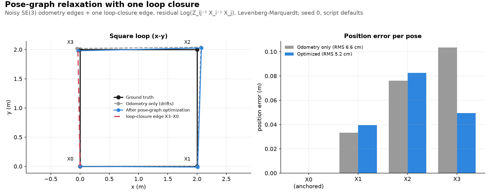

# Pose-graph optimization

**Pose-graph optimization (PGO)** is one of the easiest SLAM ideas once we have the right mental picture:

> **Pose-graph optimization adjusts all robot poses so that the relative-motion and loop-closure constraints are as consistent as possible.**

Think of it as **"fixing the robot's entire trajectory using a network of geometric constraints."**

---

## 1. First: what is a "pose"?

A robot's **pose** is its position + orientation.

- 2D robot: $x_i = [x, y, \theta]$
- 3D robot: $T_i \in SE(3)$, which holds a 3D position and a 3D orientation

Each robot location along the trajectory is a **node**, and the nodes together form the **pose graph**:

```text
t₀       t₁       t₂       t₃       t₄

●────────●────────●────────●────────●
x₀       x₁       x₂       x₃       x₄
```

---

## 2. Where do the edges come from?

Suppose the robot moves from $x_0$ to $x_1$. From [odometry](factor_graph.md#2-why-do-we-need-it) or visual odometry, we estimate:

> "The robot moved approximately 1 meter forward."

That is a constraint between the two poses, and chaining such constraints gives the graph's edges:

```text
x₀ ──Δ₀₁── x₁ ──Δ₁₂── x₂ ──Δ₂₃── x₃
```

Each edge says:

> **"The relative transformation between these two poses should approximately equal this measurement."**

> **Note**: "odometry" and "visual odometry" aren't the same sensor, just the same *kind* of measurement from different sources - wheel odometry counts wheel rotations, while visual odometry (VO) tracks features across camera frames to estimate the same incremental relative pose.
> - The distinction matters for this graph's edges because a single (monocular) camera used this way can only recover relative motion up to an unknown **scale** factor - "the camera moved some distance" could mean 1 meter or 100 - see [vi_initialization.md §1](../frontend/vi_initialization.md#1-the-bootstrapping-problem) for why.
> - This doc's $\Delta_{ij}$ edges are treated as already-metric (as from wheel odometry, stereo VO, or monocular VO with scale recovered via IMU fusion).
> - So a pose graph's only gauge freedom is the rigid 6-DoF (3-DoF in 2D) gauge noted in [§7](#7-the-mathematics-is-actually-quite-intuitive), never a scale ambiguity - unlike monocular bundle adjustment's projective edges, whose unresolved scale is discussed in [umeyama_alignment.md](../foundations/umeyama_alignment.md).

---

## 3. Why do we need optimization?

Because measurements are noisy.

Suppose the robot walks in a square, x₀ → x₁ → x₂ → x₃, and returns to where it started, so its fifth pose x₄ lands right on top of x₀. (The scripts use 4 nodes X0-X3 with the loop edge X3→X0; this teaching example uses five poses so that x₄ can sit on x₀.)

```text
 x₃ ────────── x₂
 │             │
 │             │
 │             │
 x₀ ────────── x₁
 (x₄ is back here)
```

Odometry has small errors, so chaining slightly wrong steps leaves the estimated x₄ some distance from x₀, even though the robot is really back at its start:

```text
 x₃ ────────── x₂
 │             │
 │             │
 │             │
 x₄    x₀ ──── x₁
```

Small errors accumulate with motion. This is called **drift**.

---

## 4. The really important event: loop closure

Suppose the robot recognizes "Hey! I've been here before", for example the same visual landmark/place as at $x_0$. That gives a loop-closure constraint:

```text
x₀ ───── x₁ ───── x₂ ───── x₃ ───── x₄
│                                   │
└──────────── loop closure ─────────┘
```

It says:

> **"According to this observation, $x_4$ should be near $x_0$ with approximately this relative orientation."**

But our accumulated odometry says otherwise, so we have a conflict.

---

## 5. Pose-graph optimization resolves the conflict

- Odometry says: $x_0 \to x_1 \to x_2 \to x_3 \to x_4$
- Loop closure says: $x_4 \to x_0$
- The two are not perfectly consistent, because both are noisy.

So PGO asks:

> **"Can we slightly move all these poses so that all constraints are satisfied as well as possible?"**

It doesn't say "x₄ is wrong". It says "maybe x₁, x₂, x₃ and x₄ are all slightly wrong, so let's distribute the error."

---

## 6. Imagine stretching a rubber band

Every pose is a bead and every edge is a **rubber band** saying "you should be approximately this far apart and oriented this way". The loop closure from §4 is one more rubber band, pulling in a slightly conflicting direction. If we release the system, the beads settle into the configuration that best satisfies all the rubber bands:

```text
       ●
     /   \
    ●     ●
     \   /
      ●─●
```

That is essentially what optimization does.

---

## 7. The mathematics is actually quite intuitive

For every edge we have the **measured relative transformation** $z_{ij}$ between poses $i$ and $j$. Given our current estimates $T_i$ and $T_j$, the relative transformation they imply is $T_i^{-1}T_j$. We compare the two:

$${\text{error}_{ij} = z_{ij}^{-1}(T_i^{-1}T_j)}$$

That comparison is still a **group element** ($SE(2)$/$`SE(3)`$, not a plain vector), so to measure "how big" it is - and to compute the Jacobians the optimizer needs - we take its **Log map**, which turns it into a tangent-space vector:

$${e_{ij} = \text{Log}(\text{error}_{ij}) = \text{Log}\big(z_{ij}^{-1}(T_i^{-1}T_j)\big)}$$

That vector $e_{ij}$ is the thing that gets squared below.

**Why not just subtract poses?** Try adding to a rotation.
- 2D toy case: take $`R = I + 0.1\,[\omega]_\times = \begin{bmatrix}1 & -0.1\\ 0.1 & 1\end{bmatrix}`$.
- Each column has length $`\sqrt{1.01} \approx 1.005`$, and $`R^\top R = 1.01\,I`$. This is not a rotation: it stretches.
- **Exp** wraps a flat step onto the curved surface of valid poses. **Log** reads the gap between two poses back as a plain vector.

```text
measured relationship        estimated relationship
        ↓                            ↓
      zᵢⱼ                        Tᵢ⁻¹ Tⱼ
        └────────── compare ─────────┘
                       ↓
              error (group element)
                       ↓
                    Log map
                       ↓
                 vector eᵢⱼ
```

**Tiny example (1D toy case):** an edge measures $`z = 1.0`$ m, but our estimates imply $`1.1`$ m.
- The error is $`e = 0.1`$ m, and its plain square is $`0.01`$.
- With a trust weight $`\Omega = 100`$ (the weighted form $`e^\top \Omega e`$ used later), the cost is $`100 \cdot 0.1^2 = 1.0`$. A trusted edge makes the same gap hurt more.

PGO then minimizes the total error over every edge (odometry edges plus loop-closure edges):

```math
{\boxed{\min_{T_0,\ldots,T_n}\sum_{(i,j) \in \mathcal{E}}\|e_{ij}\|^2}}
```

In plain English:

> **Find the poses that make all the measured relative transformations agree as much as possible.**

One subtlety this formula hides: since every constraint is *relative*, rigidly translating and rotating the entire graph together leaves every $e_{ij}$ unchanged. The optimization has a flat direction with zero curvature, called **gauge freedom**. In practice we fix it by anchoring one pose (usually $T_0$), e.g. by giving it an enormous information weight, so the linear system solved at each step has a unique solution instead of infinitely many equally good ones.

**Intuition:** picture a square of poses drawn on the floor.
- Slide or turn the whole square: every relative edge is unchanged, so the cost does not change.
- Anchoring node 0 nails the square to the floor, leaving one best answer.

---

## 8. Why is this different from Bundle Adjustment?

The two differ in what they optimize and what they compare against.

| | Bundle Adjustment | Pose-graph optimization |
| --- | --- | --- |
| Optimizes | camera poses + 3D landmarks | robot poses (given relative-pose constraints) |
| Compares | image observations vs. reprojection | measured vs. implied relative poses |
| Landmarks | explicit variables | not optimized |
| Asks | "Do my cameras and 3D points explain the images?" | "Do my robot poses form a trajectory consistent with all the relative-pose measurements?" |

```text
BA: cameras and landmarks (PGO is the §4 graph: poses only)

      [cam] T₀
       /  \
      /    \
    P₁      P₂
     \      /
      \    /
      [cam] T₁
```

---

## 9. Another useful analogy: GPS navigation

Suppose we reconstruct someone's journey from odometry alone:

```text
Home → A → B → C → D
```

Accumulated error makes `D` appear 20 m away from Home, though the person is actually back at Home.

- **Relative cue (loop closure):** we recognize Home again at `D`. That ties two nodes together: "D is about 0 m from Home".
- **Absolute cue (GPS):** GPS would say "D is very close to this map position". That is an absolute (unary) constraint, i.e. a prior factor on one node, not a relative edge. Loop closure is its relative version.

Either cue can be handled by distributing the correction instead of moving only `D`:

```text
Before:

Home ─ A ─ B ─ C ───────── D
                         20m error


After:

Home ─ A ─ B ─ C ─────── D
       ↘   ↘   ↘   ↘
        small corrections
```

The trajectory becomes globally consistent. That is essentially what PGO does.

---

## 10. Why loop closure is so powerful

- **Without loop closure** the graph is a chain, so there is little opportunity to correct accumulated drift:

  ```text
  x₀ ─ x₁ ─ x₂ ─ x₃ ─ x₄ ─ x₅ ─ x₆
  ```

- **With loop closure** (the §4 picture) we get a **cycle**, which is a powerful consistency check: if we follow the measurements around the loop, we should come back to where we started. If we don't, there is accumulated error, and optimization distributes it over the loop.

---

## 11. What happens in a real SLAM system?

A typical pipeline looks roughly like:

```text
Camera/LiDAR/IMU
        │
        ▼
 Front-end estimation
        │
        ▼
Relative pose
        │
        ▼
   New pose xᵢ
        │
        ▼
   Pose graph
        │
        ├──────────────┐
        │              │
        ▼              ▼
Odometry edge     Loop closure
        │              │
        └──────┬───────┘
               ▼
        Graph optimization
               │
               ▼
     Corrected trajectory
```

- The **front-end** says: "I think I moved like this."
- The **back-end** says: "Let's see whether all those estimates make sense together."
- Keeping the two separate is a core design choice in SLAM.

---

## 12. PGO doesn't magically know the correct trajectory

Suppose we have $x_0 - x_1 - x_2$ and noisy measurements. Optimization isn't discovering some objectively "true" trajectory. It finds:

> **the trajectory that best satisfies the available constraints according to the chosen error model and weights.**

For example, if one measurement is highly reliable (weight $w_1 = 100$) and another is noisy ($w_2 = 1$), the optimizer cares much more about satisfying the first constraint. So the more complete objective is:

$${\min_X \sum_{(i,j) \in \mathcal{E}} e_{ij}^\top \Omega_{ij} e_{ij}}$$

where $\Omega_{ij}$ is related to the **information/covariance** of the measurement. This is why sensor uncertainty matters.

Caveat about the accompanying scripts:

- Both `pose_graph.py` versions (`use_numpy/` and `use_manif/`) share one identity `info_matrix` across every edge, odometry and loop closure alike.
- So they don't exploit per-edge weighting like $\Omega_{ij}$ above, even though the loop-closure edge is generated with a different noise level than the odometry edges.
- Per-edge weighting is a natural extension, not something the default scripts do.

---

## 13. How PGO fits among SLAM approaches

This doc covers only PGO (with BA in §8 as the contrast); filtering is shown here just for orientation:

```text
                SLAM
                 │
        ┌────────┴────────┐
        │                 │
    Filtering         Optimization
        │                 │
        │          ┌──────┴──────┐
        │          │             │
       EKF      Pose Graph       BA
                  │              │
                  │              │
             poses only     poses + landmarks
                  │              │
                  ▼              ▼
             relative       reprojection
           pose errors         errors
```

| Approach | The question it answers |
| --- | --- |
| Filtering | "Given everything I've seen so far, where am I now?" |
| Pose-graph optimization | "Given all these relative-pose constraints, what trajectory is most consistent?" |
| Bundle adjustment | "Given all these images, what camera trajectory and 3D structure best explain the observations?" |

---

## 14. The one-sentence mental model

> **Pose-graph optimization is like taking a trajectory made of slightly inaccurate pieces, connecting those pieces with constraints - including loop closures - and then moving the poses around until the entire graph becomes as geometrically consistent as possible.**

Precisely, **PGO is a sparse nonlinear least-squares problem over poses on $SE(2)$ or $SE(3)$**. The natural next step is to see **why we need Lie groups/Lie algebra and how Gauss-Newton or Levenberg-Marquardt moves the poses during optimization**.

---


## 15. Mathematical breakdown of the error formulation and Lie algebra operations

**Intuition:** each edge is a spring whose rest length is the measured relative pose, and $F$ below is the total spring energy. We linearize at the current poses, solve a sparse linear system for small corrections, and apply them through $\mathrm{Exp}$ so every pose stays a valid rotation + translation.

Pose-Graph Optimization (PGO) formulates loop closure and drift correction as a nonlinear least squares problem on the Special Euclidean Group $\mathrm{SE}(3)$ (or $\mathrm{SE}(2)$ for 2D). Because $\mathrm{SE}(3)$ is a non-Euclidean Lie group rather than a vector space, standard calculus operations like addition and subtraction do not apply directly. Instead, optimization is performed locally on its Lie algebra $\mathfrak{se}(3)$ using tangent spaces.

### 15.1 State Representation and Constraints

#### Poses as Lie Group Elements

A 3D pose consists of a rotation $R \in \mathrm{SO}(3)$ and a translation $p \in \mathbb{R}^3$, represented as a $4 \times 4$ matrix $T_i \in \mathrm{SE}(3)$:

```math
T_i = \begin{bmatrix} R_i & p_i \\ 
\mathbf{0}^\top & 1 \end{bmatrix} \in \mathrm{SE}(3)
```

The full state vector containing all $N$ pose keyframes is $`X = \{T_1, T_2, \dots, T_N\}`$.

#### Relative Edge Measurements

An edge $`(i, j)`$ between nodes $`i`$ and $`j`$ represents a relative transformation measurement $`z_{ij} = \tilde{T}_{ij} \in \mathrm{SE}(3)`$ (e.g., from ICP scan matching or visual odometry), accompanied by an information matrix $`\Omega_{ij} = \Sigma_{ij}^{-1} \in \mathbb{R}^{6 \times 6}`$ representing measurement confidence.

### 15.2 Residual Vector Formulation on $\mathrm{SE}(3)$

The expected relative transformation between pose $T_i$ and pose $T_j$ according to the current state estimate is $`\hat{T}_{ij} = T_i^{-1} T_j`$. The error matrix $`E_{ij} \in \mathrm{SE}(3)`$ measures the relative deviation between the actual measurement $`\tilde{T}_{ij}`$ and the predicted state transformation $`T_i^{-1} T_j`$:

$${E_{ij} = \tilde{T}_{ij}^{-1} \left( T_i^{-1} T_j \right)}$$

#### Mapping Error to Tangent Space ${\mathfrak{se}(3)}$

Because optimization requires a 6-dimensional Euclidean vector space, the matrix error ${E_{ij}}$ is mapped to its local tangent space (Lie algebra ${\mathfrak{se}(3)}$) via the logarithmic map ${\log: \mathrm{SE}(3) \to \mathfrak{se}(3)}$, and flattened into a vector ${\mathbb{R}^6}$ using the **${\vee}$ operator** ${(\cdot)^\vee}$ - together, ${\mathrm{Log}(\cdot) = (\log(\cdot))^\vee: \mathrm{SE}(3) \to \mathbb{R}^6}$, mirroring the lowercase/uppercase convention already used for ${\exp}$/$`{\mathrm{Exp}}`$ below:

$${r_{ij}(X) = \left( \log \left( \tilde{T}_{ij}^{-1} T_i^{-1} T_j \right) \right)^\vee \in \mathbb{R}^6}$$

The residual vector stacks a translational and a rotational part:

```math
r_{ij} = \left[ \mathbf{v}_{ij}^\top \;\; \boldsymbol{\omega}_{ij}^\top \right]^\top
```

- $`\mathbf{v}_{ij}`$ is the translational part of the twist, $`\mathbf{v} = V(\boldsymbol{\omega})^{-1} t_E`$ (as in `use_numpy/lie_utils.py`). It equals $`E_{ij}`$'s translation only when $`\boldsymbol{\omega} = \mathbf{0}`$, or to first order.
- $`\boldsymbol{\omega}_{ij}`$ is the rotational error.

### 15.3 Objective Function

The global optimization minimizes the sum of squared Mahalanobis distances over all edges ${\mathcal{E}}$ in the graph:

```math
{F(X) = \sum_{(i,j) \in \mathcal{E}} r_{ij}(X)^\top \Omega_{ij} \, r_{ij}(X)}
```

> **Note**: Mahalanobis distance measures how far a point is from the center (mean) of a distribution, accounting for the correlations and variances between variables. Here the "point" is the residual ${r_{ij}(X)}$, the "distribution" is the measurement noise model (mean $\mathbf{0}$, covariance ${\Sigma_{ij} = \Omega_{ij}^{-1}}$), and ${\Omega_{ij}}$ is exactly the inverse-covariance weighting that turns a plain squared-error sum into a squared Mahalanobis-distance sum. See the tilestats.com video and amit's Medium explainer cited in [§17](#17-references), and [the isotropic special case](../glossary.md#2-uncertainty-and-probability), where this weighting collapses to a uniform scale factor.

### 15.4 Manifold Optimization and Linearization

Standard vector updates ${T_i \leftarrow T_i + \Delta x_i}$ break the matrix constraints of ${\mathrm{SE}(3)}$ (e.g., $R_i$ will cease to be orthogonal). Updates are applied using the exponential map ${\mathrm{Exp}: \mathbb{R}^6 \to \mathrm{SE}(3)}$ via local perturbations ${\boldsymbol{\xi}_i \in \mathbb{R}^6}$ acting on the tangent space.

#### Local Perturbation Model (Right Multiplication)

We use right perturbations throughout (never left). Applying a local perturbation $`{\boldsymbol{\xi}_i = \left[ \mathbf{v}^\top \;\; \boldsymbol{\omega}^\top \right]^\top \in \mathbb{R}^6}`$ (translation $\mathbf{v}$ first, then rotation $\boldsymbol{\omega}$) to state $T_i$:

$${T_i \oplus \boldsymbol{\xi}_i = T_i \cdot \mathrm{Exp}(\boldsymbol{\xi}_i)}$$

where ${\mathrm{Exp}(\boldsymbol{\xi}) = \exp(\boldsymbol{\xi}^\wedge) \in \mathrm{SE}(3)}$, and ${(\cdot)^\wedge}$ maps a 6D vector to a ${4 \times 4}$ Lie algebra element ${\mathfrak{se}(3)}$:

```math
{\boldsymbol{\xi}^\wedge = \begin{bmatrix} \boldsymbol{\omega}^\wedge & \mathbf{v} \\ 
\mathbf{0}^\top & 0 \end{bmatrix}, \quad \text{with } \boldsymbol{\omega}^\wedge = \begin{bmatrix} 0 & -\omega_z & \omega_y \\ 
\omega_z & 0 & -\omega_x \\ 
-\omega_y & \omega_x & 0 \end{bmatrix} \in \mathfrak{so}(3)}
```

#### First-Order Taylor Expansion

Linearizing the residual $r_{ij}$ with respect to local perturbations ${\boldsymbol{\xi}_i}$ and ${\boldsymbol{\xi}_j}$:

```math
r_{ij}(X \oplus \boldsymbol{\delta}) \approx r_{ij}(X) + J_i \, \boldsymbol{\xi}_i + J_j \, \boldsymbol{\xi}_j
```

Here the Jacobians are $`J_i = \frac{\partial r_{ij}}{\partial \boldsymbol{\xi}_i}`$ and $`J_j = \frac{\partial r_{ij}}{\partial \boldsymbol{\xi}_j}`$. They are exact (no small-residual approximation), with $`J_j = J_r^{-1}(r_{ij})`$ and $`J_i`$ carrying an extra adjoint factor:

- `use_numpy/` evaluates $J_r^{-1}$ from an 18-term series (see [§15.7](#157-the-solver-concretely)); its truncation error is $\lesssim 10^{-12}$ at about 1.6 rad.
- `use_manif/` uses manif's closed-form Jacobians. For small residuals the two agree to machine precision.

```math
{J_i = - J_r^{-1}(r_{ij}) \, \mathrm{Ad}\left( T_j^{-1} T_i \right)}
```

**Intuition (Adjoint):** the Adjoint mostly relabels axes, plus one term for the offset between the frames.

- Toy case: frames $i$ and $j$ are $90^\circ$ apart. A 1 m push "forward" in one frame is a 1 m push "sideways" in the other.
- The $R$ blocks of $\mathrm{Ad}$ do this relabeling. The $p^\wedge R$ block adds the effect of the offset $p$ between the frames.

Here, ${\mathrm{Ad}(T) \in \mathbb{R}^{6 \times 6}}$ is the **Adjoint transformation matrix** of ${\mathrm{SE}(3)}$, which transforms velocity/tangent vectors between frame coordinate systems:

```math
{\mathrm{Ad}\left(\begin{bmatrix} R & p \\ 
\mathbf{0}^\top & 1 \end{bmatrix}\right) = \begin{bmatrix} R & p^\wedge R \\ 
\mathbf{0} & R \end{bmatrix}}
```

and ${J_r^{-1}(\cdot)}$ is the inverse right Jacobian of ${\mathrm{SE}(3)}$.

**Intuition ($J_r^{-1}$):** it corrects for the curvature of the pose space. It is the identity when the edge error is zero.

- Series: $`J_r^{-1}(e) = I + \tfrac{1}{2}\mathrm{ad}_e + \dots`$, so $`J_r^{-1}(0) = I`$.
- Tiny example: an edge error with a $0.1$ rad rotation changes $J_r^{-1}$ by about $0.05$ (half the angle), so $I$ is a fair stand-in.
- It matters only for large edge errors, e.g. a bad loop closure. Near convergence the errors are small and $J_r^{-1} \approx I$.

### 15.5 Solving the Linear System (Gauss-Newton Step)

Stacking all residuals into a global residual vector $R(X)$ and Jacobians into a sparse Jacobian matrix $J$, the linearization takes the standard form:

```math
{H \, \boldsymbol{\delta}^* = -b}
```

- **Gauss-Newton approximation of the Hessian:** ${H = J^\top \Omega J = \sum_{(i,j) \in \mathcal{E}} J_{ij}^\top \Omega_{ij} J_{ij} \in \mathbb{R}^{6N \times 6N}}$
- **Gradient Vector:** ${b = J^\top \Omega R(X) \in \mathbb{R}^{6N}}$
- **Update Vector:** $`{\boldsymbol{\delta}^* = \left[ \boldsymbol{\xi}_1^\top \;\; \boldsymbol{\xi}_2^\top \;\; \dots \;\; \boldsymbol{\xi}_N^\top \right]^\top}`$

Here $F$ has no $\frac{1}{2}$ (as in the code's `cost`), while $b$ is the gradient of $\frac{1}{2}F$. The factor 2 cancels on both sides of the step, so $H\boldsymbol{\delta}^* = -b$ is unchanged.

Because edges only connect adjacent or loop-closing keyframes, $H$ is extremely **sparse** and block-structured. It is typically solved using Sparse Cholesky Factorization (${\mathrm{LL}^\top}$ or ${\mathrm{LDL}^\top}$) or Conjugate Gradients in solvers like GTSAM or g2o - see [`sparse_cholesky_factorization.md`](sparse_cholesky_factorization.md) for the full derivation.

**What that factorization is doing:** $H$ is symmetric positive-definite once the gauge is fixed (e.g. the node-0 anchor; it is singular otherwise, see §7), and Cholesky factorization writes it as $H = LL^\top$ with $L$ lower-triangular. Solving $H\boldsymbol{\delta}^* = -b$ then becomes two cheap triangular solves instead of one general one:

$$Ly = -b \quad\text{(forward substitution)}, \qquad L^\top \boldsymbol{\delta}^* = y \quad\text{(back substitution)}$$

Each pass is just row-by-row substitution - no matrix inversion needed.

**Why "sparse" matters:**

- Most pose pairs never share a constraint, so most of $H$'s off-diagonal blocks are exactly zero. Sparse Cholesky exploits that known zero pattern instead of doing dense arithmetic on zeros.
- Eliminating a variable can turn some zeros into nonzeros, called **fill-in**. Example: eliminating $x_2$ out of a chain $x_1 - x_2 - x_3$ creates a new dependency between $x_1$ and $x_3$ even though they were never directly measured.
- The elimination order controls how much fill-in accumulates. See [`elimination_tree.md`](elimination_tree.md) for a worked elimination example, and [`isam2_optimization.md` §12](isam2_optimization.md#12-variable-ordering-is-also-crucial) for why iSAM2 cares about this.

In practice a pure Gauss-Newton step can overshoot or diverge far from the solution, so a **Levenberg-Marquardt** damping term $\lambda$ is added to the Hessian's diagonal before solving. Both `pose_graph.py` implementations (`use_numpy/` and `use_manif/`) use the Marquardt-scaled form, which scales $\lambda$ by $H$'s own diagonal instead of adding $\lambda I$:

```math
{\big(H + \lambda \, \mathrm{diag}(H)\big) \, \boldsymbol{\delta}^* = -b}
```

Larger $\lambda$ shrinks the step toward (diagonally scaled) gradient descent: safer, but slower. ${\lambda \to 0}$ recovers pure Gauss-Newton, which is faster near convergence. In both scripts $\lambda$ is **adaptive**, not fixed, and the two implementations are identical here:

1. Entries of $\mathrm{diag}(H)$ below $10^{-12}$ are clamped to $10^{-12}$.
2. A trial step is accepted only if it lowers the total cost $F$. On acceptance, $\lambda \leftarrow \max(0.5\lambda,\ 10^{-7})$.
3. On rejection, $\lambda \leftarrow \max(2\lambda,\ 10^{-6})$ and the solve is retried. Each iteration tries at most 10 values of $\lambda$ in total. If all 10 are rejected, the solver stops.

`--damping` (default 0.01) is only the starting $\lambda$.

### 15.6 Retraction/State Update

Once the increment vector ${\boldsymbol{\delta}^*}$ is computed, the system updates the trajectory states on the ${\mathrm{SE}(3)}$ manifold:

```math
{T_i^{(k+1)} = T_i^{(k)} \cdot \mathrm{Exp}\left(\boldsymbol{\xi}_i^*\right), \quad \forall i \in \{1, \dots, N\}}
```

This iteration repeats until the accepted step is small, ${\Vert{}\boldsymbol{\delta}^*\Vert{} < \epsilon}$ (`--gn-tol`, default $10^{-6}$). It also stops after `--gn-max-iters` accepted iterations (default 10), or when every damping retry is rejected. The scripts have no separate test on the change in cost ${\Delta F}$.

### 15.7 The solver, concretely

The whole solver is `run_pose_graph_optimization` in [`use_numpy/pose_graph.py`](../../use_numpy/pose_graph.py). It works on $4 \times 4$ pose matrices $X_k$. Tangent vectors are ordered translation first, $`\boldsymbol{\xi} = [\mathbf{v}^\top \;\; \boldsymbol{\omega}^\top]^\top`$, the same notation as §15.4. The code numbers nodes from 0, while §15.1 numbers them from 1. Below, $X$ is §15's $T$ and $Z_{ij}$ is §15's ${\tilde{T}_{ij}}$.



*Figure: `use_numpy/pose_graph.py` at its defaults (seed 0), plotted by `uv run python assets/make_figures.py pose_graph`.*

**Measurements** (`simulate_noisy_edges`): each edge is the true relative pose with right-multiplied noise. The loop-closure edge scales both std-devs by `--loop-noise-scale` (default 0.5):

```math
Z_{ij} = \left(X_i^{\text{true}}\right)^{-1} X_j^{\text{true}} \, \mathrm{Exp}(\mathbf{n}), \qquad \mathbf{n} \sim \mathcal{N}\!\left(\mathbf{0},\ \mathrm{diag}(\sigma_p^2 I_3,\ \sigma_r^2 I_3)\right)
```

The defaults are ${\sigma_p = 0.05}$ m (`--pos-noise-std`) and ${\sigma_r = 0.01}$ rad (`--rot-noise-std`). The initial guess is the dead-reckoned chain $X_{k+1} = X_k Z_{k,k+1}$ (`run_dead_reckoning`), which never uses the loop-closure edge.

**Residual** (the edge loop and `cost`): the code first predicts node $j$ from node $i$, then compares:

$$\hat{X}_j = X_i Z_{ij}, \qquad e_{ij} = \mathrm{Log}\big(\hat{X}_j^{-1} X_j\big) = \mathrm{Log}\big(Z_{ij}^{-1} X_i^{-1} X_j\big)$$

This is §15.2's $r_{ij}$. In code, $\hat{X}_j$ is `T_pred`.

**Jacobians** (the edge loop): the chain rule through `T_pred`, with right perturbations $`X \leftarrow X \, \mathrm{Exp}(\boldsymbol{\xi})`$:

$$J_c = \mathrm{Ad}\big(Z_{ij}^{-1}\big), \qquad J_a = J_r^{-1}(e_{ij}), \qquad J_b = -J_r^{-1}(-e_{ij})$$

```math
J_i = J_b \, J_c, \qquad J_j = J_a
```

These are `Jc_self` ($`\partial \hat{X}_j / \partial X_i`$), `Ja` ($`\partial e_{ij} / \partial X_j`$) and `Jb` ($`\partial e_{ij} / \partial \hat{X}_j`$). `use_manif/` gets the same three matrices from `Xi.compose(Z_ij, Jc_self)` and `Xj.rminus(T_pred, Ja, Jb)`. The product equals §15.4's closed form:

```math
-J_r^{-1}(-e_{ij}) \, \mathrm{Ad}\big(Z_{ij}^{-1}\big) = -J_r^{-1}(e_{ij}) \, \mathrm{Ad}\big(X_j^{-1} X_i\big)
```

This holds because $`J_r(-e) = J_l(e) = \mathrm{Ad}(\mathrm{Exp}(e)) \, J_r(e)`$ and ${\mathrm{Exp}(e_{ij})^{-1} = X_j^{-1} X_i Z_{ij}}$.

**Right Jacobian** (`se3_right_jacobian`, `compute_se3_inv_right_jacobian` in `use_numpy/lie_utils.py`): an 18-term series in the little adjoint (`se3_ad`), then a plain matrix inverse:

```math
J_r(\boldsymbol{\xi}) = \sum_{n=0}^{17} \frac{\left(-\mathrm{ad}_{\boldsymbol{\xi}}\right)^n}{(n+1)!}, \qquad \mathrm{ad}_{\boldsymbol{\xi}} = \begin{bmatrix} \boldsymbol{\omega}^\wedge & \mathbf{v}^\wedge \\ 
\mathbf{0} & \boldsymbol{\omega}^\wedge \end{bmatrix}, \qquad J_r^{-1} = \big(J_r\big)^{-1}
```

The series needs no small-angle branch. `se3_adjoint` builds $\mathrm{Ad}$ exactly as in §15.4.

**Assembly** (the edge loop): each edge adds four blocks to $H$ and two to $g$, with $\Omega$ = `info_matrix`:

$$H_{ii} \mathrel{+}= J_i^\top \Omega J_i, \quad H_{jj} \mathrel{+}= J_j^\top \Omega J_j, \quad H_{ij} \mathrel{+}= J_i^\top \Omega J_j, \quad H_{ji} \mathrel{+}= J_j^\top \Omega J_i$$

```math
g_i \mathrel{-}= J_i^\top \Omega \, e_{ij}, \qquad g_j \mathrel{-}= J_j^\top \Omega \, e_{ij}
```

So $g = -b$ in §15.5's notation, and the code solves $`(H + \lambda \, \mathrm{diag}(H)) \boldsymbol{\delta} = g`$. `main` sets $\Omega = I_6$ for every edge, including the loop closure.

**Anchor** (gauge fix): before the edges are added, ${H_{00} \mathrel{+}= 10^6 I_6}$, and nothing is added to $g$. This is a prior that pulls node 0's step ${\boldsymbol{\delta}_0}$ toward zero. It is centered on node 0's current estimate, not on a fixed pose. Two side effects are easy to miss:

- The anchor is not part of `cost`, so the accept/reject test ignores it.
- Because it sits in $\mathrm{diag}(H)$, the Marquardt term damps node 0 far more than the other nodes.

**Cost** (`cost`): $`F = \sum e_{ij}^\top \Omega \, e_{ij}`$, with no $\frac{1}{2}$ factor. It is the value printed as "total chi-squared error" and the value the accept test compares.

**Retraction**: every node, node 0 included, is updated as $`X_k \leftarrow X_k \, \mathrm{Exp}(\boldsymbol{\delta}_k)`$ (`se3_exp`). `use_manif/` writes the same update as `T + manif.SE3Tangent(delta_k)`.

**Defaults**: `--damping 0.01` (initial $\lambda$), `--gn-tol 1e-6`, `--gn-max-iters 10`, `--side-length 2.0`, one node per square corner (4 nodes, 3 odometry edges and 1 loop closure). With `--seed 0` the default run converges in 5 iterations.

---

## 16. Robust loss functions used to handle false loop closures

In Pose-Graph Optimization (PGO), standard nonlinear least squares relies on an $L_2$ squared-error norm ${F(x) = \sum r_{ij}^\top \Omega_{ij} r_{ij}}$. Under an $L_2$ loss, a single false loop closure (a severe outlier) produces a massive residual $r_{ij}$ whose squared weight pulls the entire trajectory out of shape to satisfy the invalid edge.

Robust cost functions replace or reweight the standard $L_2$ norm to cap or reduce the influence of large residuals.

### 16.1 The M-Estimator Framework (Iteratively Reweighted Least Squares)

Instead of minimizing the squared cost $e^2$ (where $e = \sqrt{r^\top \Omega r}$ is the normalized residual scalar), M-estimators minimize a robust kernel $\rho(e)$. Kernels are conventionally written with a $\frac{1}{2}$ (e.g. $\rho = \frac{1}{2}e^2$ for $L_2$, as in Huber below), while §15.3's $F$ has none. A constant factor changes neither the minimizer nor the weights $w(e)$.

```math
\min_{X} \sum_{(i,j) \in \mathcal{E}} \rho\left( \sqrt{r_{ij}(X)^\top \Omega_{ij} \, r_{ij}(X)} \right)
```

To integrate this into standard Gauss-Newton or Levenberg-Marquardt solvers without modifying the core linear algebra solver, robust kernels use **Iteratively Reweighted Least Squares (IRLS)**. The robust cost is converted into a modified information matrix $\Omega_{ij}^\text{robust} = w(e) \cdot \Omega_{ij}$, where the weight function $w(e)$ is:

$$w(e) = \frac{1}{e} \frac{\partial \rho(e)}{\partial e}$$

**Tiny example:** take $\delta = k = 1$ and one false loop closure with $e = 10$. Costs use the $\frac{1}{2}$ convention above.

- $L_2$: cost $\frac{1}{2}\cdot 10^2 = 50$, weight $1$. The edge dominates the whole graph.
- Huber: cost $1\cdot(10 - 0.5) = 9.5$, weight $\frac{1}{10} = 0.1$.
- Cauchy: cost $\frac{1}{2}\ln(1 + 100) \approx 2.31$, weight $\frac{1}{101} \approx 0.0099$. The edge is almost ignored.
- Good edge, $e = 0.5$: $L_2$ and Huber keep weight $1$. Cauchy gives $\frac{1}{1.25} = 0.8$, a mild down-weight.

### 16.2 Classical M-Estimators

#### Huber Loss

Huber acts as quadratic ($L_2$) for small residuals (inliers) and linear ($L_1$) for residuals exceeding a threshold $\delta$:

```math
\rho(e) = \begin{cases} \frac{1}{2} e^2 & \text{if } \vert{}e\vert{} \le \delta \\ 
\delta \left( \vert{}e\vert{} - \frac{1}{2} \delta \right) & \text{if } \vert{}e\vert{} > \delta \end{cases}, \quad w(e) = \begin{cases} 1 & \text{if } \vert{}e\vert{} \le \delta \\ 
\frac{\delta}{\vert{}e\vert{}} & \text{if } \vert{}e\vert{} > \delta \end{cases}
```

- **Behavior:** Because $w(e) \propto \frac{1}{\vert{}e\vert{}}$, the gradient magnitude becomes constant ($\delta$) for outliers rather than growing infinitely.
- **Limitation in SLAM:** A linear error cost still grows indefinitely as $e \to \infty$. If a false loop closure has a massive initial error, Huber will still pull the graph significantly toward the false measurement.

#### Cauchy Loss

Cauchy uses a logarithmic tail that flattens out faster than Huber:

$$\rho(e) = \frac{k^2}{2} \ln\left(1 + \frac{e^2}{k^2}\right), \quad w(e) = \frac{1}{1 + \left(\frac{e}{k}\right)^2}$$

- **Behavior:** The weight falls off quadratically ($w(e) \propto \frac{1}{e^2}$), heavily suppressing high-residual edges.

### 16.3 Dynamic Covariance Scaling (DCS)

Dynamic Covariance Scaling (Agarwal et al., 2013) is specifically designed for pose-graph optimization. It is still a reweighting scheme - like §16.1's IRLS, it rescales each edge's information matrix at every iteration - but its weight is a closed-form $s_{ij}$ derived from Switchable Constraints, rather than from a chosen kernel $\rho$.

DCS adds a dynamic scaling parameter $s_{ij} \in (0, 1]$ directly to the information matrix $\Omega_{ij}$:

```math
\Omega_{ij}^\text{DCS} = s_{ij}^2 \, \Omega_{ij}
```

The scaling factor $s_{ij}$ is calculated in closed form at each iteration using the current error $e_{ij}^2 = r_{ij}^\top \Omega_{ij} r_{ij}$ and an upper-bound parameter $\Phi$:

```math
s_{ij} = \min\left(1, \; \frac{2 \Phi}{\Phi + e_{ij}^2}\right)
```

```text
                       DCS Scaling Factor (s_ij)
          1.0 |────────────┐
              |             \
              |              \___   (s_ij decreases once e_ij^2 > Phi)
          0.0 +--------------------> e_ij^2 (Error)
              0            Phi

```

#### How DCS Handles Outliers:

1. **Inliers ($e_{ij}^2 \le \Phi$):** $s_{ij} = 1$. The edge retains full confidence and behaves as a standard quadratic term.
2. **Outliers ($e_{ij}^2 > \Phi$):** $s_{ij} = \frac{2 \Phi}{\Phi + e_{ij}^2} < 1$. As error $e_{ij}^2$ grows, $s_{ij}^2 \propto \frac{1}{e^4}$, so the effective weight of the edge drops rapidly toward zero.
3. **No Extra State Variables:** Unlike original Switchable Constraints, DCS does not add auxiliary optimization variables to the Hessian matrix $H$, preserving graph sparsity without increasing matrix inversion costs.

### 16.4 Comparison of Robust Loss Functions

| Loss Function | Residual Cost Tail $\rho(e)$ | Weight Degeneration $w(e)$ | SLAM False Loop Rejection Power |
| ------------- | ------------- | ------------- | ------------- |
| **Standard $L_2$** | Unbounded Quadratic ($e^2$) | Constant ($1.0$) | **None** (1 outlier ruins the map) |
| **Huber** | Unbounded Linear ($\delta e$) | $\propto \frac{1}{e}$ | **Low/Moderate** (Dampens, but still pulls graph) |
| **Cauchy** | Logarithmic ($\ln e^2$) | $\propto \frac{1}{e^2}$ | **High** |
| **DCS** | Saturating (GM-equivalent, see below) | $\propto \frac{1}{e^4}$ | **Very High** (Effectively turns off bad edges) |
| **Geman-McClure** | Saturation/Bounded | $\propto \frac{1}{(1 + e^2)^2}$ | **Very High** |

What is DCS's cost? Be careful, because the obvious reading is wrong:

- DCS comes from Switchable Constraints' augmented cost $\Psi(s, e) = s^2e^2 + \Phi(s-1)^2$. The second term is a prior that keeps the switch $s$ near $1$ unless the data justifies turning the edge off.
- Substituting DCS's closed-form $s=\frac{2\Phi}{\Phi+e^2}$ into $\Psi$ gives exactly $\Phi$, since $\frac{\Phi\left[4\Phi e^2 + (\Phi-e^2)^2\right]}{(\Phi+e^2)^2} = \Phi$. But this $s$ is **not** the minimizer of $\Psi$ over $s$, so $\Phi$ is not the effective robust cost. (A cost constant in $e$ would also have zero gradient, i.e. IRLS weight $0$, contradicting the $s^2 \propto \frac{1}{e^4}$ weight in the table.)
- The true minimizer is $s^* = \frac{\Phi}{\Phi+e^2}$, giving $\Psi^* = \frac{\Phi e^2}{\Phi+e^2}$. This is Geman-McClure-shaped: it grows like $e^2$ for small $e$ and approaches $\Phi$ only asymptotically. For $\Phi = 12.59$: $\Psi^* = 7.73,\ 11.18,\ 12.57$ at $e^2 = 20,\ 100,\ 10^4$.
- In practice, DCS uses its closed-form $s$ as an IRLS-style weight $s^2 \propto \frac{1}{e^4}$. MacTavish & Barfoot (2015) show this weighting is equivalent to a Geman-McClure-type kernel. Both therefore saturate rather than diverge, and both carry the "Graduated Non-Convexity" caveat below.

### 16.5 Practical Considerations in Implementation

1. **Threshold Tuning ($\delta, k, \Phi$):** The parameters set the boundary between inliers and outliers. In $\mathrm{SE}(3)$ PGO, error $e^2$ approximately follows a Chi-Square distribution ($\chi^2$) with 6 degrees of freedom, for inliers with well-modeled Gaussian noise. Setting $\Phi$ or $k^2$ corresponding to the 95% or 99% quantile of $\chi^2(6)$ (e.g., $\Phi \approx 12.59$) provides a sound baseline.
2. **Graduated Non-Convexity (GNC):** Highly non-convex robust functions (like DCS or Geman-McClure) can introduce local minima if applied from a poor initial guess. Modern solvers use GNC to start with a convex $L_2$ loss and gradually harden the robust kernel as iterations progress.

This section is theory only: neither `use_numpy/pose_graph.py` nor `use_manif/pose_graph.py` implements Huber, Cauchy, or DCS reweighting. Both still use the single unweighted `info_matrix = np.eye(6)` noted in §12. Robust reweighting is a natural extension, not something the accompanying scripts exercise.

---

## 17. References

1. Grisetti, G., Kümmerle, R., Stachniss, C., & Burgard, W. (2010). *A Tutorial on Graph-Based SLAM*. IEEE Intelligent Transportation Systems Magazine, 2(4), 31-43. https://doi.org/10.1109/MITS.2010.939925 - already cited in [frontend_backend.md §6](../frontend_backend.md#6-references); the general graph/error-formulation/optimization reference behind §1-§14 here.
2. tilestats.com (2021, February 3). *Euclidean Distance and the Mahalanobis Distance (and the Error Ellipse)* [Video]. YouTube. https://www.youtube.com/watch?v=xXhLvheEF7o - the Mahalanobis-distance intuition in §15.3.
3. amit (2024, October 30). *Understanding Mahalanobis Distance*. Medium. https://medium.com/@pamit2235/understanding-mahalanobis-distance-081bd765fcdb - the Mahalanobis-distance intuition in §15.3.
4. Huber, P. J. (1964). *Robust Estimation of a Location Parameter*. Annals of Mathematical Statistics, 35(1), 73-101. https://doi.org/10.1214/aoms/1177703732 - the Huber loss in §16.2.
5. Geman, S., & McClure, D. E. (1985). *Bayesian Image Analysis: An Application to Single Photon Emission Tomography*. Proceedings of the American Statistical Association, Statistical Computing Section, 12-18. - the Geman-McClure loss named in §16.4's comparison table.
6. Agarwal, P., Tipaldi, G. D., Spinello, L., Stachniss, C., & Burgard, W. (2013). *Robust Map Optimization Using Dynamic Covariance Scaling*. ICRA 2013, 62-69. https://doi.org/10.1109/ICRA.2013.6630557 - Dynamic Covariance Scaling in §16.3, already named inline there as "Agarwal et al., 2013".
7. MacTavish, K., & Barfoot, T. D. (2015). *At all Costs: A Comparison of Robust Cost Functions for Camera Correspondence Outliers*. 12th Conference on Computer and Robot Vision (CRV), 62-69. https://doi.org/10.1109/CRV.2015.52 - the DCS/Geman-McClure equivalence result named in §16.4.
